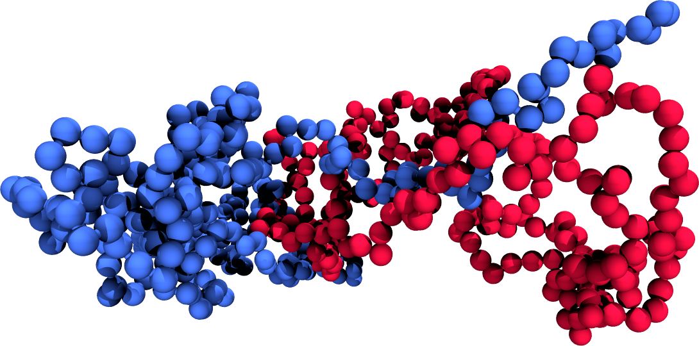
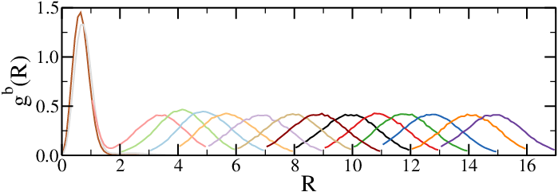
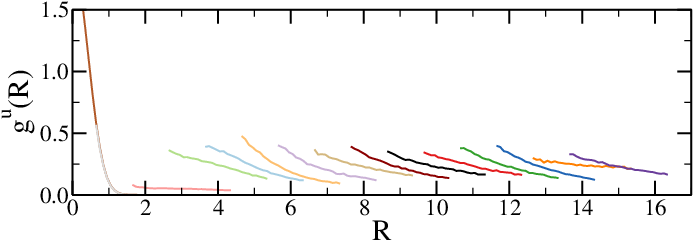
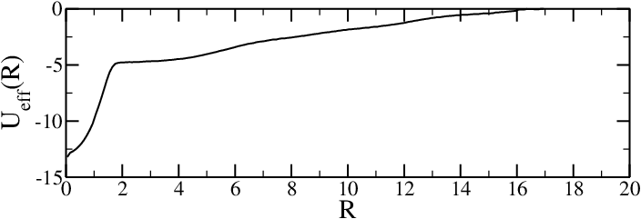

```{note}
In this chapter I will use *reaction* as a general term for a microscopic process that transforms the system of interest (be it a macromolecule, an extended many-body system, a collection of atoms, *etc.*) between two well-defined states, $A$ and $B$.
```

In biophysics, *reactions* (in the sense given above) are extremely important, and are often the focus of any enhanced sampling technique discussed in the context of biomolecules. However, these same techniques have been very often introduced in, or can be easily adapted to, other contexts[^cg].

[^cg]: To provide an example that you can already appreciate, the bottom-up effective interactions discussed in the [coarse graining chapter](./coarse_grained.md) can be computed with any of the techniques discussed in this chapter.


(reaction-coordinates)=
# Collective variables and reaction coordinates

The phase space of a many-body system is a highly-dimensional manifold where each point corresponds to a microstate. As the system evolves in time, the collection of points in phase space it visits form a trajectory that fully describes its evolution. In many cases it is useful to project the trajectory on a space with a lower dimensionality: the resulting quantities can be used to obtain *coarse-grained* models, but also to describe the essential features of a system in a way that is easier to analyse and visualise.

In the context of molecular simulations, any quantity that is used to describe a system in a coarse-grained fashion is a *collective variable* (CV), and can be written as a function of (all or a subset of) the microscopic degrees of freedom $\dofs$. In condensed-matter physics, collective variables are often called *order parameters*. By contrast, in the biophysics and biochemistry worlds the most used term is *reaction coordinate* (RC), defined as a parameter or set of parameters that describe the progress of the reaction of interest, serving as a way to quantify and track the changes occurring within a system as it evolves through the reaction pathway. Since we will be focussing on reactions, in the following I will tend to refer to the coarse-grained variable(s) of interest as RC or reaction coordinate(s), but most of what I will say translates naturally to any other CV.

The primary purpose of a reaction coordinate is to provide a simplified description of the system's thermodynamics, making it possible to monitor and analyze the progress of a reaction in terms of a single or a few variables: by using a reaction coordinate we are reducing the complexity of a many-body system with many degrees of freedom to obtain a simplified description that can be used to investigate the reaction itself, effectively applying a *dimensionality reduction* procedure. This simplification is essential for understanding the microscopic underpinnings of the reaction of interest. Defining a reaction coordinate makes it possible to draw a diagram such as the one shown in [](#fe_barrier), which are often called free-energy profiles or landscapes, where the variation of the free energy along a particular reaction coordinate or collective variable is plotted.

```{figure} figures/fe_barrier.png
:name: fe_barrier
:align: center
:width: 500px

A sketch of the free energy landscape of a system displaying two basins separated by a transition state.
```

The choice of the RC depends on the specific process being studied and it is not, in general, unique. It can be a simple geometric parameter such as bond length, bond angle, or dihedral angle, or a more complex collective variable that captures the overall structural changes in the system, such as the distance between two key functional groups, the position or coordination number of a particular atom, or the solvent-accessible surface area of a biomolecule. [](#fig:fes_examples) shows two "real-world" examples, one taken from simulations of the oxDNA coarse-grained model, and the other from atomistic simulations of proteins.

```{figure} figures/fes_examples.png
:name: fig:fes_examples
:align: center
:width: 700px

(a) Free energy profiles for three different duplexes of length 12 as a function of the number of complementary (native) base pairs of the two strands. The oxDNA simulations for each duplex were run at their respective melting  temperatures, namely 48 $^\circ$C, 73 $^\circ$C, and 80 $^\circ$C. Adapted from [](doi:10.1063/1.4754132). (b) Free-energy surface of the dimerization process of the fibritin foldon domain (PDB code: 1RFO). The two CVs are the distance between the centres of mass of the monomers, $R_{MM}$, and the number of specific monomer-monomer contacts, $N_D$. Structures representative of the two free-energy basins N and C (gray) are compared with dimer arrangement in the trimeric experimental structure (red and blue). Adapted from [](doi:10.1073/pnas.1320077110).
```

```{note}
In general, a reaction coordinate can be multidimensional, and sometimes it is useful, or even necessary, to define such complex variables. However, for the sake of simplicity here I will use unidimensional reaction coordinates, which will be designated by the symbol $\xi = \xi(\dofs)$.
```

Once we have chosen a RC to characterise the reaction of interest, which is in general not an easy task, and an active area of research in itself, we can use it to describe the reaction. We can formally see how if we calculate the *partially-integrated partition function* (see *e.g.* [](10.33011/livecoms.4.1.1583)) by integrating the Boltzmann factor over all the degrees of freedom at constant $\xi$, *viz.*:

$$
Q(\xi) = \int_V e^{-\beta H(\dofs)} \delta(\xi - \xi(\dofs)) d\dofs,
$$ (Q_unbiased)

where $\delta(\cdot)$ is the Dirac delta distribution function. Note that the same procedure has been already carried out in the context of [coarse graining](./coarse_grained.md), where the partial integration on the phase space made it possible to obtain a simplified description of the system, showing that the process of dimensionality reduction we apply is strictly the same in the two cases.

In turn, $Q(\xi)$ can be used to obtain a free-energy profile (sometimes called free-energy surface if $\xi$ is multidimensional) such as the ones presented in [](#fe_barrier) and [](#fig:fes_examples), which is defined as

$$
F(\xi) = -k_B T \ln (Q(\xi)).
$$

Now consider an observable that can be written as a function of $\xi$. Its ensemble average can be formally written as

$$
\langle O(\xi(\dofs) \rangle = \frac{\int_V e^{-\beta H(\dofs)} O(\xi(\dofs)) d\dofs}{\int_V e^{-\beta H(\dofs)} d\dofs},
$$

which can be simplified by using Eq. [](#Q_unbiased) to

$$
\langle O(\xi) \rangle = \frac{\int_{\xi_{\rm min}}^{\xi_{\rm max}} O(\xi) Q(\xi) d\xi}{\int_{\xi_{\rm min}}^{\xi_{\rm max}} Q(\xi) d\xi} = \int_{\xi_{\rm min}}^{\xi_{\rm max}} O(\xi) P(\xi) d\xi,
$$

where $\xi_{\rm min}$ and $\xi_{\rm max}$ correspond to the minimum and maximum values of $\xi$, and we have defined the *marginal probability density*

$$
P(\xi) = \frac{Q(\xi)}{\int_{\xi_{\rm min}}^{\xi_{\rm max}} Q(\xi) d\xi} = \frac{Q(\xi)}{Q},
$$ (marginal_P)

where we have used the partition function $Q = \int_{\xi_{\rm min}}^{\xi_{\rm max}} Q(\xi) d\xi$.

```{hint} A simple example
Consider a system formed by two DNA strands made of $N_1$ and $N_2$ units (atoms or coarse-grained beads), respectively, that can hybridise: a possible (although not exactly ideal) reaction coordinate could be the distance between the centres of mass of the two strands, *viz.*:

$$
\xi = \left| \vec{R}^{\rm cm}_1 - \vec{R}^{\rm cm}_2 \right| = \left| \frac{1}{N_1} \sum_{i \in N_1} \vec{r}_i - \frac{1}{N_2} \sum_{i \in N_2} \vec{r}_i \right|.
$$
```

# Reactions and rare events

Consider a system that can switch, possibly reversibly, between two macrostates, $A$ and $B$. Here the term macrostate is used loosely to indicate ensembles of microstates where the system resides for times that are much larger than the microscopic characteristic time; in thermodynamic parlance, $A$ and $B$, which are sometimes called *basins*, should be either metastable or equilibrium states, and therefore separated by a free-energy barrier $\Delta F_b$ larger than the thermal energy.

```{hint} Some examples
Examples relevant to computational biophysics are processes involving protein folding and unfolding, nucleic acid hybridisation, or switching between different conformations of the same (macro)molecule.
```

In this context the free-energy barrier[^activation_energy] between $A$ from $B$, $\Delta F_b^{A \to B} = F_{\rm max} - F_A$, is defined as the difference between the free energy of $A$, $F_A$ and that of the transition state, $F_{\rm max}$, which is the highest free-energy point along the reaction pathway connecting $A$ to $B$[^delta_F]. Note that $\Delta F_b^{A \to B}$ controls not only the probability of jumping from $A$ to $B$, but also the rate of the reaction, which is proportional to $e^{-\beta \Delta f_b}$ (see *e.g.* [](https://doi.org/10.1063/1.1749604
) and [](https://doi.org/10.1039/TF9353100875)). See [](#fe_barrier) for a graphical definition of these quantities. 

It is often the case that what interests us is the *reaction* itself rather than the $A$ and $B$ states, which are often known (and possibly have been characterised) beforehand. In this case, simulations starting from one of the two states, say $A$, would remain in $A$ for sometime, then quickly jump to state $B$, where it would again reside for some time before switching basin once again, and so on. If the free-energy barrier between the two basins is large (compared to $k_B T$), the number of transitions from $A$ to $B$ and back will be very small. Therefore, using unbiased simulations[^unbiased] to sample the transition itself, for instance to evaluate the free-energy landscape as in [](#fe_barrier), requires a large computational effort which is mostly wasted in sampling uninteresting parts of the phase space.

In this part we will understand how the sampling of the transition from $A$ to $B$ can be enhanced by using advanced computational techniques collectively known as [rare event sampling techniques](https://en.wikipedia.org/wiki/Rare_event_sampling), which are methods used also outside the context of molecular models (see [](doi:10.1088/2752-5295/ad8027) for an interesting example on climate-change-related extreme events).

:::{seealso} Rare events with a toy model
Head over [here](./notebooks/enhanced_sampling.ipynb) for some Python code that can be used to simulate the dynamics of a particle in a double-well potential, which exhibits many of the properties discussed in this part.
:::

[^activation_energy]: Sometimes also called *activation (free) energy*.
[^delta_F]: Note that, per this definition, $\Delta F_b^{A \to B} \neq \Delta F_b^{B \to A} = F_{\rm max} - F_B$.
[^unbiased]: Unbiased simulations are "regular" simulations, where the system evolves according to the fundamental laws of physics (Newton's laws of motion in this context), without any artificial bias or constraints imposed.

# Umbrella Sampling

The first technique I will present is the venerable *umbrella sampling* (US), which was introduced in the Seventies by [Torrie and Valleau](https://doi.org/10.1016/0021-9991(77)90121-8).

The basic idea behind umbrella sampling is to bias the system along a chosen reaction coordinate by adding a so-called *biasing potential*[^umbrella] that confines the system to different regions (also known as *windows*) along that coordinate. By running multiple simulations with biasing potentials centred on different points along the reaction coordinate, the entire range of interest can be sampled. After sufficient sampling is done in each window, the bias introduced by the additional potentials can be removed to obtain the unbiased free energy profile (or any other observable of interest) along the reaction coordinate.

A typical umbrella sampling simulation thus comprises several steps, which I will discuss separately.

## Choosing the reaction coordinate

This is arguably the most important step, since choosing a sub-optimal RC can sometimes massively increase the required simulation time. Fortunately, most of the times the choice is either obvious (*e.g.* the concentration of the product in a chemical reaction), or dictated by the observable(s) of interest (see below for an [example](#us-example)).

## Selecting a biasing potential

The role of the biasing potential $V^{\rm bias}(\xi)$ is to confine a system within a (usually rather narrow) region of the reaction coordinate. As such it must be a function of the reaction coordinate(s) only, without any explicit dependence on any of the microscopic $\dofs$. The most common choice is a harmonic potential, whose shape gives the method its name and usually takes the form

$$
V^{\rm bias}(\xi) = \frac{1}{2} K (\xi - \bar\xi)^2,
$$

where $\bar\xi$ is the position of the minimum of the potential and $K$ is the spring constant. Other choices are possible (see *e.g.* [here](https://doi.org/10.1039/C4SM02218A) or [here](https://doi.org/10.1063/1.1739216) for examples of biases that are not differentiable and therefore can only be used in Monte Carlo simulations).

## Partitioning the reaction coordinate into windows

Next, we need to split the range of interest, $[\xi_{\rm min}, \xi_{\rm max}]$, into windows. The most common strategy is to divide the reaction coordinate into equispaced windows centred on $\xi_1, \xi_2, \xi_3, \ldots$, with $i \in [1, N]$, where $N$ is the total number of windows (and hence of independent simulations). The distance between two neighbouring windows, $\Delta \xi_i = \xi_{i + 1} - \xi_i$, which is often taken as a constant, should be chosen carefully: on one hand it should be as large as possible to make $N$ as small as possible; on the other hand, $\Delta \xi$ should be chosen so that there is some overlap between adjacent windows to prevent discontinuities in the free energy profile. This is to ensure that the neighboring windows provide sufficient sampling for accurate reweighting. An often good-enough first estimate can be made by assuming that $P(\xi_i) \approx P(\xi_{i + 1})$, and then by choosing a $\Delta \xi$-value for which $V^{\rm bias}(\Delta \xi)$ is of the order ot $k_B T$, *i.e.* that the value of the biasing potential calculated in the midpoint separating two neighbouring windows is of the order of the thermal energy.

In practice, the number, size and spacing of the windows depends on the curvature of the free energy profile along the reaction coordinate, which is not known beforehand. Smaller windows may be needed in regions with steep gradients or large energy barriers, while larger windows may suffice in more gradually changing regions. Fortunately, given the independent nature of the simulations that run in each window, the partitioning can be improved upon *a posteriori*: if one realises that the explored range is not sufficient, it can be extended by adding simulations with biasing potentials centred beyond $\xi_{\rm min}$ and/or $\xi_{\rm max}$. Sampling can also be improved by adding simulations in regions of the RC where the $P(R)$ is steeper.

At the end of this procedure, each window will be assigned a biasing potential $V^{\rm bias}_i(\xi)$.

```{hint} Adaptive sampling
There are more advanced methods, where the size and placement of windows are adjusted dynamically based on the evolving free energy landscape observed during the simulation (see *e.g.* [](https://doi.org/10.1002/(SICI)1096-987X(199709)18:12%3C1450::AID-JCC3%3E3.0.CO;2-I) or [](https://doi.org/10.1021/jp972280j)). This can help to focus computational resources on regions of interest and improve sampling efficiency.
```

## Sampling

Molecular dynamics or Monte Carlo simulations are performed within each window, allowing the system to equilibrate and sample configurations consistent with the biasing potential. In general ensuring that a given window has converged is not necessarily straightforward, but can be done by techniques such as [block averaging](https://sachinashanbhag.blogspot.com/2013/08/block-averaging-estimating-uncertainty.html).

## Reweighting and combining the data

In the final step we gather the data from each window and combine it together to calculate the unbiased quantities of interest. I will first show how to unbias the data from each window, and then how to join all the results together.

In analogy with Eq. [](#marginal_P) we can defined a *biased* marginal probability density for the $i$-th windows, $P^b_i(\xi)$, as

$$
P^b_i(\xi) = \frac{Q^b_i(\xi)}{\int_{\xi_{\rm min}}^{\xi_{\rm max}} Q^b_i(\xi) d\xi} = \frac{\int_V e^{-\beta (H(\dofs) + V^{\rm bias}_i(\xi))} \delta(\xi - \xi(\dofs)) d\dofs}{\int_V e^{-\beta (H(\dofs) + V^{\rm bias}_i(\xi))} d\dofs},
$$ (marginal_P_b)

where the biased partially-integrated partition function $Q^b_i(\xi)$ has also been defined. We note that the biasing factor $e^{-\beta V^{\rm bias}_i(\xi)}$ depends only on $\xi$ and therefore, since integration is performed on all degrees of freedom but $\xi$, can be moved outside of the integral. If we do so and then multiply and divide by $Q$ we obtain

$$
\begin{aligned}
P^b_i(\xi) & = e^{-\beta V^{\rm bias}_i(\xi)} \frac{\int_V e^{-\beta H(\dofs)} \delta(\xi - \xi(\dofs)) d\dofs}{\int_V e^{-\beta (H(\dofs) + V^{\rm bias}_i(\xi))} d\dofs} \frac{Q_i}{Q_i} = \\
& = e^{-\beta V^{\rm bias}_i(\xi)} \frac{\int_V e^{-\beta H(\dofs)} \delta(\xi - \xi(\dofs)) d\dofs}{Q} \frac{Q}{\int_V e^{-\beta (H(\dofs) + V^{\rm bias}_i(\xi))} d\dofs} = \\
& = e^{-\beta V^{\rm bias}_i(\xi)} P_i(\xi) \frac{1}{\left\langle e^{-\beta V^{\rm bias}_i(\xi)}\right\rangle},
\end{aligned}
$$ (unbias_marginal_pb)

where $\langle \cdot \rangle$ represents an *unbiased* ensemble average and $P_i(\xi)$ is the marginal probability density of the $i$-th window. Note that, being an ensemble average, $\left\langle e^{-\beta V^{\rm bias}_i(\xi)}\right\rangle^{-1}$ does not depend on $\xi$, and therefore it is a (in general unknown) constant[^constant]. As a consequence, we can obtain the unbiased marginal probability density up to a multiplicative constant:

$$
\Pc_i(\xi) = P^b_i(\xi) e^{\beta V^{\rm bias}_i(\xi)} \propto P_i(\xi).
$$ (unbiasing)

where I use the symbol $\Pc_i(\xi)$ in place of $P_i(\xi)$, since the former is unnormalised and therefore not a proper probability density. This procedure is known as *unbiasing*, and it is a special case of *histogram reweighting*[^reweighting]. Applying Eq. [](#unbiasing) yields $N$ functions $\Pc_i(\xi)$ that are shifted relative to each other because of the unknown constant. The *total* $\Pc(\xi)$ can be recoverd by stitching together all the $\Pc_i(\xi)$, utilising the regions of the $\xi$-space where each pair of windows overlap significantly to find the unknown multiplying constants[^reweight_observables]. There are several methods available to perform this task. Here I will present two such methods: a simple least-squares fit and the (much more powerful) WHAM.

```{attention} On the discrete nature of $P_i(\xi)$
The derivation above has been carried out by considering continuous functions for the sake of clarify. However, the simulation output is always a *histogram*, *i.e.* $P^b_{i,\zeta} = P^b_i(\xi_\zeta)$ (and, equivalently, $\Pc_{i, \zeta}$), where the greek subscript $\zeta$ runs over the histogram bins and corresponds to a value of the RC, $\xi_\zeta$. In the following derivations I will use this latter notation.
```

[^reweighting]: Under certain conditions, histograms computed with some parameters (*e.g.* temperature or chemical potential) can be reweighted to obtain the same quantity for some other (usually nearby) values of the same parameters, without having to run additional simulations.
[^reweight_observables]: Note that the same procedure can be used to reconstruct the profile of any observable that depends solely on the RC, since Eq. [](#unbias_marginal_pb) is valid for any $O = O(\xi)$.

### Least-squares method

Consider two windows $i$ and $j$ (with $|j - i| = 1$), whose unnormalised marginal probability densities overlap in a $\xi$-region $\lbrace \xi_o \rbrace$. We want to find the constant $C_{ij}$ that, multiplying $\Pc_{j,\zeta}$, minimises the mean-squared error between the two overlapping portions of the histograms, which is defined as

$$
{\rm MSE}_{ij} = \sum_{\zeta \in {\xi_o}} \left(\Pc_{i, \zeta} - C_{ij} \Pc_{j, \zeta} \right)^2.
$$

Imposing $\frac{d {\rm MSE}_{ij}}{d C_{ij}} = 0$ we find

$$
C_{ij} = \frac{\sum_{\zeta \in {\xi_o}} \Pc_{i, \zeta} \Pc_{j, \zeta}}{\sum_{\zeta \in {\xi_o}} \Pc_{j,\zeta}^2}.
$$ (least-squares)

```{tip} Exercise
From a numerical point of view, it is often better to stitch the free-energy profiles $F_{i,\zeta} = -k_B T \ln \Pc_{i, \zeta}$ rather than the bare $\Pc_{i, \zeta}$, since in the former case the unknown constant is additive rather than multiplicative. Try to derive an expression for such an additive constant $A_{ij}$.
```

In practice, with this method the $0$-th window data are unchanged, while all the subsequent ones are rescaled one after the other by repeatedly applying Eq. [](#least-squares). Once the final histogram $\Pc_\zeta$ is obtained, we can either normalise it (if we need a proper probability density), or use it to compute the associated free-energy profile

$$
F_\zeta = -k_B T \ln \Pc_\zeta + {\rm const},
$$

where I made explicit the fact that classical free energies are always specified up to an additive constant, which can be chosen freely. If we are interested in a reaction between states $A$ and $B$, it is common to set $F(\xi_A)$ or $F(\xi_B)$ to 0, while for potentials of mean force (see for instance the [example](#us-example) below) it is customary to set $\lim_{\xi \to \infty} F(\xi) = 0$.

[^constant]: This constant will take different values in different windows, since it is an ensemble average of a window-dependent quantity, $V^{\rm bias}_i(\xi)$.

### The Weighted Histogram Analysis Method (WHAM)

[WHAM](https://doi.org/10.1002/jcc.540130812) is a widely used reweighting technique for combining data from multiple biased simulations to obtain an unbiased estimate of the free energy profile. The basic idea behind WHAM is to reweight the probability distributions obtained from each window simulation such that they are consistent with each other and with the unbiased distribution. The reweighting process involves applying a set of equations that account for the biasing potentials applied in each window and the overlap between adjacent windows.

The following derivation has been inspired by [Guillaume Bouvier's "traditional" derivation](https://bougui505.github.io/assets/wham_derivation.pdf), which in turn is based on the [original one](https://doi.org/10.1002/jcc.540130812).

We start by defining some accessory quantities that make it possible to generalise the method beyond a specific Umbrella Sampling to any case where one wants to join multiple overlapping histograms:

* Latin letters $i$, $j$ and $k$ will be used to index different *simulations* rather than windows, since one may want to run multiple simulations for the same window to improve statistics. The total number of simulations is $\#_{\rm sims}$.
* The reaction coordinate is split into $\#_{\rm bins}$ bins, and $\zeta$ is the $\zeta$-th bin, *i.e.* $\xi_\zeta$.
* $u_{i,\zeta}$ is the biasing factor applied to the $\zeta$-th bin of the $i$-th simulation. For the type of Umbrella Sampling described above, $u_{i,\zeta} = e^{-\beta V^{\rm bias}_i(\xi_\zeta)}$.
* The output of simulation $i$ is the best estimate for the *biased* probability $q^b_{i,\zeta}$, which we define as $P^b_{i,\zeta} \equiv \frac{m_{i,\zeta}}{M_i}$, where $m_{i,\zeta}$ is the number of counts in bin $\zeta$ and $M_i$ is the number of generated samples, with both quantities referring to the $i$-th simulation.
* $p^\circ_\zeta$ is the (unbiased) probability of bin $\zeta$, that is, the quantity we wish to calculate.
* The biased probability of bin $\zeta$ of simulation $i$ is then:
$$
q^b_{i,\zeta} = u_{i,\zeta} p^\circ_\zeta f_i
$$
where $f_i$ is a normalising constant that ensures that $\sum_\zeta q^b_{i,\zeta} = 1$, *viz.*
$$
\label{f_i_definition}
f_i^{-1} = \sum_\zeta u_{i,\zeta} p^\circ_\zeta.
$$

Using the above definitions, the best estimate for the *unbiased* probability of the $\zeta$-th bin of simulation $i$ is

$$
P_{i,\zeta} = \frac{P^b_{i,\zeta}}{u_{i,\zeta}f_i} = \frac{m_{i,\zeta}}{M_i u_{i,\zeta} f_i}.
$$ (unbiased_prob)

We assume that $p^\circ_\zeta$ can be written as a weighted sum of all the reweighted histograms, $P_{i,\zeta}$, as follows:

$$
p^\circ_\zeta = \sum_i \omega_{i,\zeta} P_{i,\zeta},
$$ (weighted_sum)

where the set of weights $\lbrace \omega_{i,\zeta} \rbrace$ are normalised, *e.g.* $\sum_i \omega_{i,\zeta} = 1$. The WHAM method boils down to ensuring that the weights are chosen so as to minimise the expected variance of $p^\circ_\zeta$, which is defined as 

$$
\Var{p^\circ_\zeta} = \left\langle \left( p^\circ_\zeta - \langle p^\circ_\zeta \rangle \right)^2 \right\rangle = \left\langle \left( \sum_i \omega_{i,\zeta} (P_{i,\zeta} - \langle P_{i,\zeta} \rangle) \right)^2 \right\rangle,
$$

where the average is taken over all the windows that have sampled $\xi_\zeta$. Defining $\delta P_{i,\zeta} \equiv P_{i,\zeta} - \langle P_{i,\zeta} \rangle$ we obtain

$$
\begin{aligned}
\Var{p^\circ_\zeta} & = \left\langle \left( \sum_i \omega_{i,\zeta} \delta P_{i,\zeta} \right)^2 \right\rangle =\\
                    & = \left\langle \sum_i \omega^2_{i,\zeta} \delta P^2_{i,\zeta} \right\rangle + 2 \left\langle \sum_{j \neq k} \omega_{j,\zeta} \omega_{k,\zeta} \delta P_{j,\zeta} \delta P_{k,\zeta} \right\rangle = \\
                    & = \sum_i \omega^2_{i,\zeta} \left\langle \delta P^2_{i,\zeta} \right\rangle + 2 \sum_{j \neq k} \omega_{j,\zeta} \omega_{k,\zeta} \left\langle \delta P_{j,\zeta} \delta P_{k,\zeta} \right\rangle
\end{aligned}
$$

We note that $\left\langle \delta P^2_{i,\zeta} \right\rangle = \Var(P_{i,\zeta})$. Assuming that simulations $j$ and $k$ are uncorrelated[^uncorrelated], $\left\langle \delta P_{j,\zeta} \delta P_{k,\zeta} \right\rangle = 0$ and therefore

$$
\Var{p^\circ_\zeta} = \sum_i \omega^2_{i,\zeta} \Var(P_{i,\zeta}).
$$

We can minimise the variance with respect to the set of weights $\lbrace \omega_{i,\zeta} \rbrace$ subjects to the constraints $\sum_i \omega_{i,\zeta} = 1$ by using a Lagrange multiplier $\lambda_\zeta$. The quantity to minimise is therefore

$$
L \equiv \sum_i \omega^2_{i,\zeta} \Var(P_{i,\zeta}) + \lambda_\zeta \sum_i \omega_{i,\zeta},
$$

whose derivative reads

$$
\frac{\partial L}{\partial \omega_{j,\zeta}} = 2 \omega_{j,\zeta} \Var(P_{j,\zeta}) + \lambda_\zeta
$$

whence we obtain

$$
\omega_{j,\zeta} = -\frac{\lambda_\zeta}{2 \Var(P_{j,\zeta})}.
$$ (omega_lambda)

Applying the normalisation constraint we find

$$
\sum_j \omega_{j,\zeta} = - \sum_j \frac{\lambda_\zeta}{2 \Var(P_{j,\zeta})} = 1,
$$

which can be solved for $\lambda_\zeta$, yielding

$$
\lambda_\zeta = -2 \sum_j \Var(P_{j,\zeta}).
$$

Using this latter relation in Eq. [](#omega_lambda) gives the optimal value for weight $\omega_{j,\zeta}$:

$$
\omega_{j,\zeta} = \frac{\sum_k \Var(P_{k,\zeta})}{\Var(P_{j,\zeta})}.
$$

We now need to write $\Var(P_{k,\zeta})$ in terms of the simulation output. Recalling that $\Var(aX) = a^2 \Var(x)$ and using Eq. [](#unbiased_prob) we can write

$$
\Var(P_{k,\zeta}) = \frac{\Var(m_{k,\zeta})}{M^2_k u^2_{k,\zeta} f^2_k}.
$$ (var_P)

The variance of the original histograms $m_{k,\zeta}$ can be approximated by first considering that the probability of having $m$ counts in a specific histogram bin is given by the binomial distribution,

$$
P(m) = \binom{M}{m} p^m (1 - p)^{M - m},
$$

where $p$ is the probability of the event associated with the bin and $M$ is the total number of counts stored in the histogram. According to the [Poisson limit theorem](https://en.wikipedia.org/wiki/Poisson_limit_theorem), in the limit of large $M$ and small $p$[^poisson] the binomial distribution can be approximated by the Poisson distribution

$$
P(m) = e^{-Mp} \frac{(Mp)^m}{m!},
$$

whose mean and variance are both equal to $Mp$. We connect this result with our derivation by noting that the probability $p$ for bin $\zeta$ and simulation $i$ is the *biased* probability $q^b_{i,\zeta} = u_{i,\zeta} p^\circ_\zeta f_i$, and therefore

$$
\Var(m_{k,\zeta}) = M_i u_{i,\zeta} p^\circ_\zeta f_i.
$$

Using this relation in Eq. [](#var_P) yields

$$
\Var(P_{k,\zeta}) = \frac{p^\circ_\zeta}{M_k u_{k,\zeta} f_k},
$$

which gives for the weights

$$
\omega_{j,\zeta} = \frac{p^\circ_\zeta M_j u_{j,\zeta}f_j}{\sum_k p^\circ_\zeta M_k u_{k,\zeta} f_k} = \frac{M_j u_{j,\zeta}f_j}{\sum_k M_k u_{k,\zeta} f_k}.
$$

Substituting these weights in Eq. [](#weighted_sum) and using the fact that $M_j u_{j,\zeta}f_j P_{j,\zeta} = m_{j,\zeta}$ (see Eq. [](#unbiased_prob)) we obtain the WHAM set of equations

$$
p^\circ_\zeta = \frac{\sum_j M_j u_{j,\zeta}f_j P_{j,\zeta}}{\sum_k M_k u_{k,\zeta} f_k} = \frac{\sum_j m_{j,\zeta}}{\sum_k M_k u_{k,\zeta} f_k}.
$$ (wham_eqs)

Note that this is a system of $\#_{\rm bins}$ *non-linear* equations, which are complemented by the $\#_{\rm sims}$ equations [](#f_i_definition) that define the $f_i$. This sytem of equations can be solved either with non-linear solvers (such as [scipy's fsolve](https://docs.scipy.org/doc/scipy/reference/generated/scipy.optimize.fsolve.html)) or iteratively, setting the $\lbrace f_i \rbrace$ to some initial values (*e.g.* all equal to 1), using them to evaluate the $\lbrace p^\circ_\zeta \rbrace$ through Eq. [](#wham_eqs), which in turn are used to update $\lbrace f_i \rbrace$, and so on, repeating the process until convergence is achieved.

[^uncorrelated]: This uncorrelation seems obvious, but there are computational techniques such as [parallel tempering](https://en.wikipedia.org/wiki/Parallel_tempering) where this assumption may not hold.
[^poisson]: Both assumptions are reasonable for most real-world examples, since $M$ should be large to have a good statistics, and $p$ should be small in a well-sampled, biased simulation, where many bins should have non-zero counts.

(us-example)=
## A real-world example

As discussed in the chapter on [coarse-grained force fields](./coarse_grained.md), the effective interaction between two objects composed of multiple interacting units (atoms, molecules or beads) can be estimated in the dilute limit (*i.e.* at low density) as 

$$
U_{\rm eff}(R) = -k_B T \ln g(R),
$$ (umbrella_example_U_eff)

where $R$ is the distance between the two objects (defined *e.g.* as the distance between the two centres of mass) and $g(R)$ is the associated radial distribution function. For complicated objects composed of many parts, estimating $g(R)$ with sufficient accuracy through means of unbiased simulations requires an ungodly amount of computation time and is therefore unfeasible. Here I show an example where this issue has been overcome by using umbrella sampling.

Using the language introduced in this section, $R$ is the reaction coordinate and $g(R) = P(R) / 4 \pi R^2$ the observable of interest, where $P(R)$ is the marginal probability density.

```{figure}
:name: fig:umbrella_example
:align: center

(fig:umbrella_example-a)=

(fig:umbrella_example-b)=

(fig:umbrella_example-c)=

(fig:umbrella_example-d)=


The results of umbrella sampling simulations: the raw data is unbiased and then combined together to yield the final free-energy profile. Here the reaction coordinate $R$ is the distance between the centres of mass of two polymers.
```

[](#fig:umbrella_example) shows the results of umbrella sampling simulations of a system composed of two polymer chains, where the chosen reaction coordinate is the distance between the two centres of mass, $R$, and the final output is the effective chain-chain interaction as a function of $R$. [](#fig:umbrella_example-a) shows a snapshot of the two chains, [](#fig:umbrella_example-b) shows the raw (biased) $g^b_i(R)$ data for all the windows $i$, and [](#fig:umbrella_example-c) contains the $g^u_i(R)$, unbiased according to Eq. [](#unbiasing). Finally, [](#fig:umbrella_example-d) contains the effective interaction, obtained with the WHAM method and shifted so that it vanishes at large distances.

[^umbrella]: The bias often takes the form of a harmonic potential whose shape, resembling an umbrella, gives the method its name.

# Metadynamics

```{tip}
The main references for this part are [](doi:10.1002/wcms.31) and [](10.1038/s42254-020-0153-0).
```

Umbrella sampling is a technique that is relatively simple ot implement and works well in many real-world systems. However, it suffers from several drawbacks when applied to non-trivial systems. For instance, it scales badly with the number of collective variables, and requires a trial-and-error approach to determine the spring constants and window partitioning. Among the plethora of methods developed to overcome some (or all) of these limitations, here I will present one of the most successfull and used ones: metadynamics, which was introduced for the first time in [](doi:10.1073/pnas.202427399).

In metadynamics simulations, the system is pushed away from the regions of the phase space where it would tend to reside by adding a history-dependent biasing potential. In this way, if the simulation is long enough, the system will diffuse over an almost flat biased free-energy profile. The original information (*i.e.* the free-energy profile of the unbiased system) can be reconstructed from the "learned" biased potential or from the histogram of the biased CVs, depending on the metadynamics flavour employed (more on this latter).

In practice, in ordinary metadynamics, after the set of collective variables has been chosen, an unbiased simulation is started (often from a configuration that is within a basin). Then, every fixed amount of time steps, the bias potential is updated as follows:

$$
V_{t + 1}^\text{bias}(\xi) = V_{t}^\text{bias}(\xi) + w \exp{\left( -\frac{(\xi_t - \xi)^2}{2 \sigma^2} \right)},
$$ (eq:bias_update)

where $t$ measures time by counting the number of times that the bias potential has been updated, $V_{t}^\text{bias}(\xi)$ is the bias potential at time $t$, $\xi_t$ is the value of the CV(s) at time $t$, and $w$ and $\sigma$ are two parameters which set the height and width of the gaussians that are used to progessively fill the wells of the free-energy profile. Leveraging Eq. [](#eq:bias_update), the bias potential at time $t$ can be written as

$$
V_{t}^\text{bias}(\xi) = w \sum_{t' < t}  \exp{\left( -\frac{(\xi_{t'} - \xi)^2}{2 \sigma^2} \right)}.
$$

```{figure} figures/metadynamics_example.png
:name: fig:metadynamics_example
:align: center
:width: 400px

Example of a metadynamics simulation in a one-dimensional model potential. The time $t$ is measured by counting the number of Gaussians deposited. (Top) Time evolution of the collective variable $s$ during the simulation. (Bottom) Representation of the progressive filling of the "true" underlying ("true") potential (thick line) by means of the Gaussians deposited along the trajectory. The sum of the underlying potential and of the metadynamics bias is shown at different times (thin lines). Taken from [](doi:10.1002/wcms.31).
```

To see how the bias affects the exploration of the phase space of a simple system, consider the simple one-dimensional potential with three minima $A$, $B$, and $C$ presented in the bottom panel of [](#fig:metadynamics_example). The system is initialised to be in the local minimum $B$, where it would most likely remain if sampled with unbiased simulations, since the barriers separating it from the other minima are larger than $10 \; k_BT$. However, if metadynamics is used, the deposited Gaussians make the bias potential grow,  until for $t \approx 135$ the system is pushed out of $B$, moving into $A$, which is the closest basin (in terms of barrier height). Here, the Gaussians accumulation starts anew, filling the underlying free-energy basin at $t \approx 430$. At this point, the system can freely diffuse in the region around $A$ and $B$. Eventually ($t \approx 810$), the bias potential fills this region, and the system can easily access also the basin of $C$. Finally, at $t \approx 1650$ also this minimum is compensanted by the bias, and the dynamics of the system becomes diffusive over the whole free-energy profile (see the top panel of [](#fig:metadynamics_example)).

This simple example illustrates the main features of metadynamics:

1. It accelerates the sampling of the phase space by pushing the system away from local free-energy minima.
2. It make it possible to efficiently explore reaction pathways, since the system tends to escape the minima passing through the lowest free-energy saddle points.
3. No *a priori* knowledge of the landscape is required, at variance with umbrella sampling, where the optimal choice of the bias stiffness $K$ and of the number of windows $N$ depend on the local steepness of the free energy and of the CV range of interest.
4. The method is intrinsically parallelisable. Indeed, multiple simulations can be run to independently explore the phase space, and each simulation contributes to the bias potential, which is shared among all "walkers" ([](doi:10.1021/jp054359r)).

After a transient, the bias potential $V^\text{bias}$ and the underlying free energy are formally connected by the following relationship

$$
\lim_{t \to \infty} V_t^\text{bias}(\xi) = -F(\xi) + C,
\label{eq:V_F_metad}
$$

where $C$ is an immaterial constant. In reality, the long-time $V^\text{bias}$ oscillates around the real free energy rather than converging to it, since the deposition of the Gaussians continue even when the dynamics become diffusive. Moreover, it is not always obvious when simulations should be stopped.

These two issues can be solved by well-tempered metadynamics, introduced in [](doi:10.1103/PhysRevLett.100.020603). With this variation, the height of the Gaussian to be deposited at the given point $\xi$ decreases exponentially with the strength of the bias potential already present in $\xi$. In other words, Eq. [](#eq:bias_update) becomes

$$
V_{t + 1}^\text{bias}(\xi) = V_{t}^\text{bias}(\xi) + w \exp{\left( -\frac{V_{t}^\text{bias}(\xi)}{k_B \Delta T} \right)} \exp{\left( -\frac{(\xi_t - \xi)^2}{2 \sigma^2} \right)},
$$

where $\Delta T$, which has the dimension of a temperature, controls the rate at which the height decreases, which is always inversely proportional to the time spent by the simulation in the CV point where the Gaussian is to be deposited. This inverse relationship guarantees that the bias potential converges. However, in this case the relationship between the long-time potential bias and the free energy, which is given by Eq. [](#eq:V_F_metad) in ordinary metadynamics, becomes

$$
\lim_{t \to \infty} V_t^\text{bias}(\xi) = -\frac{\Delta T}{T + \Delta T} F(\xi) + C,
$$ (eq:V_F_welltempered)

which suggests that $\Delta T$ has a double role: it decreases the height of the deposited Gaussians, therefore damping the sampling fluctuations, but it also controls the effective temperature at which the CV is sampled. Ordinary metadynamics is recovered in the $\Delta T \to \infty$ limit, while the $\Delta T \to 0$ limit corresponds to ordinary MD simulations.

In ordinary metadynamics, after an initial (transient) time $t_\text{fill}$, the free-energy minima are filled with the bias potential and the free-energy profile is essentially flat. However, $V_t^\text{bias}$ does not converge to the free energy since the process of Gaussian depositing never stops. However, the profile of the bias potential retains, on average, the same shape. Therefore, the best estimator for the free-energy profile at time $t$ is the *time-average* of $V_t^\text{bias}$ rather than its its instantaneous value[^V_bias_average], *e.g.*:

$$
F_t(\xi) = - k_B T \log\left( \frac{1}{t - t_\text{fill}} \sum_{t' = t_\text{fill}}^t V_{t'}^\text{bias}(\xi)\right).
$$ (eq:ordinary_F)

The error associated to Eq. [](#eq:ordinary_F) can be estimated by using a block analysis. With this technique, the equilibration part of the simulation is discarded, and the rest is split in $N_b$ blocks. The standard error associated to the average bias potentials of the blocks is computed as a function of $N_b$. If $t - t_\text{fill}$ is sufficiently long, the error estimate will be approximately independent of the number of the blocks, and therefore can be used to assess the statistical accuracy of the free energy profile.

```{figure} figures/metadynamics_comparison.png
:name: fig:metadynamics_comparison
:align: center
:width: 700px

Schematic representation of error calculation in ordinary (upper) and well-tempered (lower) metadynamics. The initial part of the simulations (dashed profiles) sould always be discarded, while block analysis is applied over the rest to estimate the final free-energy profile. For ordinary and well-temperered metadynamics, the block analysis is performed on the bias potentials and on the histograms of the biased CVs, respectively. Taken from the Supplemetary Information of [](doi:10.1038/s42254-020-0153-0).
```

This procedure is sketched in the top part of [](#fig:metadynamics_comparison).

In well-tempered metadynamics, the final free-energy profile can be extracted from the final bias potential by exploiting Eq. [](#eq:V_F_welltempered). However, a better way, which also makes it possible to estimate the bin-wise error, is to perform a block analysis (described above) to the histogram of the biased CV $H(\xi)$. With this analysis, Eq. [](#eq:V_F_welltempered) is replaced by[^metadynamics_reweight]

$$
F(\xi_\alpha) = - k_B T \log H(\xi_\alpha) - V^\text{bias}(\xi_\alpha),
$$ (eq:welltempered_F)

where the fact that we are dealing with histograms is made explicit by the $\alpha$ subscript. The error on the free energy of bin $\alpha$ is the standard error associated to the histogram block average converted to the error on the free-energy which, following [](doi:10.1038/s42254-020-0153-0), can be written as

$$
\frac{1}{\sqrt{N_b}} \sqrt{\Var_\alpha\left[ \log \left( e^{\frac{V_{i + 1}^\text{bias}(\xi_\alpha)}{k_B \Delta T}} - e^{\frac{V_{i}^\text{bias}(\xi_\alpha)}{k_B \Delta T}} \right) \right]},
$$

where $i$ is the block index and the variance is computed across all blocks. This procedure is presented in the bottom part of [](#fig:metadynamics_comparison).

[^V_bias_average]: As noted in [](doi:10.1038/s42254-020-0153-0), this is similar to a regular observable in an unbiased simulation, which converges to some specific *average* value after a certain equilibration time, but whose instantaneous value does not have any macroscopic meaning.
[^metadynamics_reweight]: Here we reweight the histogram, as you would do with ordinary umbrella sampling histograms.

# Thermodynamic & Hamiltonian integration

```{tip}
The main reference for this part is [](doi:10.1088/0953-8984/20/15/153101).
```

The rare-event methods discussed above make it possible to map the free energy profile along one or more reaction coordinates, and to characterise the free-energy barriers and intermediates that separate the (meta)stable states. However, in many cases we are interested only in the free-energy difference between two states that can be connected by a reversible transformation (*e.g.*, turning off interactions, changing the positions of nature of atoms or molecules, changing the thermodynamic parameters such as temperature or density).

Here I will give a brief introduction to numerical techniques that address this challenge by introducing a structured approach to systematically connect different states of a system. Both methods rest on the same idea: free energy differences can be obtained by "transforming" one state into another while carefully accounting for the changes encountered along the way. Instead of attempting to capture the full complexity of a system's phase space in a single calculation, these methods break the problem into manageable steps, enabling precise and controlled exploration of the underlying thermodynamics.

## Thermodynamic integration

Given two distinct states $A$ and $B$ differing for their thermodynamic conditions (temperature, pressure, *etc.*), the thermodynamic integration (TI) method makes it possible to compute their free energy difference, $F_B - F_A$. The idea is to define a reversible path in the space of the thermodynamic variables that connects $A$ and $B$[^reversible], and then run simulations along this path to estimate the derivatives of the free energy that can be integrated to yield the free energy difference, since

$$
F(x_2) - F(x_1) = \int_{x_1}^{x_2} \frac{\partial F}{\partial x} dx,
$$

where $x$ is the thermodynamic variable that varies along the path.

```{figure} figures/TI.png
:name: fig:TI
:align: center
:width: 400px

A $(P-T)$ phase diagram featuring a gas-liquid phase transition ending in a critical point (marked with a diamond). The two points $A$ and $B$ are connected by three paths (blue dashed lines). Two paths (1 and 3) are reversible, but in path 3 both $P$ and $T$ vary simultaneously, making it less useful for TI applications. By contrast, path 2 crosses the phase transition, and therefore it is not reversible.
```

[](#fig:TI) shows examples of reversible and irreversible paths in a $(P, T)$ phase diagram. Although paths 1 and 3 are both reversible and therefore in principle, amenable to TI, in practice it is more convenient to change a single thermodynamic variable at a time as done in path 1.

For one-component systems, common thermodynamic variables are temperature $T$, pressure $P$, number of particles $N$, volume $V$, density $\rho$, and a state is defined by two thermodynamic variables (often either $(P, T)$, $(\rho, T$) or $(V, T$)). The integration can follow three directions:

* Integration along isotherms: $T$ is constant, $\rho$ varies. The Helmholtz free energy difference is given by
$$
F(\rho_2, T) - F(\rho_1, T) = N\int_{\rho_1}^{\rho_2} \frac{P(\rho)}{\rho^2} d\rho,
\label{eq:HI_isotherms}
$$
where the integrand can be obtained *e.g.* with canonical simulations.
* Integration along isobars: $P$ is constant, $T$ varies. The Gibbs free energy difference is given by
$$
\frac{G(T_2, P)}{k_B T_2} - \frac{G(T_1, P)}{k_B T_1} = - \int_{T_1}^{T_2} \frac{H(T)}{k_B T^2}dT,
\label{eq:HI_isobars}
$$
where $H(T)$ is the enthalpy, which can be evaluated with isobaric-isothermal ($NPT$) simulations.
* Integration along isochores: $\rho$ is constant, $T$ varies. The Helmholtz free energy difference is given by
$$
\frac{F(\rho, T_2)}{k_B T_2} - \frac{F(\rho, T_1)}{k_B T_1} = - \int_{T_1}^{T_2} \frac{U(T)}{k_B T^2} dT,
\label{eq:HI_isochores}
$$
where the integrand can be obtained with canonical simulations.

[^reversible]: by definition, the free energy difference between two states do not depend on the path connecting them, as long as such transformation is reversible.

(sec:HI)=
## Hamiltonian integration

With Hamiltonian integration (HI), it is possible to estimate the free energy difference between systems that are in the same thermodynamic state but have different Hamiltonians, $H_A$ and $H_B$. This is accomplished by introducing a new Hamiltonian $H(\lambda)$ that uses a parameter $\lambda$ to interpolate between $H_A$ and $H_B$. The most common form used in HI is

$$
H(\lambda) = H_A + \lambda (H_B - H_A),
$$

so that $H(0) = H_A$ and $H(1) = H_B$. The free energy of the system becomes a function of $\lambda$, *viz.*

$$
F(N, V, T, \lambda) = -k_B T \log \left[ \frac{q^N}{N!} \int \exp(-\beta H(\lambda)) d\{ \vec r \} \right]
$$ (eq:F_lambda)

where $q$ is the "molecular" partition function (which includes the momenta contributions). Deriving Eq. [](#eq:F_lambda) with respect to $\lambda$ yields

$$
\frac{\partial F(N, V, T, \lambda)}{\partial \lambda} = \left\langle \frac{\partial H(\lambda)}{\partial \lambda} \right\rangle_{N, V, T, \lambda},
$$

which can be integrated to obtain the free energy difference between $A$ and $B$:

$$
\begin{split}
F_B(N, V, T) - F_A(N, V, T) & = F(N, V, T, 1) - F(N, V, T, 0) = \\
 & = \int_0^1 \left\langle \frac{\partial H(\lambda)}{\partial \lambda} \right\rangle_{N, V, T, \lambda} d\lambda.
\end{split}
$$

Note that the above equation is formally identical if $P$ is kept fixed instead of $V$, *i.e.* in the isobaric-isothermal ensemble.

## A complete example

Advances in materials science and nanotechnology show that the specificity of the Watson-Crick mechanism offers numerous possibilities for realizing nano- and mesoscopic supramolecular constructs entirely made up of DNA. These can be used as testing grounds for theoretical predictions (*e.g.* [](doi:10.1073/pnas.1304632110)), to build novel materials and devices for technological applications (*e.g.* [](doi:10.1126/science.adl5549)), but also as a biophysical tool (see *e.g.* [](doi:10.1073/pnas.1304632110) and [](doi:10.1038/s41570-024-00606-1)).

A simple but powerful framework to use DNA to build materials is provided by DNA nanostars, which are DNA constructs composed of a certain number of arms ending with sticky ends, whose collective phase behavior has been investigated both experimentally and numerically investigated. In [](doi:10.1021/nn501138w), we have used oxDNA to numerically demonstrate that the ground state[^ground_state] of tetravalent DNA nanostars in solution is a disordered state (a "liquid") rather than a crystal, which is a rather surprising result.

```{figure} figures/TI_HI_example.png
:name: fig:TI_HI_example
:align: center
:width: 700px

(a) The sequence used to build tetravalent DNA nanostars, and a sketch of the secondary structure of a single nanostar. (b) Cartoon of the protocol employed to compute the free energy of the fluid phase of a system made of tetravalent DNA nanostars. The path connecting the initial and final states comprises thermodynamic integration parts (green dashed lines), and a Hamiltonian integration part (orange dotted line) that connects a system of tetramers with switched-off sticky ends to the
fully interacting fluid. The snapshots show typical configurations at the marked state points. Here, DNA strands are colored according to the following scheme: DNA sequences interacting only through excluded volume are in gray, unbound sticky ends are in violet, and bound ones are in green. Adapted from [](doi:10.1021/nn501138w).
```

The sequences and secondary structure of the strands composing the nanostars is shown in [](#fig:TI_HI_example)(a), while the thermodynamic/Hamiltonian path used to evaluate the free energy of the liquid state is shown in [](#fig:TI_HI_example)(b). The integration starts at high temperature and low density, where the system is well approximated by an ideal gas, for which we have an analyitical expression for the free energy. Here we used a modified Hamiltonian in which the sticky ends that provide inter-nanostar bonding have been disabled by setting $\lambda = 0$. We then used Eq. [](#eq:HI_isotherms) to obtain the free energy of a high-$T$ liquid at the target density, and then HI to obtain the free energy of a high-$T$ system with interacting sticky ends ($\lambda = 1$). Finally, we used Eq. [](#eq:HI_isochores) to evaluate the free energy of the system at low temperature, where essentially all inter-nanostar bonds are formed and the system is very close to its classical ground state.

In order to demonstrate that the liquid state has a lower free energy than the crystal, we used a particular HI technique, called Einstein crystal and described thoroughly in [](doi:10.1088/0953-8984/20/15/153101), to evaluate the free energy of the latter. This method is a bit out of scope here, but if you are interested you can read our paper to find out what we did.

[^ground_state]: Here ground state is to be meant classically as the equilibrium state of the system as $T \to 0$.

# Alchemical free-energy calculations

```{tip}
The main references for this part is [](doi:10.1021/acsphyschemau.3c00033).
```

In chemistry and biophysics, it is common to employ so-called alchemical free energy (AFE) calculations to quantify free energy differences between two thermodynamic states. The basic idea is the same underlying Hamiltonian integration. Indeed, the term "alchemical" refers to the use of nonphysical transformations, akin to the transmutation of elements imagined by medieval alchemists, to connect two states by parametrising the transition through a $\lambda$ coupling variable varying between 0 to 1. In biophysics, AFE calculations are applied to diverse problems, such as determining solvation free energies, calculating relative binding affinities, and studying the effects of mutations in biomolecules.

```{figure} figures/alchemical_free_energy.png
:name: fig:alchemical_free_energy
:align: center
:width: 700px

Illustration of a thermodynamic cycle for the relative binding free energy, $\Delta \Delta G_\text{bind}$, between two ligands ("Ligand 1" and "Ligand 2"). Taken from [](doi:10.1021/acsphyschemau.3c00033).
```

One common application is shown in [](#fig:alchemical_free_energy). In the figure, the green arrows represent the absolute binding free energy, $\Delta G_\text{bind}$, of each ligand (indicated by the superscript), which involves changing the environment from unbound in the aqueous phase to bound in a complex with the protein target. These quantities are experimentally measurable but are challenging to directly compute, as the change in the environment can be considerably complicated. The red arrows represent alchemical transformations where Ligand 1 is mutated into a similar Ligand 2 in the same environment. These transformations are frequently more amenable to practical computations. The yellow circles in the figures indicate the region of each ligand that undergoes the most significant changes in the alchemical transformation and would likely be modeled using a "softcore potential" during the alchemical transformation.

There are three principal methodologies underpin AFE calculations, each offering distinct approaches to determining free energy differences. Here I want to introduce them very briefly, so that the reader is aware of their existence

## Hamiltonian integration

As discussed [above](#sec:HI), free energy changes are obtained by integrating the thermodynamic derivative $\partial U / \partial \lambda$ along the alchemical pathway. This approach requires simulations at several discrete $\lambda$ points, where the average derivative is computed. Numerical integration over these points yields the total free energy difference. HI is known for its robustness and straightforward implementation but can be computationally intensive due to the need for dense sampling along the $\lambda$ coordinate.

## Free Energy Perturbation (FEP)

FEP directly estimates the free energy difference between states based on the overlap of their phase spaces. The idea is to run simulations at $N$ values of $\{ \lambda_i \}$, so that the total free energy change is

$$
\Delta F_{A \to B} = \sum_{i=1}^{N - 1} \Delta F_{\lambda_i \to \lambda_{i + 1}}.
$$

The free-energy difference between neighboring states is estimated using the exponential averaging of the energy difference (the so-called Zwanzig equation), where the average can be performed in the $\lambda_k$, $\lambda_{k+1}$ or in both systems, so that there are three possible ways of computing $\Delta F_{\lambda_i \to \lambda_{i + 1}}$:

$$
\begin{aligned}
\Delta F_{\lambda_i \to \lambda_{i + 1}} &= - k_B T \log \left\langle e^{-\beta \Delta H_{i, i+1}} \right\rangle_{\lambda_i}\\
\Delta F_{\lambda_i \to \lambda_{i + 1}} &= - k_B T \log \left\langle e^{\beta \Delta H_{i, i+1}} \right\rangle_{\lambda_{i+1}}\\
\Delta F_{\lambda_i \to \lambda_{i + 1}} &= - k_B T \log \left[ \frac{\left\langle f(\beta(\Delta H_{i, i+1} - C)) \right\rangle_i}{\left\langle f(\beta(C - \Delta H_{i, i+1})) \right\rangle_{i+1}} \right] + C,
\end{aligned}
$$

where $\Delta H_{i, i+1} = H(\lambda_{i + 1}) - H(\lambda_i)$, $f = 1 / (1 + e^x)$ is the Fermi function, and $C$ is an arbitrary constant. In principle, FEP can calculate free energy changes by sampling only the end states, $A$ and $B$. However, if the sampled configurations from $A$ poorly represent those of $B$, the ensemble average $\left\langle e^{-\beta \Delta H} \right\rangle_{A}$​ becomes dominated by rare, poorly sampled configurations, leading to large statistical errors. Therefore, in practice, a number of intermediate $\lambda$ windows are often required to ensure adequate phase space overlap and convergence, making the computational cost of the method comparable to that of HI.

## Nonequilibrium Work (NEW) methods

Nonequilibrium Work (NEW) methods provide a distinct approach to alchemical free energy calculations, departing from traditional equilibrium-based techniques. These methods calculate free energy differences by performing rapid transformations between thermodynamic states, where the system is intentionally driven out of equilibrium. At the heart of these calculations lies the [Jarzynski equality](https://en.wikipedia.org/wiki/Jarzynski_equality), a foundational equation in nonequilibrium statistical mechanics. The Jarzynski equality is expressed as:

$$
e^{-\beta \Delta F} = \overline{e^{-\beta W}}
$$

where $W$ is the work done during the transformation, and the overline denotes an ensemble average over multiple realizations of the nonequilibrium process. Using the chain rule,

$$
W = \int_0^\tau \frac{\partial H(\lambda)}{\partial \lambda} \frac{d \lambda}{dt}dt,
$$

where $\tau$ is the duration of the transformation. The Jarzynski equality equality reveals that the free energy difference between two states can be computed from an ensemble of nonequilibrium work measurements, even if the system does not equilibrate during the transformation.

In practice, the transformation is performed by smoothly varying the coupling parameter $\lambda$ from 0 to 1 over a finite time $\tau$, which generates a trajectory where the work $W$ done on the system is recorded. A series of such trajectories is then used to compute the exponential average of $W$, providing an estimate of $\Delta F$.

Unlike equilibrium methods that require exhaustive sampling across several $\lambda$ windows, NEW simulations focus on generating multiple rapid trajectories, each starting from a well-equilibrated initial state. These trajectories can be run independently, allowing for significant parallelization and reduced wall-clock time. However, the accuracy of NEW methods depends on the careful sampling of initial conditions and the balance between transformation speed and system relaxation. Extremely fast transformations may lead to poor convergence, as large deviations from equilibrium can bias the results.
