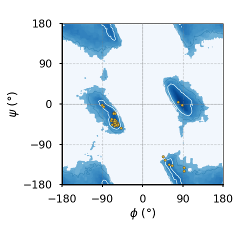
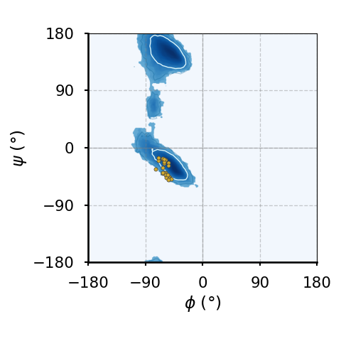
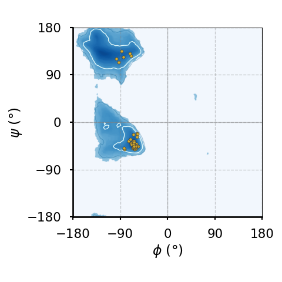
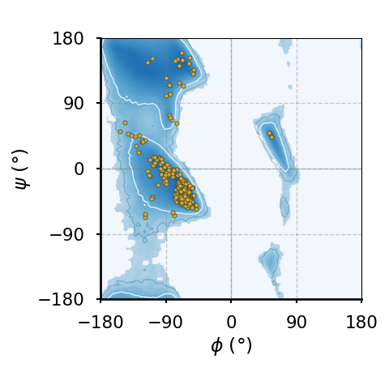
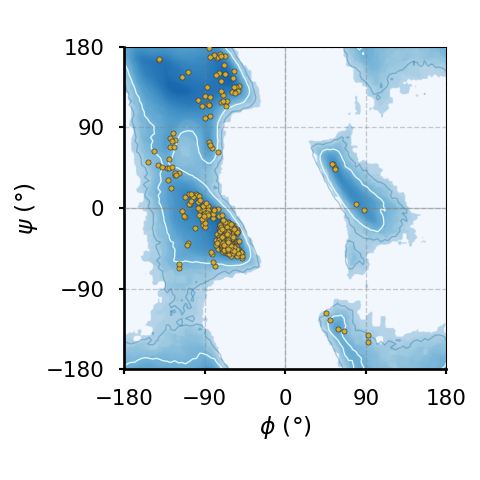
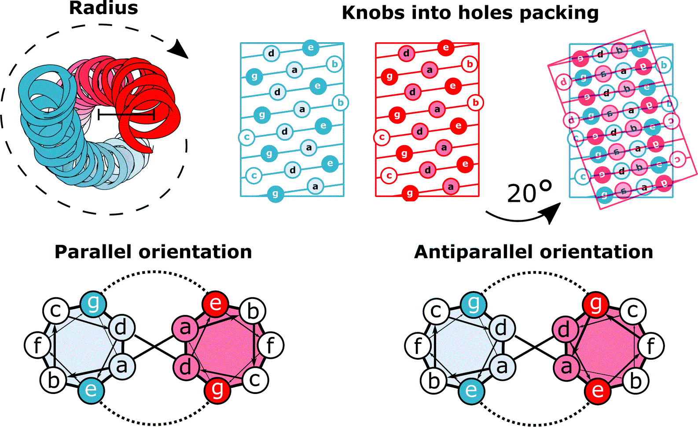
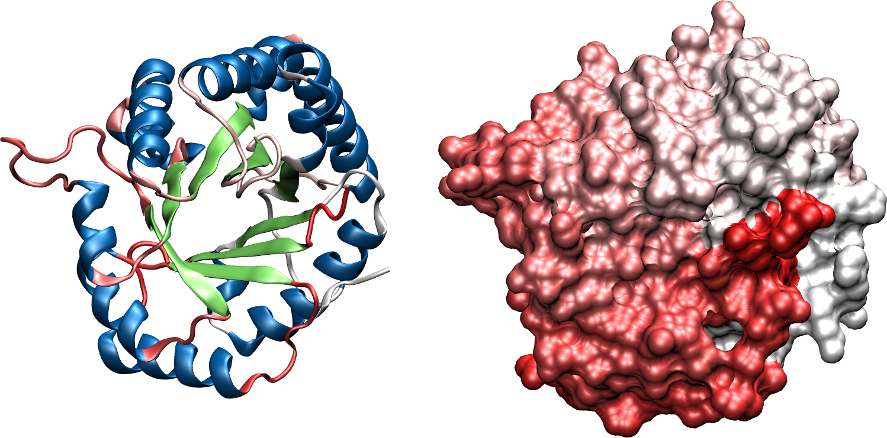
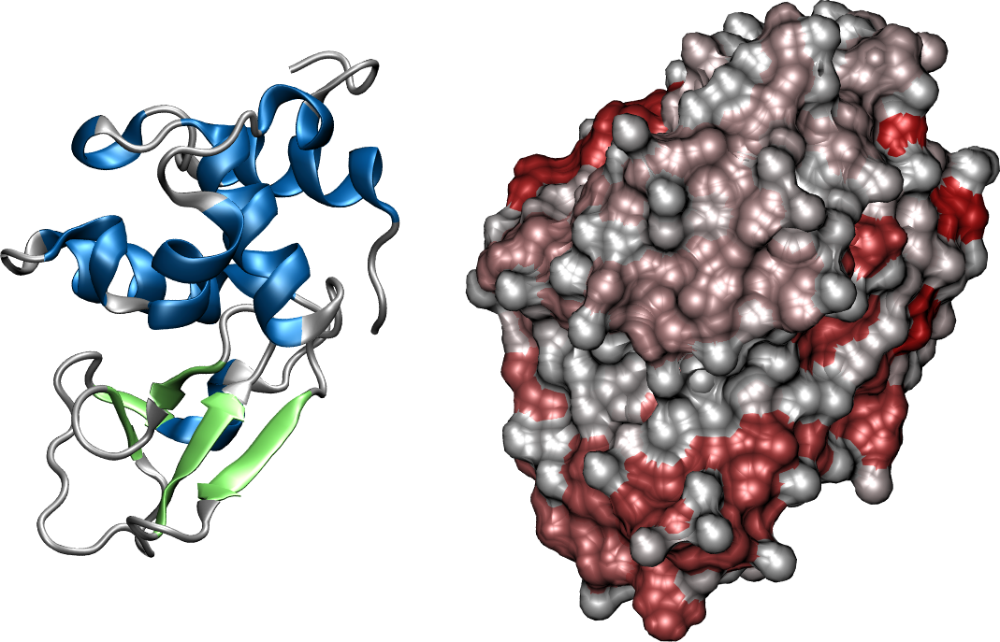

```{tip}
The main references for this part are @finkelstein2002protein, @lehninger2005lehninger, and @schlick2010molecular.
```

```{figure} figures/hemoglobin_introduction.png
:name: fig:hemoglobin-introduction
:align: center

A protein (hemoglobin) represented in two different ways: (a) as a collection of atoms, shown as Van der Walls spheres, and (b) by putting emphasis on the covalent bonds that connect the atoms. The colour coding is: carbons are black, oxygens are reds, nitrogens are blue, phospori are yellow.
```

Proteins (an example of which is shwon in [](#fig:hemoglobin-introduction), are macromolecules composed by amino acids linked by peptide bonds. Let's understand what these two things are.

# Amino acids

An amino acid (AA) is a molecule that consists of

* an amino group: A functional group containing nitrogen, written as $-NH_2$. At neutral pH (pH $\approx 7$) this group is protonated, *i.e.* it becomes $-NH_3^+$.
* a carboxyl group: A functional group consisting of a carbon atom double-bonded to an oxygen atom and bonded to a hydroxyl group, written as $-COOH$. At neutral pH (pH $\approx 7$) this group is negatively charged by donating a proton, becoming $-COO^-$. Note that the carbon of this group is often named $C'$ to distinguish it from the carbons of the side chains.
* a side chain (R group): A variable group that differs among amino acids and determines the characteristics and properties of each amino acid. The side chain can be as simple as a hydrogen atom (as in glycine) or more complex like a ring structure (as in tryptophan).
* a central carbon atom ($C^\alpha$) that links together the three foregoing chemical groups plus an additional hydrogen atom.

```{figure} figures/amino_acids.png
:name: fig:amino-acids
:align: center

(A) The structure of a generic amino acid with side chain R. (B) A cartoon showing the spatial difference between the left-handed (L) and right-handed (D) amino-acid enantiomers. (C) Another representation showing that looking down the $H-C^\alpha$ towards the latter, the first letter(s) of the chemical groups read in clockwise order spell out a proper word ($CORN$) for L-amino acids, but a non-existing word ($CONR$) for D-amino acids. In (B) and (C) the chemical groups are coloured as in panel (A).
```

The four bonds of the $C^\alpha$ are arranged in a tetrahedral fashion, which means that all amino acids but glycine[^glycine] are chiral molecules: each AA can, in principle, exist into two distinct forms that are one the mirror image of the other (*i.e.* they are [enantiomers](https://en.wikipedia.org/wiki/Enantiomer)). [](#fig:amino-acids) shows the chemical structure of amino acids in panel (A), and the two enantiomers in panel (B) with two different representations. For reasons that are not yet understood, most proteins found in nature are made of L-amino acids[^D-proteins]. By contrast, D-amino acids, which are synthesised by special enzymes, are rare but present in living beings, being involved in some specific biological processes (see *e.g.* [](doi:10.1007/s00018-010-0571-8) and references therein).

(sec:AA_list)=
## List of amino acids

Given the generic nature of the side chain $R$, there exist countless different amino acid molecules. However, there are 20 standard amino acids that are commonly found in proteins and are encoded by the genetic code. These 20 amino acids are the building blocks of proteins in all known forms of life. 

```{figure} figures/structures_amino_acids.png
:name: fig:structures_AA
:align: center

The chemical structure of the 20 standard amino acids. As discussed in the text, the AAs are separated into categories according to the properties of their side chains ($R$ groups). Adapted from [here](https://commons.wikimedia.org/wiki/File:Amino_Acids002.svg).
```

[](#fig:structures_AA) shows the chemical structure of the 20 standard amino acids, together with their three- and one-letter abbreviations. In the figure the AAs are grouped in the following classes:

1. Charged amino acids: AAs with side chains that are charged at physiological pH, making them highly hydrophilic. These are:
    * Lysine (Lys, K) and Arginine (Arg, R) - positively charged
    * Aspartic acid (Asp, D) and Glutamic acid (Glu, E) - negatively charged
    * Histidine (His, H) - being [amphoteric](https://en.wikipedia.org/wiki/Amphoterism), can be positively charged, negatively charged or neutral depending on the pH, playing a role in enzyme active sites.
2. Polar unchaged armino acids: AAs with side chains that can form hydrogen bonds, making them hydrophilic but not charged at physiological pH. These are:
    * Serine (Ser, S), Threonine (Thr, T), Asparagine (Asn, N), Glutamine (Gln, Q)
    * Cysteine (Cys, C) - has been traditionally considered a polar (hydrophilic) AA, but this view has been challenged, which is why here it is listed among the hydrophobic AAs. See for instance [](doi:10.1016/S0014-5793(99)01122-9).
3. Aromatic amino acids: AAs with side chains with aromatic rings, contributing to protein structure and function through stacking interactions. These are:
    * Phenylalanine (Phe, F), Tryptophan (Trp, W) - the side chains have a strong hydrophobic character
    * Tyrosine (Tyr, Y) - the presence of the hydroxil group $-OH$ endowes this AA with both hydrophobic and hydrophilic features
4. Hydrophobic amino acids: AAs with side chains that are hydrophobic and likely to be found in the interior of proteins. These are:
    * Glycine (Gly, G), Alanine (Ala, A), Valine (Val, V), Isoleucine (Ile, I), Leucine (Leu, L), Methionine (Met, M), Proline (Pro, P)
    * Cysteine (Cys, C) - has been traditionally considered a polar (hydrophilic) AA, but this view has been challenged, which is why here it is listed among the hydrophobic AAs. See for instance [](doi:10.1016/S0014-5793(99)01122-9).

:::{note} Non-standard amino acids
In addition to the 20 standard amino acids, there are a few non-standard amino acids that are found in some proteins or are used in specialized biological processes. Two notable ones are:

* Selenocysteine (Sec, U): Sometimes referred to as the 21st amino acid, it is incorporated into proteins by a unique mechanism that involves a specific tRNA and a specific sequence in the mRNA.
* Pyrrolysine (Pyl, O): Sometimes referred to as the 22nd amino acid, it is found in some archaeal and bacterial proteins and is also incorporated by a specific tRNA and sequence in the mRNA.

There are also many other amino acids that are not incorporated into proteins but have important roles in metabolism, such as ornithine and citrulline. Additionally, post-translational modifications can lead to the formation of amino acid derivatives within proteins, such as phosphorylated serine or hydroxyproline.
:::

Note that in amino acids, the carbon atoms in the side chains are named systematically based on their position relative to the alpha carbon $C^\alpha$. The naming convention is to use successive Greek letters (and possibly numerals for branched side chains) to denote each carbon atom, where the beta carbon, $C^\beta$, is attached to $C^\alpha$, $C^\gamma$ follows the beta carbon, and so on and so forth.

Here are some examples:

* In alanine the side chain has only one carbon, the beta carbon $C^\beta$.
* In leucine the side chain has four carbons and branches at the gamma carbon, so that the names are $C^\beta, C^\gamma, C^{\delta_1},$ and $C^{\delta_2}$.
* In lysine the side chain has four carbons: $C^\beta, C^\gamma, C^\delta$, and $C^\epsilon$.

[^glycine]: To convince yourself that glycine is not chiral substitute R with H in the rightmost subpanel of [](#fig:amino-acids)(C) and look down the $R-C^\alpha$ bond towards $C^\alpha$: you will see that the resulting view is the same as that of the leftmost panel, which makes the two "enantiomers" identical.
[^D-proteins]: Incorporation of D-amino acids in proteins has been observed to occur only outside of ribosomes. [](doi:10.1007/s00018-010-0571-8) reports some examples.

## Post-translational modifications

Post-translational modifications (PTMs) are chemical changes that occur to amino acids in proteins after they have been synthesized by ribosomes during the translation process. These modifications are essential for the proper functioning, regulation, and localization of proteins within the cell. PTMs can influence a protein's activity, stability, interactions with other molecules, and overall role in cellular processes. They are critical in the fine-tuning of protein functions and can affect the protein's behavior in various physiological contexts.

One of the most common types of PTMs is [phosphorylation](https://en.wikipedia.org/wiki/Protein_phosphorylation), which involves the addition of a phosphate group ($-PO_4$) to specific amino acids within the protein, typically serine, threonine, or tyrosine. A phosphate is charged and hydrophilic, so that its addition to side chains alters the interaction with nearby amino acids, making phosphorylation a key regulatory mechanism that can activate or deactivate enzymes, receptors, and other proteins, thereby modulating signaling pathways and cellular responses. This modification is reversible and can be dynamically regulated by kinases (which add phosphate groups) and phosphatases (which remove them), allowing for precise control of protein function.

Another important PTM is [glycosylation](https://en.wikipedia.org/wiki/Glycosylation), where carbohydrate groups are attached to specific amino acid, often asparagine (N-linked glycosylation) or serine/threonine (O-linked glycosylation). Glycosylation plays a critical role in protein folding, stability, and cell-cell communication. It can also affect the protein's immunogenicity and its recognition by other molecules, influencing processes such as immune responses and cellular adhesion.

Additional types of PTMs include ubiquitination, where ubiquitin proteins are attached to lysine of a target protein, marking it for degradation by the proteasome[^proteasome]. [Acetylation](https://en.wikipedia.org/wiki/Protein_acetylation), the addition of an acetyl group ($−COCH_3$) to lysine, can impact protein stability and gene expression by modifying histones and other nuclear proteins. [Methylation](https://en.wikipedia.org/wiki/Protein_methylation), the addition of methyl groups ($-CH_3$), typically occurs on lysine and arginine and can regulate gene expression and protein-protein interactions.

Finally, a very common PTM is the hydroxylation of proline, whereby a proline's pyrrolidine ring gains a hydroxyl ($-OH$) group. It is one of the main components of [collagen](#sec:collagen) which, as we will see in a few lessons, is a structural protein that provides strength, support, and elasticity to connective tissues throughout the body.

[^proteasome]: Proteasomes are large, multi-protein complexes responsible for degrading and recycling damaged, misfolded, or unneeded proteins within the cell. It recognizes proteins tagged with the small protein [ubiquitin](https://en.wikipedia.org/wiki/Ubiquitin) and breaks them down into small peptides.

(peptide-bond)=
# The peptide bond

Two amino acids can be linked together through a *peptide bond*, which is a covalent bond that connects the carboxyl group ($-COOH$) of one AA to the amino group ($-NH_2$) of the other. The reaction through which a peptide bond is formed is called "dehydration synthesis" since the carboxyl group loses a hydroxyl group ($-OH$), and the amino group loses a hydrogen atom ($-H$), which combine to form a water molecule ($H_2O$) that is released in solution. Once an AA has been incorporated into the growing chain and the water molecule has been removed, what remains of the molecule is called an *amino acid residue*, or just *residue*. Note that under physiological conditions this reaction is not spontaneous, and therefore requires catalysis (usually performed by ribosomes).

```{figure} figures/peptide_bond.png
:name: fig:peptide-bond
:align: center

The formation of a dipeptide through a dehydration synthesis: two amino acids are joined together, and a water molecule is subsequently released. The peptide bond is indicated by the arrow.
```

[](#fig:peptide-bond) shows the chemical reaction that takes place when two amino acids are joined together, highlighting the peptide bond that links them. The generic term for a chain of amino acids connected by peptide bonds is *polypeptide*, which is a class of biopolymers that comprises (but is not strictly equivalent to) proteins. While there is some ambiguity in the definition, a polypeptide is considered to be a protein when it takes a specific three-dimensional structure[^intrinsically_disordered] and a well-defined biological function. Note that by this definition a protein is not necessarily formed by a single polypeptide chain. Indeed, there are many proteins, like hemoglobin, that are made of multiple polypeptide units linked by non-covalent bonds (see [](#sec:quaternary_structure) for a more comprehensive discussion on this matter).

```{important}
The peptide bond has a partial double-bond character arising from resonance: the lone pair of electrons on the nitrogen delocalizes to the carbonyl oxygen, creating a double-bond character between the carbon and nitrogen that restricts rotation around the peptide bond, making it planar and rigid.
```

The linear sequence of amino acids that are covalently linked together by peptide bonds to form a polypeptide chain is called *the primary sequence* of a protein. The primary sequence is the most basic level of protein structure and dictates the specific order in which amino acids are arranged, and it determines the protein's ultimate shape and function through interactions that lead to higher levels of structural organization which we will discuss later on. As a result, any changes or mutations in the primary sequence can significantly impact the protein's overall structure and function.

[^intrinsically_disordered]: Contrary to this definition, [not all proteins have a specific three dimensional structure](https://en.wikipedia.org/wiki/Intrinsically_disordered_proteins), either because they are fully intrinsically-disordered, or because they contain regions that are intrinsically disordered.

## Trans and cis conformations

```{figure} figures/trans_cis.png
:name: fig:trans-cis
:align: center
:width: 400

Typical trans and cis conformations of the backbone portion of a single amino acid. In the trans conformation the alpha carbons and their attached side chains are opposite to each other, making this configuration much more stable than the cis conformation, which is rarely observed in proteins.
```

The planarity of the peptide bond means that amino acids can take two distinct conformations around it:

1. *Trans* conformation: the alpha carbon atoms of the adjacent amino acids are positioned on opposite sides of the peptide bond. This arrangement is more stable and commonly observed in proteins because it minimizes steric hindrance between the carbons and side chains of the amino acids.
2. *Cis* conformation: the alpha carbon atoms of the adjacent amino acids are positioned on the same side of the peptide bond. This conformation is less stable due to increased steric clashes between the carbons and side chains, making it less common.

The trans conformation is energetically favorable and typically found in the vast majority of peptide bonds in proteins, while the cis conformation can be found in certain regions of proteins, especially involving the amino acid proline, whose unique cyclic structure partially stabilises the cis conformation.

(sec:molecular_vibrations)=
# Molecular vibrations

The length of chemical (covalent) bonds is of the order of an angstrom, with $C-H$, $O-H$ and $N-H$ being almost exactly $1 \,\angstrom$, $C-C$ being $\approx 1.5 \,\angstrom$, and $C=O$ and the peptide bond $C-N$ being in between ($\approx 1.3\, \angstrom$).

Regarding covalent bond angles, these depend on the nature of the hybridization. We are primarily concerned with sp$^2$- and sp$^3$-hybridized atoms, which result in planar (approximately $120^\circ$) and tetrahedral (approximately $109.5^\circ$) structures, respectively. In polypeptides, sp$^2$ hybridization is observed in the carbon and nitrogen atoms of the peptide bond, while sp$^3$ hybridization is seen in the alpha carbon, which forms four bonds, and in oxygen and sulfur atoms, which typically form two bonds.

As we will discuss [later](./all_atom.md), vibrations of bond lengths and angles have characteristic frequencies associated to the infrared (IR):

* The bond lengths of interest have typical frequencies that go from $3 \cdot 10^{13}$ Hz for $C-C$ to $9 \cdot 10^{13}$ Hz for $C-H$ (corresponding to 1000 cm$^{-1}$ and 3000 cm$^{-1}$, respectively)
* Bond angles have typical frequencies of $1.8 \cdot 10^{13}$ to $2.7 \cdot 10^{13}$ Hz for $C^\alpha$, $1.5 \cdot 10^{13}$ to $2.4 \cdot 10^{13}$ Hz for $C$, and $2.1 \cdot 10^{13}$ to $3.6 \cdot 10^{13}$ Hz for $N$ (500 to 1200 cm$^{-1}$ for the total range).

The values of these typical frequencies can be compared to the thermal energy, $k_B T$, by using Planck's relation, $U = h \nu$, which yields

$$
\nu_{\rm th} = \frac{k_B T}{h} \approx 6.2 \cdot 10^{12} \, {\rm Hz}.
$$

Noting that this value is roughly half of the lowest vibrational or bending frequency reported above, we can conclude that thermal energy does not significantly impact bond stretching and angle bending vibrations[^bond_angles]. As a result, covalent bond and angle vibrations contribute very little to the conformational flexibility of polypeptides, at least under normal conditions.

[^bond_angles]: Temperature-induced fluctuations of bond angles are somewhat larger than those of bond lengths, and therefore cannot be disregarded completely. However the effect is rather minor, as typical amplitudes ar of the order of $5^\circ$ (@finkelstein2002protein).

By contrast, the typical frequencies of rotations around single bonds are generally much lower than those of bond stretching or bond angle bending vibrations. In fact, some of these frequencies are in the range that is accessible by thermal energy at room temperature, endowing polypeptides with a rotational flexibility that is essential for their conformational dynamics, allowing them to adopt various functional states.

```{figure} figures/dihedral.png
:name: fig:dihedral
:align: center
:width: 400px

The dihedral angle $\varphi$ is defined as the angle formed by the planes determined by the $ABC$ and $BCD$ atoms, which are connected by covalent bonds represented by blue lines. Note that in this picture only one of the two possible choices for the  angle, *i.e.* the dihedral angle $\varphi$, is shown explicitly (see text for details).
```

The rotation angle around a bond is called torsional or *dihedral* angle, which, as shown in [](#fig:dihedral), is the angle formed by two intersecting planes determined by the positions of four atoms. Given the four atoms in figure, $ABCD$, let $\overrightarrow{XY}$ be the vector connecting two covalently linked atoms $X$ and $Y$. Given the ambiguity of defining the normal to a plane, the definition of the torsional angle requires a convention. If we choose to define the normal vector to the $ABC$ plane as $\vec{n}_1 = \overrightarrow{AB} \times \overrightarrow{BC}$, the two normal vectors to the $BCD$ plane are

$$
\begin{aligned}
\vec{n}_2 & = \overrightarrow{DC} \times \overrightarrow{CB}\\
\vec{n}'_2 & = \overrightarrow{BC} \times \overrightarrow{CD} = -\vec{n}_2.
\end{aligned}
$$

We can now define two torsional angles, $\varphi$, $\hat{\varphi}$, as the angles between the normal vectors, *viz.*

$$
\begin{aligned}
\cos \varphi &= \frac{\vec{n}_1 \cdot \vec{n}_2}{\lVert \vec{n}_1 \rVert \lVert \vec{n}_2 \rVert}\\
\cos \hat{\varphi} &= \frac{\vec{n}_1 \cdot \vec{n}'_2}{\lVert \vec{n}_1 \rVert \lVert \vec{n}'_2 \rVert} = -\cos \varphi.
\end{aligned}
$$

The two angles are connected by the relation $\varphi + \hat{\varphi} = \pi$. Following @schlick2010molecular, I will call $\varphi$ the dihedral angle, and $\hat{\varphi}$ the torsional angle, although the two terms are often used interchangeably.

As noted [above](#peptide-bond), the peptide bond, whose associated dihedral angle is called $\omega$, has a partial double-bond character that restricts rotations around it. The peptide bond is considered to be "planar", *i.e.* that the dihedral angle takes values $\omega = \pi$ (trans) or $\omega = 0$ (cis), with the latter, as we said, being somewhat less common. Deviations from these values are considered to be rare, but this view has been challenged (see *e.g.* [](doi:10.1073/pnas.1107115108)).

By contrast, rotations around bonds that connect sp$^2$- and sp$^3$-hybridized atoms are associated to energy barriers that are of the order of $k_BT$ and therefore are the main contributors to the flexibility of the macromolecules. In the main chains of peptides the dihedral angles involved in these rotations are those associated to the $N - C^\alpha$ and $C^\alpha - C$ bonds, which are called $\phi$ and $\psi$.

```{figure} figures/phi_psi.png
:name: fig:phi-psi
:align: center
:width: 250px

A polypeptide backbone showing the definition of the dihedral angles $\phi$, $\psi$ and $\omega$. Credits to [Dcrjsr and Adam Rędzikowski via Wikimedia Commons](https://commons.wikimedia.org/w/index.php?curid=24585750).
```

A graphical representation of a part of a polypeptide backbone with its associated dihedral angles is shown in [](#fig:phi-psi).

(sec:ramachandran)=
## Ramachandran Plots

The small energy barriers associated to rotations around $\phi$ and $\psi$ only take into account the atom themselves, not the rest of the molecule to which they are attached. Steric hindrances, resulting from the repulsive interactions between atoms and groups attached to the $C$, $C^\alpha$ and $N$ atoms, disfavor or even prohibit certain combinations of $(\phi, \psi)$ values.

A graphical representation of the allowed and disallowed dihedral angles of amino acid residues in protein structures is the Ramachandran plot, introduced for the first time in [](doi:10.1016/S0022-2836(63)80023-6). By plotting $\phi$ and $\psi$ on the $x$ and $y$ axes, respectively, the plot reveals regions where the angles are sterically favorable, corresponding to common secondary structures and motifs like $\alpha$-helices and $\beta$-sheets which will be introduced below. This visualization is crucial for validating protein structures, as it highlights conformational possibilities and identifies potential structural anomalies (*i.e.* AA conformations that lie in disallowed regions of the plot).

```{warning}
In many papers and books on the subject of protein structure, there is an important fact that is often not stressed or even omitted (perhaps because it should be obvious to people who, unlike us, know some biochemistry): in the original explanation of the Ramachandran plot, the steric clashes that contribute to excluding some $(\phi, \psi)$ combinations are those involving at least third neighbours (often called 1-4 interactions).
```

Given a protein structure, it is possible to extract and plot the $\phi$ and $\psi$ values obtained for each residue on the same figure. However, different amino acids display different flexibilities depending on their associated side chains. Therefore, it is common to produce multiple Ramachandran plots, each serving specific purposes and providing insights into various aspects of protein structure and conformation. The most common ones are:

* **Glycine Ramachandran Plot:** glycine residues have more conformational freedom due to the absence of a side chain, and therefore a wider range of allowed $\phi$ and $\psi$ angles compared to the general case, reflecting the famous enhanced flexibility of this AA.
* **Pre-Proline Ramachandran Plot:** residues that precede proline in the primary sequence often exhibit distinct conformational preferences given by the steric influence of proline.
* **Proline Ramachandran Plot:** proline residues have restricted $\phi$ and $\psi$ angles due to the cyclic nature of its side chain, resulting in a limited range of conformations, highlighting the unique structural constraints of this AA.
* **Ile-Val Ramachandran Plot:** the branched carbons of isoleucine (Ile) and valine (Val) give them a distinct shape of disallowed $\phi$-$\psi$ regions.
* **General Ramachandran Plot:** $\phi$ and $\psi$ angles for all residues that are not part of one of the foregoing categories.

```{figure}
:name: fig:ramachandran_plot
:align: center

(fig:ramachandran_plot-a)=

(fig:ramachandran_plot-b)=

(fig:ramachandran_plot-c)=

(fig:ramachandran_plot-d)=

(fig:ramachandran_plot-e)=

(fig:ramachandran_plot-f)=


Ramachandran plots of amino acids that compose the human hemoglobin protein [1A3N](https://www.rcsb.org/structure/1A3N) (points), plotted on background  85th and 75th centiles contour lines, white and blue lines, respectively, generated by analysing the Top8000 PDB data set. I have used a modified version of [this software](https://github.com/Joseph-Ellaway/Ramachandran_Plotter) to make the plots.
```

[](#fig:ramachandran_plot) shows examples of the plot types described above, with the empty (non-coloured) "space" being associated to angle combinations that are sterically forbidden. The points in the panels refer to the $(\phi, \psi)$ combinations of the residues of the human hemoglobin protein, while the background contour plots have been calculated by extracting the values of $\phi$ and $\psi$ from 8000 reference protein structures listed in a database[^ramachandran_plot_reference].

A comparison between [](#fig:ramachandran_plot-a) and the other plots shows that glycine has a much greater conformational flexibility than any other AA. By contrast, [pre-prolines](#fig:ramachandran_plot-b) and [prolines](#fig:ramachandran_plot-c) (and, to a smaller extent, [leucines and valines](#fig:ramachandran_plot-d)) are much more constrained than an [average AA](#fig:ramachandran_plot-e).

[^ramachandran_plot_reference]: While it is not explicitly stated in the repository of [the software](https://github.com/Joseph-Ellaway/Ramachandran_Plotter) I have used to make the figure, I believe that the reference Top8000 database used is [this one](http://kinemage.biochem.duke.edu/research/top8000/). The updated version of the same database can instead be downloaded [here](https://zenodo.org/records/5777651).

## Non-covalent interactions

A closer look at the plots also reveals that $\phi \approx 0$ configurations are forbidden, while $\psi \approx 0$ are infrequent but not entirely disallowed. What is the difference between these two situations? And, more generally, what causes the shape of the Ramachandran plots?

The "forbidden" regions on this plot correspond to combinations of these angles that result in significant steric clashes and unfavourable interactions, making these conformations highly improbable or energetically unfavorable. These interactions are termed *noncovalent*, since they arise between pairs of atoms that are not involved in a bond. I will briefly sketch the most important noncovalent interactions in this context. Of course, as shown in [](#fig:ramachandran_plot), the absolute and relative importances of these terms depend not only on the nature of the amino acid, but also on its local environment.

(sec:van-der-waals)=
### Van der Waals interactions

The most prominent reason for the forbidden regions is steric hindrance, where atoms are positioned too closely together, leading to repulsive forces. This happens when the dihedral angles place the backbone or side chain atoms in close proximity, causing overlaps or severe crowding, making some conformations energetically unfavorable.

The atom-atom repulsion is a general phenomenon occurring when electron clouds belonging to atoms with fully-occupied orbitals overlap. The repulsion is caused by  the Pauli exclusion principle, which prevents two electrons from occupying the same quantum state, and it is a steeply increasing function of the decreasing interaction distance. It is common to model the functional dependence of the repulsive interaction energy on $r$, the interatomic distance, with the (heuristic) form $\sim r^{-12}$, which is not based on first-principles calculations but is computationally cheap and good enough for most purposes (@leach2001molecular, @schlick2010molecular).

When the atom-atom interdistance is sufficiently larger, quantum mechanical effects lead to attractive forces (the most important being the famous dispersion or [London](doi:10.1007/BF01421741) force) that arise from temporary dipoles induced in atoms or molecules as electrons move around. In general, the total attractive contribution is the sum of three contributions having the same functional dependence on distance, $r^{-6}$ (see *e.g.* @israelachvili2011intermolecular).

```{figure} figures/LJ.png
:name: fig:LJ
:align: center
:width: 500px

The Lennard-Jones potential, often used to model van der Waals interactions.
```

The total interaction, which is the sum of the two terms, is termed van der Walls interaction and is often modelled with the famous Lennard-Jones (LJ) potential, *viz.*

$$
V(r) = \epsilon \left( \left( \frac{r_{\rm min}}{r} \right)^{12} - 2 \left( \frac{r_{\rm min}}{r} \right)^{6} \right),
$$

where $\epsilon$ is the depth of the minimum arising from the competition between attraction and repulsion, and $r_{\rm min}$ is its position. A plot of the LJ potential is presented in [](#fig:LJ). The figure highlights an additional length, $r_0$, which is the distance at which the energy becomes positive, and therefore can be seen as an estimate for the minimum distance below which two atoms "clash"[^LJ_parameters]. Therefore, the value that $r_0$ takes for each pair of noncovalent interaction can be useful to estimate the stability of a given conformation.

:::{tip} An alternative form of the Lennard-Jones potential
In molecular simulations, it is common to express the LJ potential in the following slightly different manner:

$$
V(r) = 4 \epsilon \left( \left( \frac{\sigma}{r} \right)^{12} - \left( \frac{\sigma}{r} \right)^{6} \right),
$$

where $\sigma = r_0$ is also known as the "diameter" of the atom.
:::

:::{table} Typical values for the parameters of the van der Walls interaction between same-type atoms (listed in the first column), as reported in @finkelstein2002protein.
:label: tbl:vdW
:align: center

| Atom | $\epsilon$ (kcal / mol) | $\beta \epsilon = \epsilon / k_BT$ at 298 K|$r_{\rm min}$ ($\angstrom$) | $r_0$ ($\angstrom$) |
| :--- | :---: | :---: | :---: | :---: |
| $H$ | 0.12 | 0.20 | 2.4 | 2.0 |
| $C$ | 0.12 | 0.20 | 3.4 | 3.0 |
| $O$ | 0.23 | 0.39 | 3.0 | 2.7 |
| $N$ | 0.20 | 0.34 | 3.1 | 2.7 |
:::

Typical values for $\epsilon$, $r_0$ and $r_{\rm min}$ for the main self interactions, *i.e.* interactions between atoms of the same type, are listed in [](#tbl:vdW). Note that the interaction strengths are always smaller than $k_BT$ at ambient temperature. In the case of mixed interactions between atoms of type $i$ and $j$, there exist several [combining rules](https://en.wikipedia.org/wiki/Combining_rules) to estimate the values of the van der Waals parameters (see @leach2001molecular for a discussion). The most common are the Lorentz-Berthelot rules, which amount to taking the arithmetic mean for the radii and the geometric mean for the energy strengths:

$$
\begin{aligned}
r_{\rm min}^{ij} &= \frac{r_{\rm min}^{ii} + r_{\rm min}^{jj}}{2}\\
\epsilon_{ij} & = \sqrt{\epsilon_{ii}\epsilon{jj}}.
\end{aligned}
$$

```{figure} figures/steric.png
:name: fig:steric
:align: center
:width: 500px

Cis conformation over $\phi$ (left) and over $\psi$ (right). The numbers above the dashed lines are the average distances between $C$ (left) and $N$ (right) atoms.
```

We are now equipped to rationalise our observation that values of $\phi \approx 0$ are forbidden, while conformations with $\psi \approx 0$ are infrequent but not impossible. The difference between the typical conformations having these dihedral values can be appreciated by looking at [](#fig:steric): in both cases the two 1-4 atoms connected to the atoms involved in the bond that defines the dihedral lie in the same half-plane and are roughly at the same distance ($\approx 2.9 \, \angstrom$). However, in the $\phi$ case the two atoms are both carbons, which have a "minimum allowed distance" of $r_0^{\rm CC} \approx 3.0 \, \angstrom$, making this conformation essentially forbidden. By contrast, in the $\psi$ case both atoms are nitrogens, so that the minimum allowed distance is $r_0^{\rm NN} \approx 2.7 \, \angstrom$, which is smaller than the actual $N-N$ distance: according to the effect of this 1-4 interaction, this conformation is allowed.

Of course, even if we look at the contributions due to van der Waals forces only, there are other atom-atom interactions that forbid specific conformations. These interactions involve mostly the oxygen, the alpha carbon and the $N$ hydrogen of the backbone, but also the side chains. However, in the latter case the main contributor is the beta carbon, which is why the only AA lacking it, glycine, has a distinctively different Ramachandran plot.

[^LJ_parameters]: In writing this part I was heavily inspired by @finkelstein2002protein, but I'm swapping the names of the two characteristic distances, $r_0$ and $r_{\rm min}$, which I found misleading in the original discussion.

(sec:hydrogen-bonds)=
### Hydrogen bonds

Certain combinations of $\phi$ and $\psi$ angles can prevent the formation of hydrogen bonds, which are particular bonds that can link amino acids between them and with water molecules (or other solutes): if the backbone dihedral angles do not permit optimal hydrogen bonding, the conformation is unlikely to be stable or favorable. But what is a hydrogen bond?

A hydrogen bond (HB) is a type of weak chemical bond that occurs when a hydrogen atom, which is covalently bonded to an electronegative atom (like oxygen, nitrogen, or fluorine), experiences an attraction to another electronegative atom in a different molecule or a different part of the same molecule, and can be understood in terms of electrostatic interactions. Indeed, atoms like nitrogen, oxygen, and fluorine are highly electronegative, meaning they have a strong tendency to attract electrons. In a molecule, when hydrogen is covalently bonded to an electronegative atom, the shared electron is drawn closer to it, creating a partial negative charge on it and a partial positive charge on the hydrogen atom which generates an uneven distribution of electron density. If the hydrogen atom comes close enough to another electronegative atom having a partial negative charge, the electrostatic interaction between the opposite partial charges will give raise to an effective attraction. This effect can create reversible bonds between different molecules, or between different parts of the same molecule.

```{important}
Molecules or chemical groups capable of participating in hydrogen bonds are called *polar*.
```

Notable examples in this context are mainly those in which there are $O$ and $N$ atoms involved: $O-H :: O$, $N-H :: N$, $O-H :: N$, *etc.*, where $::$ is shorthand for a hydrogen bond. In all these cases, the atom covalently bound to the hydrogen (or sometimes the whole group) is called the *donor*, while the other one (or the molecule it is part of) is the *acceptor*. As a rule of thumb, the number of HBs that an electronegative atom can accept is equal to its number of lone pairs[^lone_pairs], which is one for nitrogen and two for oxygen. 

We now look at the geometry of a hydrogen bond. In a HB, the distance between the acceptor and the hydrogen atom varies slightly depending on the specific molecules and environmental conditions, but typically ranges from $1.8$ to $2.2\, \angstrom$. As a result, the distance between the acceptor and the atom covalently bonded to the hydrogen is close to $r_{\rm min}$, the optimal van der Waals distance for interactions involving $O$ and/or $N$. 
A fundamental property of hydrogen bonds is that, unlike in van der Waals interactions, HBs are highly directional: their strength depends on the relative orientations of the chemical groups involved. Specifically, the optimal hydrogen bond occurs when the donor atom, hydrogen atom, and acceptor atom are aligned linearly, with an angle close to $180^\circ$. Deviation from this linear alignment results in weaker hydrogen bonds, or even bond breakage if it exceeds $\approx 20-30^\circ$.

```{figure} figures/hydrogen_bonds.png
:name: fig:hydrogen_bonds
:align: center

(a) Typical distances in a hydrogen bond. (b) Optimal hydrogen bonds are linear, but small deviations are possible. (c) Hydrogen bonds in a liquid water molecular dynamics simulation, with some acceptor-hydrogen distances highlighted (credits to [Splette and Wikimedia](https://commons.wikimedia.org/wiki/File:Liquid_water_hydrogen_bond.png)).
```

[](#fig:hydrogen_bonds) shows a schematic view of the main properties of hydrogen bonds, together with a simulation snapshot of liquid water where some hydrogen bonds are explicitly highlighted.

The importance of HBs on the association of molecules can be appreciated by looking at the following table, which shows the melting and boiling temperatures at ambient pressure, $T_m$ and $T_b$, of 3 molecules of similar weight:

|Molecule|# of HBs|Molecular weight|$T_m$|$T_b$|
|:---|:---:|:---:|:---:|:---:|
| [Methane](https://www.engineeringtoolbox.com/methane-d_1420.html), $CH_4$ | 0 | 16 g/mol | $-182.6^\circ \, {\rm C}$ | $-161.6^\circ \, {\rm C}$ |
| [Ammonia](https://www.engineeringtoolbox.com/ammonia-d_971.html), $NH_3$ | 1 | 17 g/mol | $-77.7^\circ \, {\rm C}$ | $-33.3^\circ \, {\rm C}$ |
| Water, $H_2O$ | 2 | 18 g/mol | $0^\circ \, {\rm C}$ | $100^\circ \, {\rm C}$ |

Since carbon is very weakly electronegative, it does not form any hydrogen bond. As a result, association in methane, as embodied by the values of $T_m$ and $T_b$, happens at very low temperature, where the attraction is provided by [van der Waals interactions](#sec:van-der-waals) only. However, as electronegativity (and the number of lone pairs) increases from $C$ to $N$ and then $O$, HBs become more and more relevant, substantially increasing the melting and boiling temperatures.

Following @finkelstein2002protein, the strength of hydrogen bonds can be estimated by comparing the (latent) heat of vaporization[^latent_heat] of molecules that are composed by the same atoms, *e.g.* dimethyl ether $H_3C-O-CH_3$, 5 kcal / mol, and ethanol, $CH_3-CH_2-OH$, 10 kcal/mol. Since the latter has an $OH$ group that the former lacks, there is an additional contribution of the latent heat due to one HB per molecule which amounts to $\approx 10 - 5 = 5$ kcal/mol. A similar estimate can be made by using the heat of vaporization of ice (we will see why in a moment), which is $\approx 12$ kcal/mol. Of this value, $\approx 2$ kcal/mol are due to van der Waals interactions, as estimated by looking at the evaporation of analogous, but non-HB-forming, molecules (*e.g.* $CH_4$ or $O_2$). The rest is provided by the two hydrogen bonds that each water molecule can form, yielding again an energy gain of $\approx 5$ kcal/mol per HB. Recalling that, at room temperature, $k_B T \approx 0.6$ kcal / mol, we can estimate that one HB provides $\approx 8\,k_B T$, suggesting that the formation of hydrogen bonds is highly favoured under ambient conditions. The order of magnitude of this value is intermediate between the van der Waals interaction strength, which is a fraction of $k_B T$ (see the table reported in the [previous section](#sec:van-der-waals)), and the strength of covalent bonds, which amounts to hundreds of kJ / mol ($> 100 \, k_B T$).

In water, hydrogen bonds are the main driving force for condensation and ice formation. Since each oxygen can accept two bonds, and each hydrogen can mediate one donor-acceptor interaction, each water molecule can be involved in four bonds that are arranged on a (nearly perfect) tetrahedron. This geometry can be rationalised as follows. In general, electron pairs (both bonding and lone pairs) around a central atom will arrange themselves to minimize repulsion, but the repulsion between lone pairs is greater than the repulsion between bonding pairs. Consequently, the two lone pairs will occupy positions that are as far apart as possible, pushing the bonding pairs closer together. As a result, the four pairs of electrons (two lone pairs and two bonding pairs) around the oxygen atom in water adopt a tetrahedral arrangement to minimize repulsion, with the bond angle between the hydrogen atoms in a water molecule being $\approx 104.5^\circ$, slightly less than the ideal tetrahedral angle of $109.5^\circ$ due to the greater repulsion exerted by the lone pairs.

Since the natural tetrahedral geometry of water molecules leads to the maximum number of HBs, it should not come as a surprise that regular ice has a diamond cubic cell, where each molecule is connected to four others through (almost) linear hydrogen bonds. When ice melts into liquid water, it releases $\approx 1.4$ kcal/mol of heat. In turn, when water turns into vapour at $100^\circ$, $\approx 10$ kcal/mol of boiling heat is released. If we assume that no hydrogen bonds are present in water vapour, we could use these values to estimate that a fraction of $1.4 / (10 + 1.4) \approx 0.12$ breaks when ice melts. However, this is not the case. In fact, it is perhaps surprising that liquid water at ambient conditions has roughly the same number of HBs of ice, *i.e.* $\approx 4$. What happens then when ice melts into liquid water? The hydrogen bonds become looser, and their length and, more importantly, angular fluctuations increase. Of course, these fluctuations have an energetic cost, which is counterbalanced by the entropy provided by the many possible ways of realising disordered networks made of molecules connected by "flexible" hydrogen bonds.

:::{tip} Why does ice float on water?
The famous property of liquid water being denser than ice, which is one of the very many anomalies of water, can be qualitatively understood by considering the geometrical constraints set by hydrogen bonds. 

In hexagonal ice, which is the most stable form of ice at ambient pressure, each water molecule forms four linear hydrogen bonds with neighboring water molecules, creating an almost perfect tetrahedral arrangement that leads to an open, hexagonal lattice structure with a lot of empty space within. By contrast, in liquid water each molecule still participates in nearly four hydrogen bonds. However, these bonds are not fixed and can fluctuate, allowing the molecules to pack closer together, which leads to a higher density, $1.00$ g/cm$^3$ at $4^\circ$ C, compared to that of ice, $0.917$ g/cm$^3$.
:::

We now go back to proteins, with the working hypothesis that, under ambient conditions, all hydrogen bonds are formed[^all_hbs]. If we look at the peptide backbone, we see that it contains nitrogen and oxygen, which are polar groups and can be involved in hydrogen bonds. In addition, as [discussed before](#sec:AA_list), many side chains are polar, or even charged under physiological conditions. As a result, a polypeptide has many chemical groups that can be involved in hydrogen bonds. What partners do these chemical groups bond to: other polar groups or water molecules?

To answer this question let us consider two chemical groups on the same polypeptide, an acceptor $A$ and a donor $D$, that can form a hydrogen bond. Assuming that all hydrogen bonds are formed, there are two possible states: $A$ is bonded to $D$, or they are both bonded to water molecules. The equilibrium between these two states can be described by

$$
A :: HOH + D :: OH_2 \rightleftharpoons A :: D + HOH :: OH_2.
$$

When $D$ and $A$ form a HB, the two water molecules are freed to form hydrogen bonds with other water molecules. Since the number of hydrogen bonds on the left-hand side matches that on the right-hand side, the energy remains essentially unchanged. However, entropic contributions must also be considered:

1. When a hydrogen bond forms between $A$ and $D$, the polypeptide's flexible backbone is typically forced to adopt a more constrained and specific conformation to facilitate this interaction, leading to a loss of conformational freedom and therefore a loss of entropy.
2. When the intramolecular hydrogen bond forms, the water molecules previously bonded to the polar groups are released into the bulk solvent. These water molecules, previously constrained in position and orientation (low-entropy state), now return to a more disordered state, increasing the system's entropy

Interestingly, it turns out that, on average, the entropic contributions of these two effects not only have opposite signs but are also comparable in magnitude (see @finkelstein2002protein for a more thorough discussion), so that the conformation the backbone adopts is "marginally" stable and depends on the local environment rather than on intrinsic factors.

[^lone_pairs]: Pairs of valence electrons that are not shared with another atom in a covalent bond and are not involved in bonding.
[^latent_heat]: The amount of energy (usually expressed per mole) that must be supplied to a liquid to transform it into a gas.
[^all_hbs]: As discussed above, this is not a particularly strong approximation.

### Electrostatic interactions

According to classical electrostatic, the interaction energy between two charges $q_1$ and $q_2$ at distance $r$ in a homogeneous medium is

$$
U(r) = \frac{q_1 q_2}{4 \pi \epsilon r},
$$ (eq:electrostatic_energy)

where $\epsilon = \epsilon_r \epsilon_0$, $\epsilon_r$ is the relative dielectric permittivity of the medium and $\epsilon_0$ is the absolute permittivity of vacuum. Common values of $\epsilon_r$ are $\approx 80$ for water, $\approx 3$ for a folded protein and $1$ for vacuum (or air). However, we are not dealing with homogenous media, as the distances we consider are very much comparable with inter-molecular separations. In [all-atom](./all_atom.md) simulations, solvent and solute atoms and molecules are handled explicitly and therefore there is no "medium" and Eq. [](#eq:electrostatic_energy) is applied with $\epsilon_r = 1$. By contrast, when one is interested in [coarse-grained](./coarse_grained.md) models, where the solvent's effect is described implicitly, or in theoretical considerations, when the description should be as simple as possible, one has to address the question of how to describe the effect of macromolecular charged groups and their interactions.

Let's start by considering what happens inside a protein. If we consider two positive charges separated by a distance of $3 \, \angstrom$, their interaction energy is $\approx 1.5$ kcal/mol ($\approx 2.5 k_BT$) in water, while a whopping $\approx 40$ kcal/mol ($\approx 70 k_B T$) in a non-polarisable medium such as plastics or dry proteins ($\epsilon_r \approx 3$). Such a large repulsion would be enough to destroy a protein, which is usually stabilised by a "reserve" free energy of $\approx 10$ kcal/mol (@finkelstein2002protein). This tells us that charged side chains will not be found close to each other in a protein core. However, we can go further and consider the electrostatic self-energy of a single atom of charge $q$ and radius $R$[^self_energy]:

$$
U_{\rm self} = \frac{q^2}{8 \pi \epsilon R}.
$$

Setting $q = e$ and $R = 1.5\, \angstrom$ yield the same values we obtained for interacting pairs (*i.e.* $\approx 1.5$ kcal/mol in water, $\approx 40$ kcal/mol in the protein), meaning that the cost of having a single charged group inside a protein core exceeds the stability of the protein itself. As a consequence, ionisable side chains are nearly always uncharged when embedded in a core, since the free-energy cost of donating or accepting a $H^+$ (to or from water) is much smaller than the energetic contribution due to the electrostatic self-energy of a charge.

Now we can consider what happens outside of the protein. Following @finkelstein2002protein we can leverage basic[^basic_electrostatics] electrostatics in the presence of dielectric materials to find that even close to the protein surface the dielectric constant is much larger than that inside the core ($\approx 40 \gg 3$). Thus, the charge-charge interaction strength is always severely reduced compared to the vacuum.

Everything said above rests on the assumption that the medium can be regarded as continous and homogeneous. However, when dealing with atomic distances ($\approx \angstrom$), the granularity of the solvent cannot, in principle, be neglected. For instance, if two charges are $3-4 \, \angstrom$ apart, no atoms or molecules can get in between them and affect the resulting electrostatic interaction. However, it turns out that the water molecules that are attracted by the pair of charges and come from the sides are enough to screen the electrostatic interactions almost as if the solvent were homogeneous and had the "macroscopic" dielectric permittivity $\epsilon_r$.

This result should not be surprising if we think about common table salt, $NaCl$: the binding energy between the $Na^+$ and $Cl^-$ ions, if we again take $R = 3 \, \angstrom$, is $-1.5$ kcal/mol and $-120$ kcal/mol in bulk water ($\epsilon_r = 80$) and vacuum ($\epsilon_r = 1$), respectively. Even if the assumption of a perfectly continuous and homogeneous solvent were to break down at short distances, so that the effective dielectric constant were reduced to, say, $\epsilon_r = 20$, the interaction energy would still be $-6.0$ kcal/mol. This is on the order of the strength of a single [hydrogen bond](#sec:hydrogen-bonds) between two water molecules. 

If that were the case, we would expect $NaCl$ to dissolve only very sparingly: the maximum possible concentration of dissolved salt (*i.e.* the saturated solution, where no more ions can be accommodated without precipitating back out as solid crystal) would be comparable to the concentration of water molecules in saturated water vapor, which is $\approx 10^{-4}$ mol / l (or $10^{-4}$ M). In other words, only a very small amount of salt should remain stably dissolved. This observation confirms that the effective dielectric constant of liquid water must remain very high, and therefore close to the bulk value of 80, even when $R \approx 3 \, \angstrom$.

[^self_energy]: This quantity is just the work required to charge up a spherical body of radius $R$, $\int_0^q \frac{q'dq'}{4 \pi \epsilon R}$.
[^basic_electrostatics]: basic but by no means obvious or straightforward.

## Rotamers

Almost all amino acids can adopt different orientations of side chains around single bonds. Exceptions are 

* glycine, which has no rotational freedom in terms of side chain orientation,
* alanine, whose side chain is a methyl group, $-CH3$, which is small and symmetrical, offering no significant variation in rotameric states,
* proline, whose side chain forms a ring by bonding back to the backbone nitrogen, severely restricting the rotation around its side chain.

The distinct conformations of an amino acid at fixed values of $(\phi, \psi)$ are called *rotamers* and arise due to the rotation around the bonds connecting the side chains to the main backbone of the polypeptide chain. The dihedral angles connected to the rotamers are referred to as $\chi$ angles, which describe the rotations around the bonds within the side chains of amino acids. Each rotatable bond in a side chain is associated with a specific $\chi$ angle, labeled sequentially from the backbone outward. For instance, $\chi_1$ is the dihedral angle around the bond between the alpha carbon and the beta carbon, $\chi_2$ is the dihedral angle around the bond between the beta carbon and the gamma carbon, and so on for longer side chains.

Each amino acid side chain can adopt multiple rotameric states, influenced by steric interactions, hydrogen bonding, and other intramolecular forces. The different rotamers contribute to the overall flexibility and diversity of protein structures, allowing proteins to achieve their functional conformations and interact effectively with other molecules.

(sec:primary_structure)=
# Primary structure

The order in which amino acids are linked together by peptide bonds is known as the *primary structure* of a protein. The convention to list the sequence of a protein is to use the one-letter or three-letter codes for amino acids in the sequence, which has a well-defined directionality. The sequence starts at the end of the amino acid chain that has a free amine group ($-NH_2$), which is called N-terminus and, by convention, marks the beginning of a protein. The other end has a free carboxyl group ($-COOH$) and is known as the C-terminus, which is considered the end of the protein.

:::{tip} An example
:class: dropdown

The sequence of [bovine (cow) rhodopsin](https://www.uniprot.org/uniprotkb/P02699/entry#sequences) expressed with the one-letter code is

> MNGTEGPNFYVPFSNKTGVVRSPFEAPQYYLAEPWQFSMLAAYMFLLIMLGFPINFLTLYVTVQHKKLRTPLNYILLNLAVADLFMVFGGFTTTLYTSLHGYFVFGPTGCNLEGFFATLGGEIALWSLVVLAIERYVVVCKPMSNFRFGENHAIMGVAFTWVMALACAAPPLVGWSRYIPEGMQCSCGIDYYTPHEETNNESFVIYMFVVHFIIPLIVIFFCYGQLVFTVKEAAAQQQESATTQKAEKEVTRMVIIMVIAFLICWLPYAGVAFYIFTHQGSDFGPIFMTIPAFFAKTSAVYNPVIYIMMNKQFRNCMVTTLCCGKNPLGDDEASTTVSKTETSQVAPA
:::

# Visualising molecules

When dealing with molecular models, it is very important to be able to visualise the 3D structure of the system. Indeed, visualization tools make it possible to explore the three-dimensional conformation of molecules, helping to identify key structural features (*e.g.* active sites, binding pockets, regions of flexibility, *etc.*). When performing simulations, the are many uses for visualisations. Here I will list the main ones:

1. It is very important to familiarise with the system under investigation: always look at what you simulate!
2. A big part of setting up complicated simulations is to prepare the initial configuration. This is often a multi-step process, and being able to visually follow this process can speed-up the troubleshooting of possible issues.
3. Sometimes (often...) simulations provide "wrong" results, either because something went awry during the simulation itself, or because some parameters were incorrectly set. You should always make sure that the final (or equilibrium) configurations of your simulations make sense and match the results you obtain, and visualising them help in this direction.
4. A big part of doing science is to be able to efficiently and clearly explain your results to an audience. Good figures are fundamental to convey the important messages of your work, and sometimes a visualisation of a 3D structure (or part of a 3D structure) can very efficiently make a point across.

The next two sections will briefly introduce how information about a molecular system can be stored on a computer, and how to visualise a molecular structure.

## File formats

```{figure} figures/xkcd_standards.png
:name: fig:xkcd_standards

The proliferation of standards. Credits to [xkcd](https://xkcd.com/927).
```

For historical (but not only, as shown in [](#fig:xkcd_standards)) reasons, there exist multiple file formats for representing molecular structures, simulation data, and related information. While each main simulation software has its own, there are also some (usually software-agnostic) standard formats that are widely used to share information about molecular structures. In structural and computational biology, the standard is the Protein Data Bank (PDB) file format, originally developed in the 1970s to archive experimental data from X-ray crystallography, NMR spectroscopy, and cryo-electron microscopy. Each PDB file contains a detailed description of the atomic coordinates, connectivity, and sometimes additional information like secondary structure annotations, heteroatoms, and crystallographic data.

The full format specification can be found [at this link](https://www.wwpdb.org/documentation/file-format). Here I will provide a short description based on [this one](https://www.cgl.ucsf.edu/chimera/docs/UsersGuide/tutorials/pdbintro.html), which should be enough for most use cases. A PDB file is a human-readable text file where each line of information in the file is called a record, and the records are arranged in a specific order to describe a structure. The first part of a PDB file usually contains some metadata, with the most common record types being:

* **HEADER**: a general description of the contents of the file, including the name of the macromolecule, classification, deposition date, and PDB ID.
* **TITLE**: a more detailed description of the structure, often including the protein’s function, any ligands or cofactors, and relevant experimental conditions.
* **COMPND**: the macromolecular components of the structure (*e.g.* the names of individual protein chains, nucleic acids, ligands, *etc.*).
* **SOURCE**: the source of each macromolecule (*e.g.* the organism, tissue, or cell line from which the structure was derived).
* **KEYWDS**: keywords that describe the structure, such as enzyme classification, protein family, or biological process.
* **EXPDTA**: information about the experimental method used to determine the structure (*e.g.* X-ray crystallography, NMR spectroscopy, cryo-electron microscopy, *etc.*).
* **AUTHOR**: the names of the researchers who contributed to the structure determination.
* **REVDAT**: the revision history of the PDB file, including the dates of modifications and a brief description of the changes made.
* **JRNL**: reference(s) to the publication(s) associated with the structure determination.
* **REMARK**: more general remarks or comments related to the structure (*e.g.* experimental details, data processing, *etc.*).
* **SEQRES**: the primary sequences of the macromolecules stored in the file, with the amino acid or nucleotide residues given by their one-letter codes.

The actual structure and connectivity is stored in records that are usually of the following types:

* **ATOM**: atomic coordinate record containing the $x, y, z$ coordinates, in $\angstrom$, for atoms in standard residues (amino acids and nucleic acids).
* **HETATM**: same as ATOM, but for atoms in nonstandard residues. Nonstandard residues include ions, solvent (such as water molecules), and other molecules such as co-factors. The only functional difference from ATOM records is that HETATM residues are by default not connected to other residues.
* **TER**: indicates the end of a chain of residues.
* **HELIX**: indicates the location and type (right-handed $\alpha$, *etc.*) of helices, which are secondary structures that will be introduced soon. One record per helix.
* **SHEET**: indicates the location, sense (anti-parallel, *etc.*) and registration with respect to the previous strand in the sheet (if any) of each $\beta$-strand, which is another type of secondary structure (see below). One record per strand.
* **SSBOND**: defines disulfide bonds, which are particular bonds linking cysteine residues that will be introduced later.

Each record has a specific format that was designed when [punched cards](https://en.wikipedia.org/wiki/Punched_card) where still common. Therefore, records are made of fields that have a fixed width, and never go beyond 80 columns. Here I report the format of the ATOM, HETATM, and TER records:

| Record Type | Columns | Data | Justification | Data Type |
| --- | --- | --- | --- | --- |
| ATOM | 1-4 | "ATOM" |     | character |
| | 7-11 | Atom serial number | right | integer |
| | 13-16 | Atom name | left | character |
| | 17  | Alternate location indicator |     | character |
| | 18-20 | Residue name | right | character |
| | 22  | Chain identifier |     | character |
| | 23-26 | Residue sequence number | right | integer |
| | 27  | Code for insertions of residues |     | character |
| | 31-38 | $x$ coordinate | right | real (8.3) |
| | 39-46 | $y$ coordinate | right | real (8.3) |
| | 47-54 | $z$ coordinate | right | real (8.3) |
| | 55-60 | Occupancy | right | real (6.2) |
| | 61-66 | Temperature factor | right | real (6.2) |
| | 73-76 | Segment identifier | left | character |
| | 77-78 | Element symbol | right | character |
| | 79-80 | Charge |     | character |
| HETATM | 1-6 | "HETATM" |     | character |
| | 7-80 | same as ATOM records |     |     |
| TER | 1-3 | "TER" |     | character |
| | 7-11 | Serial number | right | integer |
| | 18-20 | Residue name | right | character |
| | 22  | Chain identifier |     | character |
| | 23-26 | Residue sequence number | right | integer |
| | 27  | Code for insertions of residues |     | character |

The following excerpt, taken from the [PDB file of human hemoglobin](https://www.rcsb.org/structure/1a3n), shows how a PDB file looks like:

```
HEADER    OXYGEN TRANSPORT                        22-JAN-98   1A3N
TITLE     DEOXY HUMAN HEMOGLOBIN
...
AUTHOR    J.TAME,B.VALLONE
...
REMARK   2
REMARK   2 RESOLUTION.    1.80 ANGSTROMS.
REMARK   3
REMARK   3 REFINEMENT.
REMARK   3   PROGRAM     : REFMAC
REMARK   3   AUTHORS     : MURSHUDOV,SKUBAK,LEBEDEV,PANNU,STEINER,
REMARK   3               : NICHOLLS,WINN,LONG,VAGIN
...
HELIX    1   1 PRO A    4  SER A   35  1                                  32
HELIX    2   2 PRO A   37  TYR A   42  5                                   6
HELIX    3   3 ALA A   53  ALA A   71  1                                  19
HELIX    4   4 MET A   76  ALA A   79  1                                   4
HELIX    5   5 SER A   81  HIS A   89  1                                   9
...
ATOM    219  CB  ARG A  31      -2.135   3.057  22.133  1.00  6.25           C
ATOM    220  CG  ARG A  31      -3.684   3.130  22.122  1.00  7.07           C
ATOM    221  CD  ARG A  31      -4.155   4.091  21.001  1.00  7.50           C
ATOM    222  NE  ARG A  31      -5.608   4.102  20.966  1.00  8.30           N
...
TER    4374      HIS D 146
HETATM 4375  CHA HEM A 142       8.456  12.968  30.943  1.00 12.71           C
HETATM 4376  CHB HEM A 142       6.923  14.956  26.818  1.00 15.63           C
HETATM 4377  CHC HEM A 142       8.220  10.950  24.353  1.00  9.88           C
HETATM 4378  CHD HEM A 142       9.359   8.784  28.599  1.00  7.91           C
...
END
```

:::{important} The PDB is a legacy format
While PDB files are still very common, they are being superseded by more flexible[^PDB_flexible] file formats. For instance, the PDB format has been declared obsolete by the Protein Data Bank database, whose default has become the [PDBx/mmCIF format](10.1107/S2059798319004522). Expect the PDB format to slowly disappear!
:::

:::{seealso} Python implementation
Head over [here](./notebooks/PDB.ipynb) for a Python notebook that shows how to parse and analyse PDB files.
:::

[^PDB_flexible]: but less human-readable, if you ask me.

## Software tools

There are many software tools that make it possible to visualise and interact with molecular models. Here is a (very non-comprehensive) list:

* [VMD](https://www.ks.uiuc.edu/Research/vmd/) is open source. It supports many formats, handles large systems efficiently, and has numerous plugins available and powerful scripting capabilities. However, its interface is rather ugly (especially compared to the other visualisation tools), and many functionalities can be complex for beginners.
* [PyMol](https://pymol.org/) is open source. It can be used to (more or less) easily producing high-quality, publication-ready images and animations, it has an extensive user community and good documentation and powerful scripting capabilities with Python. However, it can be get slow with very large molecular systems, and it can be complex for beginners to master all features and functionalities.
* [Chimera](https://www.cgl.ucsf.edu/chimera/download.html)[^chimera] is not open source, although its source code is available. It is the most intuitive and easy to use software presented here, especially for beginners, and it has excellent visual quality for creating publication-quality images, supports a wide range of file formats and integrates well with other bioinformatics tools. It has somewhat less powerful scripting capabilities compared to VMD and PyMOL, and ChimeraX has some features behind a paywall.

I urge you to install and try at least one of these programs. Use [this file](files/alpha_helix_H.gro), which I used to generate [](#fig:alpha_helix), or [this real protein file](files/1ecl.pdb) to test the software. In Chimera and PyMol you can directly open the file, while with VMD you'll have to create a new molecule (File $\to$ New molecule... $\to$ Browse $\to$ Load) and choose a sensible representation (Graphics $\to$ Representations... and then pick *e.g.* "NewCartoon" from the "Drawing method" menu).

[^chimera]: There is also a new software, called [ChimeraX](https://www.cgl.ucsf.edu/chimerax/), that is advertised for having "higher performance and many new features".

(sec:secondary_structure)=
# Secondary structure

The secondary structure of proteins refers to the local, repetitive folding patterns of the polypeptide chain. These structures are stabilized primarily by hydrogen bonds between the backbone atoms in the polypeptide chain, specifically between the carbonyl oxygen ($C=O$) of one amino acid and the amide hydrogen ($N-H$) of another.

The most common secondary structures found in proteins are helices (and $\alpha$-helices in particular) and $\beta$-sheets.

(sec:protein_helices)=
## Helices

A helix of length $n_0$ is a repetitive structure whereby the $C=O$ group of the $i$-th AA in thee chain is hydrogen-bonded to the $H-N$ group of a $(i + k)$-th residue, for $n_0$ consecutive values of $i$. In protein systems, a helix is identified by a name $k_N^{H}$, where:

* $k$ is the number of residues per helical turn;
* $N$ is the number of atoms in the ring closed by a hydrogen bond. For instance, the rings formed in a regular $k = 2$ helix are 7: $O :: H - N - C - C^\alpha - N - C$ (where the latter $C$ belongs to the $i$-th AA).
* $H$ is the handedness of the helix: if we look down a helix (*i.e.* if AAs with higher index come towards us) and the $(i + 1)$-th AA is staggered in the counterclockwise direction with respect to the $i$-th the helix is *right-handed* (R), otherwise is left-handed (L).

The helices that appear in proteins are $3_{10}^R$, $3.6_{13}^R$ (also known as $\alpha$-helix) and $4.4_{16}^R$ (also known as $\pi$ helix). Note that they are all right-handed[^R-helix]. The $\pi$-helix is uncommon since its open structure disfavours some stabilising van der Waals interactions, and it is rarely (if ever) present in canonical (*i.e.* regular) form[^pi-helix]. Therefore, we will not consider it any further.

Given the periodicity of a helix, there are optimal values of $\phi$ and $\psi$ that maximize efficient atomic packing and precisely align the peptide bonds, thereby stabilizing the helical structure. These values, together with other properties of the two most common helices, are reported in the table below:

|Helix|HB pattern|Residues per turn|Pitch ($\angstrom$)|$\phi$|$\psi$|
|:---|:---:|:---:|:---:|:---:|:---:|
|$3_{10}^R$|$i \to i + 3$|3|6.0|$-50^\circ$|$-25^\circ$|
|$\alpha_R$-helix ($3.6_{13}^R$)|$i \to i + 4$|3.6|5.4|$-60^\circ$|$-45^\circ$|

Since both these helices are usually right handed, I will drop the $R$ sub- and superscript.

In helices, the side chains (R groups) of the amino acids are oriented outward from the helical axis: If you imagine looking down the helical axis, the side chains would appear as spokes radiating out from the central helical core. Due to the helical twist, the side chains are staggered along the length of the helix, so that they are not directly above or below each other, and they are tilted back towards the N-terminus, giving them a slightly downward orientation relative to the helical axis.

```{figure} figures/alpha_helix.png
:name: fig:alpha_helix
:align: center
:width: 400

An $\alpha$-helix made by a polypeptide made of consecutive Ala. (a) Licorice representation, where the atoms and the bonds have the same diameter, superimposed with a ribbon that follows the backbone and shows the helical turns. The hydrogen bonds that stabilise the structure are shown with green dashed lines. (b) The same helix with the atoms represented as van der Waals spheres.
```

Figure [](#fig:alpha_helix) shows an optimal $\alpha$-helix made with a [Python library](https://github.com/clauswilke/peptidebuilder) that makes it possible to build polypeptides specifying the sequence and the geometry (in terms of $\phi$ and $\psi$). The polypeptide is composed of consecutive Alanine residues with $\phi = -60^\circ$ and $\psi = -45^\circ$, and it is shown with different representations:

* The licorice representation, also known as "ball-and-stick", where atoms are small spheres and bonds are cylinders, and everything has the same diameter, is very useful to look at molecular connections.
* Ribbon-like and/or wireframe representations are very useful to understand the organisation in terms of secondary structures.
* Drawing atoms as van der Waals spheres, also known as space-filling representation, makes it possible to appreciate the efficient packing of folded structures, but it is otherwise rather limited in its utility since it leaves only the protein surface visibile.

[^R-helix]: Short segments of left-handed $\alpha$-helices can occur in glycine-rich segments, since Gly is the only achiral amino acid.
[^pi-helix]: Short $\pi$-helices are often found flanked by $\alpha$-helices and near functional sites of proteins, but their identification has sparked some debate (see *e.g.* [](doi:10.1110/ps.9.1.201 ), [](doi:10.1093/protein/15.5.353), [](doi:10.1016/j.sbi.2019.06.011)).

## $\beta$-structures

$\beta$-structures (or $\beta$-sheets) comprise the other class of common secondary structures. $\beta$-structures are formed by $\beta$-strands, which are stretches of polypeptide chain, typically 5-10 amino acids long, in an extended conformation. Unlike the helical structure presented above, $\beta$-strands are not stable *per se*, but they are stabilised by hydrogen bonds formed with other strands. In fact, two or more $\beta$-strands can connect laterally by backbone hydrogen bonds to form a sheet-like array termed $\beta$-sheet. Since the backbone has a directionality ($N \to C$), the lateral connection joins strands that either run in the same direction or not:

* In an antiparallel $\beta$-sheet, which is the most common $\beta$ motif in proteins, adjacent strands have alternating N-terminus and C-terminus orientations.
* In a parallel $\beta$-sheet, the N-termini of adjacent strands are oriented in the same direction.

```{figure} figures/beta_sheets.png
:name: fig:beta_sheets
:align: center
:width: 500

Two segments of a chain form a $\beta$-sheet by connecting through hydrogen bonds (green dashed lines). The arrows at the beginning and at the end of the segments show the chain directionality. The two segments run anti-parallel and parallel to each other in (a) and (b), respectively (adapted from [here](https://commons.wikimedia.org/wiki/File:Sheets.svg)). In (c) the X-ray structure of the first 18 residues of [Fumarase C](https://www.rcsb.org/structure/1fuo) where the ribbon representation ("Cartoon" in VMD) is superimposed to the atomic structure and clearly shows the presence of a $\beta$-hairpin: two anti-parallel $\beta$-strands connected by a short turn. Panel (d) shows two anti-parallel $\beta$-strands fragments taken from the crystal structure of the [Micrococcus Lysodeikticus catalase](https://www.rcsb.org/structure/1gwe), where the hydrogens are omitted for clarity, and only the first carbons of the side-chain carbon are shown (in green). Credits to [Dcrjsr via Wikimedia commons](https://commons.wikimedia.org/wiki/File:1gwe_antipar_betaSheet_both.png).
```

The hydrogen bonds form between the carbonyl oxygen of one amino acid in a strand and the amide hydrogen of an amino acid in the adjacent strand. As shown in [](#fig:beta_sheets), in antiparallel sheets, these hydrogen bonds are more linear and stronger, contributing to greater stability compared to the less linear hydrogen bonds in parallel sheets. Parallel $\beta$-sheets containing 4 or fewer strands are not common, which may be due to the lower stability provided by the sub-optimal geometry of their hydrogen bonds. [](#fig:beta_sheets)(c) shows a 3D conformation of a short protein fragment that adopts a rather common $\beta$-sheet conformation called "$\beta$-hairpin", where two anti-parallel $\beta$-strands are connected by a short turn.

The last panel of [](#fig:beta_sheets) shows two other important properties of $\beta$-sheet:

1. In a fully extended $\beta$-strand, the side chains of amino acids point straight up and straight down in an alternating fashion. When $\beta$-strands align to form a sheet, their $C^\alpha$ atoms are positioned next to each other, with the side chains from each strand pointing in the same general direction. As a result, if a side chain points straight up, the bond to the carbonyl carbon must angle slightly downward due to the tetrahedral bond angle, endowing the strands with a "pleated" appearance[^pleated].
2. $\beta$-strands usually have a right-handed twist arising from a combination of the chiral nature of L-amino acids, geometric constraints of peptide bond angles, and the need to optimize hydrogen bonding and minimize steric hindrance (see *e.g.* [](doi:10.1016/0022-2836(73)90022-3)). The hydrogen bonds that stabilize a sheet do not eliminate the twist of individual strands but rather accommodate it, leading to a twisted sheet. Parallel strands tend to be more twisted.

The preferred dihedral angles of parallel and anti-parallel $\beta$-sheets are reported in the table below:

|Type|$\phi$|$\psi$|
|:---|:---:|:---:|
|Parallel, $\uparrow\uparrow$|$-120^\circ$|$115^\circ$|
|Anti-parallel, $\uparrow\downarrow$|$-140^\circ$|$135^\circ$|

[^pleated]: The pleating is so marked that sometimes $\beta$-structures are called $\beta$-pleated sheets.

## Irregular secondary structures

Irregular secondary structures in proteins are regions that do not conform to the regular patterns of $\alpha$-helices or $\beta$-sheets. These structures include loops, turns, and coils, and they play important roles in the overall shape and function of proteins. First of all, these structures can serve as linkers or hinge regions that facilitate the movement of domains within a protein, and make it possible to adopt multiple conformations necessary for function.

Moreover, they are often exposed to the solvent, where they can form hydrogen bonds that compensate for the lack of regular secondary structure, mitigating the high energy cost associated with broken hydrogen bonds. This, in turn, makes them accessible for interactions with other molecules, such as substrates, inhibitors, and other proteins.

Here is a breakdown of the most common irregular secondary structures:

* Loops are flexible regions that connect $\alpha$-helices and $\beta$-sheets. They do not have a regular, repeating structure, and often occur on the surface of proteins and are involved in interactions with other molecules or proteins. They can also contribute to the active sites of enzymes.
* Turns are short sequences of amino acids that cause a sharp change in direction of the polypeptide chain. They typically involve 4-5 amino acids and are critical for the compact folding of proteins. They often occur at the ends of $\beta$-strands, facilitating the formation of antiparallel $\beta$-sheets through the formation of $\beta$-hairpins (see [](#fig:beta_sheets)(c) for an example). Some very short turns (4 AAs) are known as [$\beta$-turns](https://en.wikipedia.org/wiki/Beta_turn) and are stabilised by a hydrogen bond.
* Coils are non-repetitive, flexible regions without a defined secondary structure. They are sometimes referred to as random coils, though they are not truly random. Coils provide flexibility and enable conformational changes in proteins. They often link regular secondary structures and can be involved in binding and recognition processes.

(sec:hydrophobic_interactions)=
# Hydrophobic interactions

As we will see in later lectures, the main driver for protein compaction (*folding*) is hydrophobicity. In general, a molecule's solubility in water is a crucial property that can be determined experimentally. By comparing the concentrations of various substances dissolved in water, we can ascertain which molecule is more soluble. This comparison reveals water's affinity for different solutes, essentially indicating which substances are more favorably integrated into the aqueous environment. Comparing the outcome of such experiments on, say, sugar and oil would make it clear that the former is much more hydrophilic ("water-lover") than the other, which has a strong hydrophobic ("afraid of water") character. Systematic experiments show that uncharged molecules or chemical groups that cannot form hydrogen bonds are hydrophobic and, when put in water, tend to shy away from the water molecules, clustering together. 

In order to explore this effect, we consider hydrocarbons as model systems, since many non-polar amino acids feature hydrocarbon side chains (see [the classification of amino acids sketched above](#sec:AA_list)), and refer to the free-energy difference of transferring a substance from a nonpolar or slightly polar solvent to water, $\Delta G$. The nonpolar solvent containing the solute molecules, which in the simplest case can be the bulk liquid of the substance of interest, is put in contact with water through a semipermeable membrane that allows the transfer of the solute only. When the equilibrium is reached, the chemical potential of the solute is the same in the bulk and in water, *viz.*

$$
\log (c_w / c_0) + \beta \mu_{{\rm ex},w} = \log (c_b / c_0) + \beta \mu_{{\rm ex},b},
$$

where $\beta = 1 / k_BT$, the $w$ and $b$ subscripts refer to the water and bulk systems, respectively, $c_i$ is the concentration of the substance of interest in the system $i$, $c_0$ is a constant to make the argument of the logarithms dimensionless, and $\mu_{{\rm ex}, i}$ is its excess (with respect to the ideal gas) chemical potential. The difference between the excess chemical potentials of the two systems can be evaluated from the (experimentally measurable) values of $c_w$ and $c_b$ through

$$
\mu_{{\rm ex},w} - \mu_{{\rm ex},b} \equiv \Delta \mu = k_B T \log \left( \frac{c_b}{c_w} \right).
$$

This quantity is the free-energy cost of moving one molecule from the bulk to the water, also known as the solvation free energy, $\Delta G$[^delta_mu_delta_G]. In turns out that this cost is approximately proportional to the molecule's accessible nonpolar surface area $A$, as described by the relationship $\gamma = \Delta G / A \sim 0.02$ kcal/mol$\angstrom^2$, where $\gamma$ is the surface (or interfacial) free energy (see [](#fig:AA_hydrophobicity)). This relationship implies that larger nonpolar surface areas result in greater free-energy costs for solvation. Interestingly, the free-energy cost increases with temperature, highlighting that the entropic contribution, $-T \Delta S$, plays a major role in the process.

```{figure} figures/AA_hydrophobicity.png
:name: fig:AA_hydrophobicity
:align: center
:width: 300

The solvation free energy as a function of the accessible surface area of amino acid side chains. Note that for both quantities the value associated to glycine (which has no side chain) has been substracted prior to plotting. The side chains of Ala, Val, Leu, Phe consist of hydrocarbons only; those of Thr and Tyr additionally have one OH-group each, Met an SH-group, Trp an NH-group, and His an N-atom and an NH-group. Therefore, their accessible non-polar area is smaller than their total accessible surface. Taken from @finkelstein2016protein.
```

But what causes entropy to decrease when a hydrophobic molecule is inserted into an aqueous solvent? The effect arises from the high cost of breaking hydrogen bonds in liquid water. Indeed, when a nonpolar solute is introduced, water molecules reorient around the solute to maintain as many hydrogen bonds as possible in order to avoid breaking existing hydrogen bonds, which would be energetically very expensive. This reorientation, while preserving hydrogen bonds, restricts the movement of water molecules and effectively "freezes" their orientations, leading to a decrease in entropy. It is these ice-like water molecules that causes the anomalously high heat capacity of hydrocarbons such as cyclohexane, $C_6H_{12}$, which can increase by up to an order of magnitude in an aqueous solvent ("iceberg effect").

:::{warning} Ice-like does not mean ordered
Water molecules take "frozen" orientations close to a hydrophobic surface to avoid breaking hydrogen bonds, but they do so without becoming crystalline: there is no long-range translational order, but few layers of molecules that adopt orientations that are compatible with HBs close to the underlying surface.
:::

The hydrophobic effect, which is the observation that non-polar substances are immiscible with water because of entropic effects, is very important in determining the stability of proteins. In fact, proteins that live in aqueous environments[^proteins_in_water] have a core composed by non-polar AAs whose formation is, by and large, driven by hydrophobic forces. The origin of these forces can be understood by considering two hydrophobic objects with accessible surface area $A_1$ and $A_2$, respectively. The cost of solvating the two objects when they are far from each other is $\Delta G_{\rm sep} \approx \gamma (A_1 + A_2)$, where $(A_1 + A_2)$ is the extent of the hydrophobic surface. However, if the two objects approach each other, the nonpolar surface area exposed to water decreases, leading to fewer water molecules with 'frozen' orientations, which in turn reduces the entropic cost associated with solvating the objects. As a result, the solvation free energy decreases, $\Delta G_{\rm bonded} = \gamma A_{12} < \Delta G_{\rm sep}$. Therefore, a state where hydrophobic surfaces are close enough that no water molecule can slip in is thermodynamically favoured with respect to a state where the same surfaces are far from each other. 

## Structured water

Around hydrophilic regions of the protein, water molecules form hydration shells through hydrogen bonds and electrostatic interactions while, as we have just seen, near hydrophobic regions, water molecules cannot form hydrogen bonds with the protein surface, but they reorient to maximize hydrogen bonding among themselves while minimizing disruption. In both cases there is the appearance of *structured water*, which is an organized arrangement of water molecules in the immediate vicinity of the protein surface. 

```{figure} figures/structured_water.png
:name: fig:structured_water
:align: center
:width: 600

Bidimensional distributions of water molecules as function of their dipole orientation and distance from the surface. Left: liquid-vapor interface; middle: hydrophilic talc (001) surface; right: hydrophobic mica (001) surface. The probability is normalised by the atomic density at the given distance. Red (blue) means higher (lower) probability.. Adapted from [](doi:10.1021/jp9018316).
```

The hydration layers around the protein have a restricted mobility and orientation that reduce their ability to respond to an applied electric field, in turn affecting the dielectric constant, which takes values that, depending on the distance from and type and geometry of the protein's surface, can be much lower than in the bulk (where $\epsilon_r \approx 80$). The reduced dielectric environment enhances electrostatic interactions between charged groups, possibly influencing protein folding, stability, and interactions with other molecules, such as substrates, inhibitors, or other proteins. 

Moreover, structured water around proteins exhibits slower dynamics compared to bulk water, which significantly impacts protein behavior and function. For instance, it can also influence the rates of enzymatic reactions by modulating the flexibility and movement of active site residues.

[^delta_mu_delta_G]: Note that in SI units $\Delta G = N \Delta \mu$, while the two coincide if expressed in kcal / mol (or kJ / mol).
[^proteins_in_water]: As we will briefly discuss below, not all proteins are in direct contact with the cytoplasm or with another aqueous environments: [fibrous](#sec:fibrous_proteins) and [membrane](#sec:membrane_proteins) proteins often perform their biological function in hydrophobic (or not-so-hydrophilic) environments.

(sec:tertiary_structure)=
# Tertiary structure

```{figure} figures/ramachandran_secondary.png
:name: fig:ramachandran_secondary
:align: center
:width: 600

The Ramachandran general plot of the Top8000 PDB data set, with contour lines highlighting the 80th and 95th centile in blue and white, respectively. The yellow circles are the optimal dihedral angles of the regular secondary structures introduced in the previous section, where those of the left-handed $\alpha$-helix are the same as the $\alpha$-helix, taken with the opposite signs.
```

The tertiary structure of proteins refers to the overall three-dimensional shape of a single polypeptide chain, resulting from the folding and interactions of its [secondary structural elements]((sec:secondary_structure)). Let's start by considering what is the geometry of the single residues that are part of well-folded proteins[^folded_proteins], which, as discussed [before](#sec:ramachandran), at first order we can assume to be fully described by the $\phi$ and $\psi$ dihedrals. 

[](#fig:ramachandran_secondary) shows the general[^general_Ramachandran] Ramachandran plot of 8000 well-characterised proteins, as well as the $(\phi, \psi)$ positions of the optimal secondary structure elements (perfect helices and $\beta$-sheets). It is evident that the majority of residues have dihedrals that are compatible with regular secondary structures. However, the probability distribution is not perfectly peaked at the optimal values (particularly for $\beta$-sheets), and it also exhibits considerable width. One obvious reason for this is that while there is a single "optimal" conformation for a given secondary structure, it is entropically favorable to adopt conformations that are close to this optimal state without incurring significant energetic penalties. 

Additionally, and more interestingly, secondary structures interact with each other and pack together to fold into the native state of the protein. To achieve this, residues must accommodate various constraints and interactions imposed by neighboring structures. These interactions include steric hindrances, electrostatic forces, and hydrogen bonding, which can cause deviations from the optimal dihedral angles. As a result, the conformations observed in Ramachandran plots reflect a balance between maintaining the overall stability of the secondary structures and allowing the flexibility required for proper folding and function, leading to broader, less sharply peaked $(\phi, \psi)$ distributions.

The regions in the Ramachandran plot that are far from those associated to regular secondary structures are usually populated by residues that are in an irregular (or even disordered) structure such as a coil or a loop.

Most proteins are generally either densely packed structures or composed of densely packed domains. The primary driving force behind the formation of these packed domains is the [hydrophobic effect](#sec:hydrophobic_interactions), which tends to compact the hydrophobic side chains into a central core that excludes water molecules. In terms of purely hydrophobic interactions, the resulting "molten globule" would be liquid, resembling an oil droplet.  However the presence of additional interactions - such as van der Waals interactions, hydrogen bonds, ionic bonds, and disulfide bridges (which we will discuss shortly) - further solidifies the protein, endowing it with the stability and shape-retaining properties essential for its biological function (@finkelstein2002protein).

Now I will (very!) briefly discuss how secondary structures pack and layer to form the native structures of proteins. Following @finkelstein2002protein, we classify folded proteins into three macrocategories: fibrous, membrane and globular proteins[^folded_proteins].

[^folded_proteins]: For the moment we leave out proteins that are intrinsically disordered or have intrinsically disordered domains, see [^intrinsically_disordered].
[^general_Ramachandran]: I remind you that a "general" Ramachandran plot shows the $\phi$ and $\psi$ angles of residues that are not Gly, Leu, Val, Pro, or come before a Pro.

(sec:fibrous_proteins)=
## Fibrous proteins

Fibrous proteins are a class of proteins characterized by their elongated, fiber-like shapes. Their primary role is to provide mechanical support, strength, and elasticity to cells and tissues. Fibrous proteins are typically very large and form huge aggregates, making them insoluble in water. Their primary structure often contains repetitive sequences that facilitate the formation of regular secondary structures and the interactions between adjacent chains which lead to the formation of higher-order aggregates ([quaternary structures](#sec:quaternary_structure) in protein lingo). These proteins are essential for maintaining structural integrity, protecting tissues, allowing flexibility, and playing a crucial role in tissue repair and wound healing.

### $\beta$-structural proteins

```{figure} figures/fibroin.png
:name: fig:fibroin
:align: center
:width: 600

Silk fibroin: its primary structure (a) (credits to [Sponk via Wikipedia Commons](https://commons.wikimedia.org/wiki/File:Silk_fibroin_primary_structure.svg)), and a fragment of [model silk fibroin](https://www.modelarchive.org/doi/10.5452/ma-cjmb5)[^silk] as seen from the top (b) and from the side (c).
```

[](#fig:fibroin) shows the primary and tertiary structure[^silk] of a representative of $\beta$-structural proteins: silk fibroin. Silk fibroin is a fibrous protein produced by spiders and silkworms. Silk fibroin consists of repetitive sequences rich in glycine, alanine, and serine: a six-residue block like the one shown in the figure, where Gly alternates with larger residues, is repeated 8 times. These octads are repeated tens of times, interspersed by less regular sequences. The mostly small amino acids of the sequence facilitate tight packing and formation of $\beta$-sheets, forming extensive hydrogen-bonded networks that contribute to the material’s strength and stability. In turn, as shown in the figure, the $\beta$-sheets are stacked together, leading to highly ordered, quasi-crystalline regions that are interspersed with less ordered amorphous regions. Those are formed by irregular parts of the fibroin itself, as well as by the disordered matrix protein [sericin](https://en.wikipedia.org/wiki/Sericin).

(sec:alpha-structural_proteins)=
### $\alpha$-structural proteins

```{figure}
:name: fig:keratin
:align: center

(fig:keratin_structure)=
 and [14](https://en.wikipedia.org/wiki/Keratin_14). Side chains are shown with the licorice representation, while sulfur atoms are shown as yellow van der Waals spheres.](figures/keratin_structure.png)

(fig:keratin_schematics)=


Coiled coils. [](#fig:keratin_structure) has been generated by using the structure solved in ([](doi:10.1038/nsmb.2330)), while [](#fig:keratin_schematics) has been adapted from [](doi:10.1039/C7CS00822H).
```

A typical example of $\alpha$-structural fibrous proteins is keratin, a protein crucial for the structural integrity and protection of vertebrate tissues, including hair, nails, feathers, horns, and skin. Composed primarily of amino acids with a high cysteine content, keratin forms $\alpha$-helices that assemble into left-handed supercoiled helices called "coiled coils".

[](#fig:keratin_structure) shows a part of the coiled coil generated by interacting regions of two proteins that compose keratin. As illustrated in [](#fig:keratin_schematics), the primary structure of proteins forming coiled coils is characterized by a specific repeating pattern of amino acids, known as a heptad repeat. This repeating sequence consists of seven amino acids, denoted as (a-b-c-d-e-f-g), where positions a and d are typically occupied by hydrophobic residues (such as leucine, isoleucine, valine, or methionine) that interact with each other in the core of the coiled coil, stabilizing the structure through hydrophobic interactions. Indeed, when one of the helix is rotated by $20^\circ$, the side chains of amino acids at the a and d positions in one $\alpha$-helix (the "knobs") project outward from the helix and fit into the spaces ("holes") formed by the side chains of the neighboring helices.
 
```{note}
In coiled coils, the $\alpha$-helix has 3.5 residues per turn instead of 3.6 as in normal helices. This distortion, proposed for the first time by [](doi:10.1107/S0365110X53001952), is what enables the "knobs into holes" packing.
```

In some cases coiled coils further assemble into durable fibrils reinforced by disulfide bonds provided by cysteine residues (identified by the sulfur atoms shown as yellow van der Waals spheres in [](#fig:keratin_structure)). This structure gives keratin its strength, rigidity, and insolubility, making it resistant to environmental stress.

:::{important} Disulfide bonds
Disulfide bonds are covalent linkages formed between the sulfur atoms of two cysteine residues ($-C^\beta H_2 - SH$ side chain) within a polypeptide chain or between different polypeptide chains. In the formation of disulfide bonds, the thiol groups $-SH$ of two cysteine residues undergo an oxidation reaction, resulting in a disulfide linkage ($-S-S-$). At room temperature this process does not occur on reasonable timescales, which is why, in the cellular environment, the formation of disulfide bonds is catalyzed by enzymes, particularly in the endoplasmic reticulum (ER) of eukaryotic cells. For instance, the enzyme protein disulfide isomerase (PDI) facilitates the formation and rearrangement of disulfide bonds, catalyzing the oxidation of thiol groups and rearranging incorrect disulfide bonds to ensure that only the correct Cys residues are connected.
:::

[^silk]: I did not find any proper PDB structure for silk fibroin, but only a file containing the "theoretical model coordinates" of a fragment of silk fibroin.

(sec:collagen)=
### Collagen

Collagen is a major component of the extracellular matrix in various connective tissues of animals. It is one of the most abundant proteins in vertebrates, making up about a quarter of their total protein mass. Collagen provides structural support, strength, and elasticity to tissues such as skin, tendons, ligaments, cartilage, bones, and blood vessels.

```{figure} figures/collagen.png
:name: fig:collagen
:align: center

The collagen triple helix or tropocollagen, taken from [here](https://www.rcsb.org/structure/1cgd). In (a) the backbones of the three chains are shown with ribbons of different colours, while prolines and hydroxyprolines are shown in black and silver, respectively. (b) shows the same configuration with atoms as van der Waals spheres.
```

The primary structure of collagen consists of a repeating tripeptide sequence Gly-X-Y, where X is often proline, and Y is often hydroxyproline, which is a post-translational modification of proline. 

Each polypeptide chain containing the repeating sequence forms a left-handed helix with 3 residues per turn, which is stabilized by the kinks induced by the pyrrolidine rings of proline and hydroxyproline residues. However, the single helix does not form any hydrogen bonds and therefore it is not stable in isolation. In turn, as shown in [](#fig:collagen), three helices can wind around each other in a right-handed fashion to form a superhelix (the *tropocollagen* molecule), stabilised by HBs formed by the Gly residues[^hyp_effect]. Moreover, the three chains are closely packed together, and the interior of the triple helix is very small and hydrophobic, requiring every third residue of the helix to interact with this central region. As a result, only the small hydrogen atom of glycine's side chain can fit and make contact with the center: any substitution of Gly with a larger amino acid can lead to distortions or disruptions in the triple helix, potentially leading to diseases such as [osteogenesis imperfecta](https://en.wikipedia.org/wiki/Osteogenesis_imperfecta).

:::{note} Eat your vegetables!
The hydroxylation of proline and lysine residues in collagen synthesis, a process catalyzed by the enzymes prolyl hydroxylase and lysyl hydroxylase, requires the presence of ascorbic acid, commonly known as vitamin C. In the absence of adequate ascorbic acid, these enzymes cannot function properly, leading to the production of collagen with reduced stability. This deficiency results in weakened connective tissues, clinically manifesting as [scurvy](https://en.wikipedia.org/wiki/Scurvy), a disease historically common among sailors who lacked access to vitamin C-rich foods, characterized by symptoms such as weakness, bleeding gums, joint pain, delayed wound healing, and petechiae.
:::

Triple helices, in turn, associate into higher order structures (collagen fibrils) that are held together by covalent cross-links catalysed by an enzyme that join together modified residues. Note that the process of collagen formation is not spontaneous but comprises many steps that require the cell machinery (see @finkelstein2002protein and references therein).

[^hyp_effect]: Although hydroxyproline has a $-OH$ group that can form a hydrogen bond, there is strong evidence that its contribution to the stability of the triple helix comes from [stereoelectronic effects](https://en.wikipedia.org/wiki/Stereoelectronic_effect) rather than hydration ([](doi:10.1021/ja800225k)).

(sec:membrane_proteins)=
## Membrane proteins

Biological membranes are thin, flexible structures that form the boundaries of cells and organelles (which are cell compartments), regulating the movement of substances in and out. They play crucial roles in cellular communication, energy transduction, and maintaining homeostasis. Membranes are composed of 

1. lipid bilayers, which consist of two layers of phospholipids with hydrophilic heads facing outward and hydrophobic tails facing inward, creating an insulating barrier;
2. membrane proteins, which are embedded within or associated with the lipid bilayer, acting as conductors, facilitating the selective transport of molecules across the membrane and transmitting signals between the cell's internal and external environments.

Membrane proteins are further classified in integral and peripheral proteins: integral membrane proteins are embedded within the lipid bilayer, often spanning it multiple times, while peripheral membrane proteins are attached to the membrane surface.

The transmembrane parts of the membrane proteins have structures that are moderately more complex than those of fibrous proteins. Since the interior of a membrane is a fatty (hydrophobic) environment, proteins need to adopt a structure where all hydrogen bonds are formed, and no polar groups are exposed. Therefore, these proteins are poorly water-soluble, and basically all their residues are packed into regular secondary structures ($\alpha$-helices or $\beta$-sheets) that are, in turn, organised into higher order structures, with the most common being helix bundles and $\beta$-barrels.

### Helix bundles

Helix bundles are structural motifs composed of several $\alpha$-helices that are arranged in a specific, often tightly packed, formation. These bundles are a common feature in the architecture of membrane proteins, particularly those that span the lipid bilayer multiple times. The helices in these bundles are typically amphipathic, meaning they have both hydrophobic and hydrophilic regions. This property allows them to interact favorably with both the hydrophobic core of the lipid bilayer and the aqueous environments on either side of the membrane.

The formation of helix bundles in membrane proteins is driven by several factors. Firstly, the hydrophobic effect plays a critical role; the hydrophobic side chains of the $\alpha$-helices tend to aggregate together to minimize their exposure to water. This aggregation helps to stabilize the protein structure within the lipid bilayer. Additionally, other interactions such as hydrogen bonds, salt bridges, and van der Waals forces between the helices further stabilize the bundle.

The presence of protein with helix bundles influence the properties of the membrane itself, since they can affect the fluidity and curvature of the membrane, which in turn impacts the behavior of other membrane-associated molecules and the overall dynamics of the lipid bilayer. The integration of helix bundles into the membrane can create microdomains or rafts that serve as organizing centers for cellular signaling pathways.

Structurally, the tight packing of helices provides stability to the protein, ensuring that it maintains its correct shape and function within the dynamic environment of the cell membrane. Functionally, the arrangement of helices can create specific sites for binding ligands, ions, or other molecules, which is essential for the protein's role in processes such as signal transduction, transport, and enzymatic activity. For example, in G-protein-coupled receptors (GPCRs), which are integral membrane proteins, the helical bundle forms a pocket that can bind other molecules, triggering conformational changes that transmit signals across the membrane, initiating a multitude of cellular responses and signaling cascades within the cytoplasm. Thus, it should come as no surprise that this class of proteins is the target of many drugs[^GPCR].

```{figure} figures/GPCR.png
:name: fig:GPCR
:align: center
:width: 600px

A GPCR protein (taken from [here](https://www.rcsb.org/structure/4GBR)) embedded in a membrane composed of a double layer of cholesterol (in black) and phosphatidylcholine (POPC, in cyan) in a 7:3 ratio. Here both surfaces of the membrane are put in contact with water. In (a) the lipids and the water (in red and white) are shown explicitly, while in (b) only the helical bundle is shown, to highlight the angles between the helices (or part thereof).
```

[](#fig:GPCR) shows the [$\beta$(2) adrenergic receptor](https://www.rcsb.org/structure/4GBR), a GPCR protein, embedded in a lipid membrane sandwiched between two water layers. A GPCR is formed by seven transmembrane $\alpha$-helices connected by alternating intracellular and extracellular loops. The helices are tilted with respect to each other, so that their side chains form the "knobs into holes" packing introduced [before](#sec:alpha-structural_proteins) ([](doi:10.1098/rsta.2012.0369)).

[^GPCR]: "Many druggable targets for treatment of common diseases involve G-protein-coupled receptors (GPCRs) that mediate therapeutic effects of $\approx 34\%$ of the marketed drugs. The sales of GPCR targeting drugs represent a global market share of over 27% ("more than 180 billion US dollars" [](doi:10.1016/j.cell.2017.11.033)).

(sec:beta-barrels)=
### $\beta$-barrels

$\beta$-barrels are cylindrical structures that are a common feature in the outer membranes of gram-negative bacteria, mitochondria, and chloroplasts. Each $\beta$-barrel is formed by $\beta$-strands that are hydrogen-bonded to each other in a sheet and then wrapped around to form a closed barrel. The edges of the $\beta$-sheet are connected by short loops that create a continuous surface.

The formation of $\beta$-barrels is driven by the hydrophobic effect, which causes the non-polar side chains to interact with the lipid bilayer, stabilizing the structure within the membrane. Additionally, the hydrogen bonds between $\beta$-strands provide structural integrity, making $\beta$-barrels very stable. Structurally, they provide a rigid and stable scaffold that can maintain their shape even under varying conditions. This rigidity is essential for their role as transporters, ensuring that the passage of molecules is controlled and efficient. Functionally, $\beta$- barrels can form pores or channels that are highly selective, allowing only specific substances to pass through. This selectivity is achieved through the size and charge of the residues lining the inside of the barrel, which can create a filter for specific molecules.

```{figure} figures/porin.png
:name: fig:porin
:align: center
:width: 500px

The [crystal structure](https://www.rcsb.org/structure/2x9k) of an E. coli porin seen from the top (a) and from the side (b) ([](doi:10.1016/j.jmb.2010.06.015)). Hydrophobic residues are coloured in red, the rest in cyan. In (a), the water is at the top and the cytoplasm is at the bottom.
```

[](#fig:porin) shows a E. coli porin, a class of membrane proteins that form large, water-filled channels through the outer membrane of several microorganisms and facilitate the passive diffusion of small molecules, such as ions, nutrients, and metabolic waste products, across the membrane. The figure shows only the protein, with the top view highlighting the large pore in the middle, and the side view demonstrating the regular pattern formed by the anti-parallel $\beta$-strands. In the figure residues are coloured according to their hydrophobic character[^hydrophobic_residues], which determines an alternating pattern that is typical for $\beta$-barrels, where the hydrophobic residues face outward to interact with the lipid bilayer, and the hydrophilic residues face inward to create a water-filled channel.

[^hydrophobic_residues]: The binary classification into hydrophobic/non-hydrophobic is somewhat ambiguous, but it will serve its purpose here.

## Globular proteins

Globular proteins are a diverse group of proteins characterized by their compact, roughly spherical shapes and high solubility in water. Unlike in fibrous proteins, in globular proteins the three-dimensional arrangements of the secondary structure motifs are more complex, with hydrophobic amino acid residues typically buried in the protein's interior and hydrophilic residues exposed to the solvent, making them soluble and functional in the cell's aqueous environment. Globular proteins perform a wide range of functions, including enzymatic catalysis (*e.g.*, lysozyme and DNA polymerase), transport and storage of molecules (*e.g.*, hemoglobin and myoglobin), immune responses (*e.g.*, antibodies), and regulatory roles (*e.g.*, hormones like insulin).

Water-soluble globular proteins are the most studied because they are the most amenable to experimental research, and they are by far the most known in terms of structure. Depending on their size, they either pack in a single, compact globule with a radius of a few nanometers, or into multiple globules (called *domains*) connected together by loops and coils. Taken all together, the majority ($\approx 90\%$) of the residues are organised in secondary structural motifs: $\approx 30\%$ in helices, $\approx 30\%$ in $\beta$-strands, and $\approx 30\%$in loops and turns. Therefore, a hierarchical classification of proteins (which goes further than the fibrous/membrane/globular split) can be made in terms of what types of secondary structures they contain, and how those are packed together. There are several databases where proteins are classified into classes and subclasses according to their structure, packing and homology (similarity) with respect to other proteins, with the classification criteria differing from database to database. Here I will follow @schlick2010molecular and describe the top levels of the [SCOP database](https://www.ebi.ac.uk/pdbe/scop)[^SCOP]. For reference, other well-known databases are [CATH](https://www.cathdb.info/) and [ECOD](http://prodata.swmed.edu/ecod/).

The main levels of classification in SCOP are as follows:

* **Class**: The highest level of classification, based on the overall secondary structure content of the proteins. Classes include all-$\alpha$ proteins, all-$\beta$ proteins, $\alpha/\beta$ proteins (where $\alpha$-helices and $\beta$-strands are interspersed), and $\alpha + \beta$ proteins (where $\alpha$-helices and $\beta$-strands are segregated).
* **Fold**: Groups proteins with the same major secondary structures in the same arrangement and with the same topological connections. Proteins within a fold share major structural features even if they do not have sequence similarity.
* **Superfamily**: Includes proteins that share a common fold and are believed to have a common evolutionary origin. Members of a superfamily may have low sequence similarity but have functional and structural features indicating a common ancestry.
* **Family**: Proteins within a superfamily that have clear sequence similarity, indicating a closer evolutionary relationship. Families are groups of proteins that share high sequence identity and often similar functions.

While I will not delve[^delve] too much on the classification, which would be outside of the scope of these lectures, I want to provide some examples of folds (also known as "supersecondary structures"). I will provide one example for each class of proteins, starting with two examples we have already encountered: even though they are not globular (nor water-soluble), they contain some common motifs that are also rather easy to identify:

* [GPCRs](#fig:GPCR) are transmembrane $\alpha$-proteins characterised by an up-and-down bundle of seven transmembrane helices. Helical bundles are very common folds in proteins, and this particular one is [a fold on its own](https://www.ebi.ac.uk/pdbe/scop/term/2000339) according to SCOP.
* The [E. coli porin](#fig:porin) is a transmembrane $\beta$-protein of the [Porins superfamily](https://www.ebi.ac.uk/pdbe/scop/term/3000224). The main structural motif is a [$\beta$-barrel](#sec:beta-barrels), which on SCOP is [not a proper fold](https://www.ebi.ac.uk/pdbe/scop/term/2000193), since $\beta$-barrels can be very different from each other, and are classified according to two numbers:
  * the number of $\beta$-strands in the barrel;
  * the ["shear number"](https://en.wikipedia.org/wiki/Beta_barrel#Shear_number), which is a measure of the staggering of nearby strands.

```{figure}
:name: fig:alpha_beta
:align: center

(fig:alpha_slash_beta)=


(fig:alpha_plus_beta)=


Examples of $\alpha / \beta$ and $\alpha + \beta$ proteins. The left panels show the protein with a ribbon-like representation, while the right panels show the accessible surface of the same protein from the same proint of view. The two structures have been taken from [here]((https://www.rcsb.org/structure/1TIM)) and [here](https://www.rcsb.org/structure/2NWD).
```

The other two classes, $\alpha / \beta$ and $\alpha + \beta$, comprise proteins that contain both $\alpha$-helices and $\beta$-sheets. However, they differ in the order with which the secondary structures are arranged:

* in $\alpha / \beta$ proteins $\alpha$-helices and $\beta$-strands alternate to form layered or barrel structures. [](#fig:alpha_slash_beta) shows a classic $\alpha / \beta$ barrel, which has [its own](https://www.ebi.ac.uk/pdbe/scop/term/2000031) SCOP fold. Note that the $\beta$-sheet is formed by parallel $\beta$-strands.
* $\alpha + \beta$ proteins contain $\alpha$-helical and $\beta$ regions that are well-separated (*i.e.* non-alternating). The SCOP [lysozyme-like fold](https://www.ebi.ac.uk/pdbe/scop/term/2001149) is a common example, and a protein of this type is shown in [](#fig:alpha_plus_beta).

Folds can be very complex from the topological point of view (especially $\beta$-structures), but a more thorough classification goes beyond the scope of these lessons.
  
[^SCOP]: Structural Classification of Proteins database.
[^delve]: [Apparently](https://www.scientificamerican.com/article/chatbots-have-thoroughly-infiltrated-scientific-publishing/) using "delve" used to be a big indicator that a piece of text was written by earlier versions of ChatGPT. Although I have used ChatGPT to polish my writing here and there, I ensure you that this "delve" is my own!

(sec:quaternary_structure)=
# Quaternary structure

The quaternary structure of a protein refers to the higher-level organization and assembly of multiple polypeptide chains, or subunits, into a single functional complex: unlike the primary, secondary, and tertiary structures, which involve the folding of a single polypeptide chain, the quaternary structure pertains to how these chains interact and fit together. This level of protein structure is crucial for the functionality of many proteins, particularly those that operate as multi-subunit complexes. We have already seen some examples when we discussed [fibrous proteins](#sec:fibrous_proteins).

Subunits in a protein's quaternary structure can be identical, known as homomeric, or different, referred to as heteromeric. The interactions between these subunits are stabilized by the same interactions that drive the formation of [secondary](#sec:secondary_structure) and [tertiary](#sec:tertiary_structure) structures, including hydrogen bonds, van der Waals forces, electrostatic and hydrophobic interactions, and disulfide bridges.

```{figure} figures/hemoglobin.png
:name: fig:hemoglobin
:align: center
:width: 400px

The [structure](https://www.rcsb.org/structure/1a3n) of human hemoglobin. The four subunits are shown with different colours, while their bound heme groups are depicted with the licorice representation.
```

The spatial arrangement of subunits within the quaternary structure is vital for the protein’s functionality, allowing the protein to interact correctly with other molecules and perform its biological activities efficiently. For example, the quaternary structure of hemoglobin, which is shown in [](#fig:hemoglobin) and consists of four subunits in a nearly-tetrahedral arrangement, enables it to efficiently bind and release oxygen molecules. Similarly, enzymes that function as multi-subunit complexes often rely on their quaternary structure to bring active sites into proximity, enhancing their catalytic efficiency.
