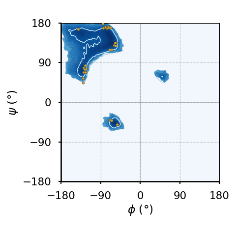

```{tip}
The main references for this part are @finkelstein2002protein and @schlick2010molecular.
```

Proteins are macromolecules composed by amino acids linked by peptide bonds. Let's analyse what these words mean.

# Macromolecules

A macromolecule is a molecule composed by a great number of covalently bonded atoms[^macromolecule]. The most common class of macromolecules is that of biopolymers, which comprise three of the four main macromolecular components of life: proteins, nucleic acids and carbohydrates. Biopolymers are, in turn, a subclass of polymers, which are defined as molecules composed by smaller subunits, the *monomers*, covalently linked together. While there exist polymeric substances with more complex architectures, the main macromolecules of life have a linear (chain) structure that makes it possible to assign a one dimensional *sequence* to each molecule. This sequence is just the list of monomers composing the chain, spelt from one chain end to the other.

```{figure} figures/polymer_sequence.png
:name: fig:polymer-sequence
:align: center
:width: 500px

A cartoon of a polymer composed by 9 monomers (the coloured spheres) connected by covalent bonds (black lines). Panel (A) shows two 2D conformations, panel (B) shows the two 1D sequences built by listing the monomers that make up the chain, starting from either end.
```

[](#fig:polymer-sequence) shows an imaginary short polymer composed by 9 monomers of different nature (coloured differently). In general, there are many different spatial arrangements that the same (bio)polymer can take in solution. By contrast, its sequence is fixed, being given by the list of covalently-linked monomers. However, as shown in the figure, in absence of any convention, the sequence can be read from either end, giving raise to an ambiguity. As we will see, there exist conventions for proteins and nucleic acids that get rid of this ambiguity.

[^macromolecule]: "great number" is a purposedly vague qualifier: there is no strict definition about the number of atoms required for a molecule to be dubbed a macromolecule.

# Amino acids

An amino acid (AA) is a molecule that consists of

* an amino group: A functional group containing nitrogen, written as $-NH_2$. At neutral pH (pH $\approx 7$) this group is protonated, *i.e.* it becomes $-NH_3^+$.
* a carboxyl group: A functional group consisting of a carbon atom double-bonded to an oxygen atom and bonded to a hydroxyl group, written as $-COOH$. At neutral pH (pH $\approx 7$) this group is negatively charged by donating a proton, becoming $-COO^-$. Note that the carbon of this group is often named $C'$ to distinguish it from the carbons of the side chains.
* a side chain (R group): A variable group that differs among amino acids and determines the characteristics and properties of each amino acid. The side chain can be as simple as a hydrogen atom (as in glycine) or more complex like a ring structure (as in tryptophan).
* a central carbon atom ($C^\alpha$) that links together the three foregoing chemical groups plus an additional hydrogen atom.

```{figure} figures/amino_acids.png
:name: fig:amino-acids
:align: center

(A) The structure of a generic amino acid with side chain R. (B) A cartoon showing the spatial difference between the left-handed (L) and right-handed (D) amino-acid enantiomers. (C) Another representation showing that looking down the $H-C^\alpha$ towards the latter, the first letter(s) of the chemical groups read in clockwise order spell out a proper word ($CORN$) for L-amino acids, but a non-existing word ($CONR$) for D-amino acids. In (B) and (C) the chemical groups are coloured as in panel (A).
```

The four bonds of the $C^\alpha$ are arranged in a tetrahedral fashion, which means that all amino acids but glycine[^glycine] are chiral molecules: each AA can, in principle, exist into two distinct forms that are one the mirror image of the other (*i.e.* they are [enantiomers](https://en.wikipedia.org/wiki/Enantiomer)). [](#fig:amino-acids) shows the chemical structure of amino acids in panel (A), and the two enantiomers in panel (B) with two different representations. For reasons that are not yet understood, most proteins found in nature are made of L-amino acids[^D-proteins]. By contrast, D-amino acids, which are synthesised by special enzymes, are rare but present in living beings, being involved in some specific biological processes (see *e.g.* [](doi:10.1007/s00018-010-0571-8) and references therein).

(sec:AA_list)=
## List of amino acids

Given the generic nature of the side chain $R$, there exist countless different amino acid molecules. However, there are 20 standard amino acids that are commonly found in proteins and are encoded by the genetic code. These 20 amino acids are the building blocks of proteins in all known forms of life. 

```{figure} figures/structures_amino_acids.png
:name: fig:structures_AA
:align: center

The chemical structure of the 20 standard amino acids. As discussed in the text, the AAs are separated into categories according to the properties of their side chains ($R$ groups). Adapted from [here](https://commons.wikimedia.org/wiki/File:Amino_Acids002.svg).
```

[](#fig:structures_AA) shows the chemical structure of the 20 standard amino acids, together with their three- and one-letter abbreviations. In the figure the AAs are grouped in the following classes:

1. Charged amino acids: AAs with side chains that are charged at physiological pH, making them highly hydrophilic. These are:
    * Lysine (Lys, K) and Arginine (Arg, R) - positively charged
    * Aspartic acid (Asp, D) and Glutamic acid (Glu, E) - negatively charged
    * Histidine (His, H) - being [amphoteric](https://en.wikipedia.org/wiki/Amphoterism), can be positively charged, negatively charged or neutral depending on the pH, playing a role in enzyme active sites.
2. Polar unchaged armino acids: AAs with side chains that can form hydrogen bonds, making them hydrophilic but not charged at physiological pH. These are:
    * Serine (Ser, S), Threonine (Thr, T), Asparagine (Asn, N), Glutamine (Gln, Q)
    * Cysteine (Cys, C) - has been traditionally considered a polar (hydrophilic) AA, but this view has been challenged, which is why here it is listed among the hydrophobic AAs. See for instance [](doi:10.1016/S0014-5793(99)01122-9).
3. Aromatic amino acids: AAs with side chains with aromatic rings, contributing to protein structure and function through stacking interactions. These are:
    * Phenylalanine (Phe, F), Tryptophan (Trp, W) - the side chains have a strong hydrophobic character
    * Tyrosine (Tyr, Y) - the presence of the hydroxil group $-OH$ endowes this AA with both hydrophobic and hydrophilic features
4. Hydrophobic amino acids: AAs with side chains that are hydrophobic and likely to be found in the interior of proteins. These are:
    * Glycine (Gly, G), Alanine (Ala, A), Valine (Val, V), Isoleucine (Ile, I), Leucine (Leu, L), Methionine (Met, M), Proline (Pro, P)
    * Cysteine (Cys, C) - has been traditionally considered a polar (hydrophilic) AA, but this view has been challenged, which is why here it is listed among the hydrophobic AAs. See for instance [](doi:10.1016/S0014-5793(99)01122-9).

```{note} Non-standard amino acids
:class: dropdown
In addition to the 20 standard amino acids, there are a few non-standard amino acids that are found in some proteins or are used in specialized biological processes. Two notable ones are:

* Selenocysteine (Sec, U): Sometimes referred to as the 21st amino acid, it is incorporated into proteins by a unique mechanism that involves a specific tRNA and a specific sequence in the mRNA.
* Pyrrolysine (Pyl, O): Sometimes referred to as the 22nd amino acid, it is found in some archaeal and bacterial proteins and is also incorporated by a specific tRNA and sequence in the mRNA.

There are also many other amino acids that are not incorporated into proteins but have important roles in metabolism, such as ornithine and citrulline. Additionally, post-translational modifications can lead to the formation of amino acid derivatives within proteins, such as phosphorylated serine or hydroxyproline.
```

Note that in amino acids, the carbon atoms in the side chains are named systematically based on their position relative to the alpha carbon $C^\alpha$. The naming convention is to use successive Greek letters (and possibly numerals for branched side chains) to denote each carbon atom, where the beta carbon, $C^\beta$, is attached to $C^\alpha$, $C^\gamma$ follows the beta carbon, and so on and so forth.

Here are some examples:

* In alanine the side chain has only one carbon, the beta carbon $C^\beta$.
* In leucine the side chain has four carbons and branches at the gamma carbon, so that the names are $C^\beta, C^\gamma, C^{\delta_1},$ and $C^{\delta_2}$.
* In lysine the side chain has four carbons: $C^\beta, C^\gamma, C^\delta$, and $C^\epsilon$.

[^glycine]: To convince yourself that glycine is not chiral substitute R with H in the rightmost subpanel of [](#fig:amino-acids)(C) and look down the $R-C^\alpha$ bond towards $C^\alpha$: you will see that the resulting view is the same as that of the leftmost panel, which makes the two "enantiomers" identical.
[^D-proteins]: Incorporation of D-amino acids in proteins has been observed to occur only outside of ribosomes. [](doi:10.1007/s00018-010-0571-8) reports some examples.

(peptide-bond)=
# The peptide bond

Two amino acids can be linked together through a *peptide bond*, which is a covalent bond that connects the carboxyl group ($-COOH$) of one AA to the amino group ($-NH_2$) of the other. The reaction through which a peptide bond is formed is called "dehydration synthesis" since the carboxyl group loses a hydroxyl group ($-OH$), and the amino group loses a hydrogen atom ($-H$), which combine to form a water molecule ($H_2O$) that is released in solution. Once an AA has been incorporated into the growing chain and the water molecule has been removed, what remains of the molecule is called an *amino acid residue*, or just *residue*. Note that under physiological conditions this reaction is not spontaneous, and therefore requires catalysis (usually performed by ribosomes).

```{figure} figures/peptide_bond.png
:name: fig:peptide-bond
:align: center

The formation of a dipeptide through a dehydration synthesis: two amino acids are joined together, and a water molecule is subsequently released. The peptide bond is indicated by the arrow.
```

[](#fig:peptide-bond) shows the chemical reaction that takes place when two amino acids are joined together, highlighting the peptide bond that links them. The generic term for a chain of amino acids connected by peptide bonds is *polypeptide*, which is a class of biopolymers that comprises (but it is not strictly equivalent to) proteins. While there is some ambiguity in the definition, a polypeptide is considered to be a protein when it takes a specific three-dimensional structure[^intrinsically_disordered] and a well-defined biological function. Note that by this definition a protein is not necessarily formed by a single polypeptide chain. Indeed, there are many proteins, like hemoglobin, that are made of multiple polypeptide units linked by non-covalent bonds (see [](#sec:quaternary_structure) for a more comprehensive discussion on this matter).

```{important}
The peptide bond has a partial double-bond character arising from resonance: the lone pair of electrons on the nitrogen delocalizes to the carbonyl oxygen, creating a double-bond character between the carbon and nitrogen that restricts rotation around the peptide bond, making it planar and rigid.
```

The linear sequence of amino acids that are covalently linked together by peptide bonds to form a polypeptide chain is called *the primary sequence* of a protein. The primary sequence is the most basic level of protein structure and dictates the specific order in which amino acids are arranged, and it determines the protein's ultimate shape and function through interactions that lead to higher levels of structural organization which we will discuss later on. As a result, any changes or mutations in the primary sequence can significantly impact the protein's overall structure and function.

[^intrinsically_disordered]: Contrary to this definition, [not all proteins have a specific three dimensional structure](https://en.wikipedia.org/wiki/Intrinsically_disordered_proteins), either because they are fully intrinsically-disordered, or because they contain regions that are intrinsically disordered.

## Trans and cis conformations

```{figure} figures/trans_cis.png
:name: fig:trans-cis
:align: center
:width: 400

Typical trans and cis conformations of the backbone portion of a single amino acid. In the trans conformation the alpha carbons and their attached side chains are opposite to each other, making this configuration much more stable than the cis conformation, which is rarely observed in proteins.
```

The planarity of the peptide bond means that amino acids can take two distinct conformations around it:

1. *Trans* conformation: the alpha carbon atoms of the adjacent amino acids are positioned on opposite sides of the peptide bond. This arrangement is more stable and commonly observed in proteins because it minimizes steric hindrance between the carbons and side chains of the amino acids.
2. *Cis* conformation: the alpha carbon atoms of the adjacent amino acids are positioned on the same side of the peptide bond. This conformation is less stable due to increased steric clashes between the carbons and side chains, making it less common.

The trans conformation is energetically favorable and typically found in the vast majority of peptide bonds in proteins, while the cis conformation can be found in certain regions of proteins, especially involving the amino acid proline, whose unique cyclic structure partially stabilises the cis conformation.

(sec:molecular_vibrations)=
# Molecular vibrations

The length of chemical (covalent) bonds is of the order of an angstrom, with $C-H$, $O-H$ and $N-H$ being almost exactly $1 \,\AA$, $C-C$ being $\approx 1.5 \,\AA$, and $C=O$ and the peptide bond $C-N$ being in between ($\approx 1.3\, \AA$).

Regarding covalent bond angles, these depend on the nature of the hybridization. We are primarily concerned with sp$^2$- and sp$^3$-hybridized atoms, which result in planar (approximately $120^\circ$) and tetrahedral (approximately $109.5^\circ$) structures, respectively. In polypeptides, sp$^2$ hybridization is observed in the carbon and nitrogen atoms of the peptide bond, while sp$^3$ hybridization is seen in the alpha carbon, which forms four bonds, and in oxygen and sulfur atoms, which typically form two bonds.

As we will discuss [later](./all_atom.md), vibrations of bond lengths and angles have characteristic frequencies associated to the infrared (IR):

* The bond lengths of interest have typical frequencies that go from $3 \cdot 10^{13}$ Hz for $C-C$ to $9 \cdot 10^{13}$ Hz for $C-H$ (corresponding to 1000 cm$^{-1}$ and 3000 cm$^{-1}$, respectively)
* Bond angles have typical frequencies of $1.8 \cdot 10^{13}$ to $2.7 \cdot 10^{13}$ Hz for $C^\alpha$, $1.5 \cdot 10^{13}$ to $2.4 \cdot 10^{13}$ Hz for $C$, and $2.1 \cdot 10^{13}$ to $3.6 \cdot 10^{13}$ Hz for $N$ (500 to 1200 cm$^{-1}$ for the total range).

The values of these typical frequencies can be compared to the thermal energy, $k_B T$, by using Planck's relation, $U = h \nu$, which yields

$$
\nu_{\rm th} = \frac{k_B T}{h} \approx 6.2 \cdot 10^{12} \, {\rm Hz}.
$$

Noting that this value is roughly half of the lowest vibrational or bending frequency reported above, we can conclude that thermal energy does not significantly impact bond stretching and angle bending vibrations[^bond_angles]. As a result, covalent bond and angle vibrations contribute very little to the conformational flexibility of polypeptides, at least under normal conditions.

[^bond_angles]: Temperature-induced fluctuations of bond angles are somewhat larger than those of bond lengths, and therefore cannot be disregarded completely. However the effect is rather minor, as typical amplitudes ar of the order of 5$^\circ$ (@finkelstein2002protein).

By contrast, the typical frequencies of rotations around single bonds are generally much lower than those of bond stretching or bond angle bending vibrations. In fact, some of these frequencies are in the range that is accessible by thermal energy at room temperature, endowing polypeptides with a rotational flexibility that is essential for their conformational dynamics, allowing them to adopt various functional states.

```{figure} figures/dihedral.png
:name: fig:dihedral
:align: center
:width: 400px

The dihedral angle $\varphi$ is defined as the angle formed by the planes determined by the $ABC$ and $BCD$ atoms, which are connected by covalent bonds represented by blue lines. Note that in this picture only one of the two possible choices for the  angle, *i.e.* the dihedral angle $\varphi$, is shown explicitly (see text for details).
```

The rotation angle around a bond is called torsional or *dihedral* angle, which, as shown in [](#fig:dihedral), is the angle formed by two intersecting planes determined by the positions of four atoms. Given the four atoms in figure, $ABCD$, let $\overrightarrow{XY}$ be the vector connecting two covalently linked atoms $X$ and $Y$. Given the ambiguity of defining the normal to a plane, the definition of the torsional angle requires a convention. If we choose to define the normal vector to the $ABC$ plane as $\vec{n}_1 = \overrightarrow{AB} \times \overrightarrow{BC}$, the two normal vectors to the $BCD$ plane are

$$
\begin{aligned}
\vec{n}_2 & = \overrightarrow{DC} \times \overrightarrow{CB}\\
\vec{n}'_2 & = \overrightarrow{BC} \times \overrightarrow{CD} = -\vec{n}_2.
\end{aligned}
$$

We can now define two torsional angles, $\varphi$, $\hat{\varphi}$, as the angles between the normal vectors, *viz.*

$$
\begin{aligned}
\cos \varphi &= \frac{\vec{n}_1 \cdot \vec{n}_2}{\lVert \vec{n}_1 \rVert \lVert \vec{n}_2 \rVert}\\
\cos \hat{\varphi} &= \frac{\vec{n}_1 \cdot \vec{n}'_2}{\lVert \vec{n}_1 \rVert \lVert \vec{n}'_2 \rVert} = -\cos \varphi.
\end{aligned}
$$

The two angles are connected by the relation $\varphi + \hat{\varphi} = \pi$. Following @schlick2010molecular, I will call $\varphi$ the dihedral angle, and $\hat{\varphi}$ the torsional angle, although the two terms are often used interchangeably.

As noted [above](#peptide-bond), the peptide bond, whose associated dihedral angle is called $\omega$, has a partial double-bond character that restricts rotations around it. The peptide bond is considered to be "planar", *i.e.* that the dihedral angle takes values $\omega = \pi$ or $\omega = 0$, with the latter being somewhat less common. Deviations from these values are considered to be rare, but this view has been challenged (see *e.g.* [](doi:10.1073/pnas.1107115108)).

By contrast, rotations around bonds that connect sp$^2$- and sp$^3$-hybridized atoms are associated to energy barriers that are of the order of $k_BT$ and therefore are the main contributors to the flexibility of the macromolecules. In the main chains of peptides the dihedral angles involved in these rotations are those associated to the $N - C^\alpha$ and $C^\alpha - C$ bonds, which are called $\phi$ and $\psi$.

```{figure} figures/phi_psi.png
:name: fig:phi-psi
:align: center
:width: 250px

A polypeptide backbone showing the definition of the dihedral angles $\phi$, $\psi$ and $\omega$. Credits to [Dcrjsr, Adam Rędzikowski and Wikimedia](https://commons.wikimedia.org/w/index.php?curid=24585750).
```

A graphical representation of a part of a polypeptide backbone with its associated dihedral angles is shown in [](#fig:phi-psi).

## Ramachandran Plots

The small energy barriers associated to rotations around $\phi$ and $\psi$ only take into account the atom themselves, not the rest of the molecule to which they are attached. Steric hindrances, resulting from the repulsive interactions between atoms and groups attached to the $C$, $C^\alpha$ and $N$ atoms, disfavor or even prohibit certain combinations of $(\phi, \psi)$ values.

A graphical representation of the allowed and disallowed dihedral angles of amino acid residues in protein structures is the Ramachandran plot, introduced for the first time in [](doi:10.1016/S0022-2836(63)80023-6). By plotting $\phi$ and $\psi$ on the $x$ and $y$ axes, respectively, the plot reveals regions where the angles are sterically favorable, corresponding to common secondary structures and motifs like $\alpha$-helices and $\beta$-sheets which will be introduced below. This visualization is crucial for validating protein structures, as it highlights conformational possibilities and identifies potential structural anomalies (*i.e.* AA conformations that lie in disallowed regions of the plot).

```{warning}
In many papers and books on the subject of protein structure, there is an important fact that is often not stressed or even omitted (perhaps because it should be obvious to people who, unlike us, know some biochemistry): in the original explanation of the Ramachandran plot, the steric clashes that contribute to excluding some $(\phi, \psi)$ combinations are those involving at least third neighbours (often called 1-4 interactions).
```

Given a protein structure, it is possible to extract and plot the $\phi$ and $\psi$ values obtained for each residue on the same figure. However, different amino acids display different flexibilities depending on their associated side chains. Therefore, it is common to produce multiple Ramachandran plots, each serving specific purposes and providing insights into various aspects of protein structure and conformation. The most common ones are:

* **Glycine Ramachandran Plot:** glycine residues have more conformational freedom due to the absence of a side chain, and therefore a wider range of allowed $\phi$ and $\psi$ angles compared to the general case, reflecting the famous enhanced flexibility of this AA.
* **Proline Ramachandran Plot:** proline residues have restricted $\phi$ and $\psi$ angles due to the cyclic nature of its side chain, resulting in a limited range of conformations, highlighting the unique structural constraints of this AA.
* **Pre-Proline Ramachandran Plot:** residues that precede proline in the primary sequence often exhibit distinct conformational preferences given by the steric influence of proline.
* **Ile-Val Ramachandran Plot:** the branched carbons of isoleucine (Ile) and valine (Val) give them a distinct shape of disallowed $\phi$-$\psi$ regions.
* **General Ramachandran Plot:** $\phi$ and $\psi$ angles for all residues that are not part of one of the foregoing categories.

```{figure}
:name: fig:ramachandran_plot
:align: center





Ramachandran plots of amino acids that compose the human hemoglobin protein [1A3N](https://www.rcsb.org/structure/1A3N) (points), plotted on background  contour lines generated by analysing the Top8000 PDB data set. I have used [this software](https://github.com/Joseph-Ellaway/Ramachandran_Plotter) to make the plots.
```

[](#fig:ramachandran_plot) shows examples of the plot types described above, with the empty (non-coloured) "space" being associated to angle combinations that are sterically forbidden. The points in the panels refer to the $(\phi, \psi)$ combinations of the residues of the human hemoglobin protein, while the background contour plots have been calculated by extracting the values of $\phi$ and $\psi$ from 8000 reference protein structures listed in a database[^ramachandran_plot_reference].

A comparison between [](#fig:ramachandran_plot-a) and the other plots shows that glycine has a much greater conformational flexibility than any other AA. By contrast, [pre-prolines](#fig:ramachandran_plot-b) and [prolines](#fig:ramachandran_plot-c) (and, to a smaller extent, [leucines and valines](#fig:ramachandran_plot-d)) are much more constrained than an [average AA](#fig:ramachandran_plot-e).

[^ramachandran_plot_reference]: While it is not explicitly stated in the repository of [the software](https://github.com/Joseph-Ellaway/Ramachandran_Plotter) I have used to make the figure, I believe that the reference Top8000 database used is [this one](http://kinemage.biochem.duke.edu/research/top8000/). The updated version of the same database can instead be downloaded [here](https://zenodo.org/records/5777651).

## Non-covalent interactions

A closer look at the plots also reveals that $\phi \approx 0$ configurations are forbidden, while $\psi \approx 0$ are infrequent but not entirely disallowed. What is the difference between these two situations? And, more generally, what causes the shape of the Ramachandran plots?

The "forbidden" regions on this plot correspond to combinations of these angles that result in significant steric clashes and unfavourable interactions, making these conformations highly improbable or energetically unfavorable. These interactions are termed *noncovalent", since they arise between pairs of atoms that are not involved in a bond. I will briefly sketch the most important noncovalent interactions in this context. Of course, as shown in [](#fig:ramachandran_plot), the absolute and relative importances of these terms depend not only on the nature of the amino acid, but also on its local environment.

(sec:van-der-waals)=
### Van der Waals interactions

The most prominent reason for the forbidden regions is steric hindrance, where atoms are positioned too closely together, leading to repulsive forces. This happens when the dihedral angles place the backbone or side chain atoms in close proximity, causing overlaps or severe crowding, making some conformations energetically unfavorable.

The atom-atom repulsion is a general phenomenon occurring when electron clouds belonging to atoms with fully-occupied orbitals overlap. The repulsion is caused by  the Pauli exclusion principle, which prevents two electrons from occupying the same quantum state, and it is a steeply increasing function of the decreasing interaction distance. It is common to model the functional dependence of the repulsive interaction energy on $r$, the interatomic distance, with the (heuristic) form $\sim r^{-12}$, which is not based on first-principles calculations but is computationally cheap and good enough for most purposes (@leach2001molecular, @schlick2010molecular).

When the atom-atom interdistance is sufficiently larger, quantum mechanical effects lead to attractive forces (the most important being the famous dispersion or [London force](doi:10.1007/BF01421741)) that arise from temporary dipoles induced in atoms or molecules as electrons move around. In general, the total attractive contribution is the sum of three contributions having the same functional dependence on distance, $r^{-6}$ (see *e.g.* @israelachvili2011intermolecular).

```{figure} figures/LJ.png
:name: fig:LJ
:align: center
:width: 500px

The Lennard-Jones potential, often used to model van der Waals interactions.
```

The total interaction, which is the sum of the two terms, is termed van der Walls interaction and is often modelled with the famous Lennard-Jones (LJ) potential, *viz.*

$$
V(r) = \epsilon \left( \left( \frac{r_{\rm min}}{r} \right)^{12} - 2 \left( \frac{r_{\rm min}}{r} \right)^{6} \right),
$$

where $\epsilon$ is the depth of the minimum arising from the competition between attraction and repulsion, and $r_{\rm min}$ is its position. A plot of the LJ potential is presented in [](#fig:LJ). The figure highlights an additional length, $r_0$, which is the distance at which the energy becomes positive, and therefore can be seen as an estimate for the minimum distance below which two atoms "clash"[^LJ_parameters]. Therefore, the value that $r_0$ takes for each pair of noncovalent interaction can be useful to estimate the stability of a given conformation.

:::{tip} An alternative form of the Lennard-Jones potential
:class: dropdown
In molecular simulations, it is common to express the LJ potential in the following slightly different manner:

$$
V(r) = 4 \epsilon \left( \left( \frac{\sigma}{r} \right)^{12} - \left( \frac{\sigma}{r} \right)^{6} \right),
$$

where $\sigma = r_0$ is also known as the "diameter" of the atom.
:::

:::{table} Typical values for the parameters of the van der Walls interaction between same-type atoms (listed in the first column), as reported in @finkelstein2002protein.
:label: tbl:vdW
:align: center

| Atom | $\epsilon$ (kcal / mol) | $r_{\rm min}$ ($\AA$) | $r_0$ ($\AA$) |
| :--- | :---: | :---: | :---: |
| $H$ | 0.12 | 2.4 | 2.0 |
| $C$ | 0.12 | 3.4 | 3.0 |
| $O$ | 0.23 | 3.0 | 2.7 |
| $N$ | 0.20 | 3.1 | 2.7 |
:::

Typical values for $\epsilon$, $r_0$ and $r_{\rm min}$ for the main self interactions, *i.e.* interactions between atoms of the same type, are listed in [](#tbl:vdW). In the case of mixed interactions between atoms of type $i$ and $j$, there exist several [combining rules](https://en.wikipedia.org/wiki/Combining_rules) to estimate the values of the van der Waals parameters (see leach2001molecular for a discussion). The most common are the Lorentz-Berthelot rules, which amount to taking the arithmetic mean for the radii and the geometric mean for the energy strengths:

$$
\begin{align}
r_{\rm min}^{ij} &= \frac{r_{\rm min}^{ii} + r_{\rm min}^{jj}}{2}\\
\epsilon_{ij} & = \sqrt{\epsilon_{ii}\epsilon{jj}}.
\end{align}
$$

```{figure} figures/steric.png
:name: fig:steric
:align: center
:width: 500px

Cis conformation over $\phi$ (left) and over $\psi$ (right). The numbers above the dashed lines are the average distances between $C$ (left) and $N$ (right) atoms.
```

We are now equipped to rationalise our observation that values of $\phi \approx 0$ are forbidden, while conformations with $\psi \approx 0$ are infrequent but not impossible. The difference between the typical conformations having these dihedral values can be appreciated by looking at [](#fig:steric): in both cases the two 1-4 atoms connected to the atoms involved in the bond that defines the dihedral lie in the same half-plane and are roughly at the same distance ($\approx 2.9 \, \AA$). However, in the $\phi$ case the two atoms are both carbons, which have a "minimum allowed distance" of $r_0^{\rm CC} \approx 3.0 \, AA$, making this conformation essentially forbidden. By contrast, in the $\psi$ case both atoms are nitrogens, so that the minimum allowed distance is $r_0^{\rm NN} \approx 2.7 \, \AA$, which is smaller than the actual $N-N$ distance: according to the effect of this 1-4 interaction, this conformation is allowed.

Of course, even if we look at the contributions due to van der Waals forces only, there are other atom-atom interactions that forbid specific conformations. These interactions involve mostly the oxygen, the alpha carbon and the $N$ hydrogen of the backbone, but also the side chains. However, in the latter case the main contributor is the beta carbon, which is why the only AA lacking it, glycine, has a distinctively different Ramachandran plot.

[^LJ_parameters]: In writing this part I was heavily inspired by @finkelstein2002protein, but I'm swapping the names of the two characteristic distances, $r_0$ and $r_{\rm min}$, which I found misleading in the original discussion.

### Hydrogen bonds

Certain combinations of $\phi$ and $\psi$ angles can prevent the formation of hydrogen bonds, which are particular bonds that can link amino acids between them and with water molecules (or other solutes): if the backbone dihedral angles do not permit optimal hydrogen bonding, the conformation is unlikely to be stable or favorable. But what is a hydrogen bond?

A hydrogen bond (HB) is a type of weak chemical bond that occurs when a hydrogen atom, which is covalently bonded to an electronegative atom (like oxygen, nitrogen, or fluorine), experiences an attraction to another electronegative atom in a different molecule or a different part of the same molecule, and can be understood in terms of electrostatic interactions. Indeed, atoms like nitrogen, oxygen, and fluorine are highly electronegative, meaning they have a strong tendency to attract electrons. In a molecule, when hydrogen is covalently bonded to an electronegative atom, the shared electron is drawn closer to it, creating a partial negative charge on it and a partial positive charge on the hydrogen atom which generates an uneven distribution of electron density. If the hydrogen atom comes close enough to another electronegative atom having a partial negative charge, the electrostatic interaction between the opposite partial charges will give raise to an effective attraction. This effect can create reversible bonds between different molecules, or between different parts of the same molecule.

```{important}
Molecules or chemical groups capable of participating in hydrogen bonds are called *polar*.
```

Notable examples in this context are mainly those in which there are $O$ and $N$ atoms involved: $O-H :: O$, $N-H :: N$, $O-H :: N$, *etc.*, where $::$ is shorthand for a hydrogen bond. In all these cases, the atom covalently bound to the hydrogen (or sometimes the whole group) is called the *donor*, while the other one (or the molecule it is part of) is the *acceptor*. As a rule of thumb, the number of HBs can an electronegative atom can accept is equal to its number of lone pairs[^lone_pairs], which is one for nitrogen and two for oxygen. 

We now look at the geometry of a hydrogen bond. In a HB, the distance between the acceptor and the hydrogen atom varies slightly depending on the specific molecules and environmental conditions, but typically ranges from $1.8$ to $2.2\, \AA$. As a result, the distance between the acceptor and the atom covalently bonded to the hydrogen is close to $r_{\rm min}$, the optimal van der Waals distance for interactions involving $O$ and/or $N$. 
A fundamental property of hydrogen bonds is that, unlike in van der Waals interactions, are highly directional interactions: their strength depends on the relative orientations of the chemical groups involved. Specifically, the optimal hydrogen bond occurs when the donor atom, hydrogen atom, and acceptor atom are aligned linearly, with an angle close to 180$^\circ$. Deviation from this linear alignment results in weaker hydrogen bonds, or even bond breakage if it exceeds $\approx 20-30^\circ$.

```{figure} figures/hydrogen_bonds.png
:name: fig:hydrogen_bonds
:align: center

(a) Typical distances in a hydrogen bond. (b) Optimal hydrogen bonds are linear, but small deviations are possible. (c) Hydrogen bonds in a liquid water molecular dynamics simulation, with some acceptor-hydrogen distances highlighted (credits to [Splette and Wikimedia](https://commons.wikimedia.org/wiki/File:Liquid_water_hydrogen_bond.png)).
```

[](#fig:hydrogen_bonds) shows a schematic view of the main properties of hydrogen bonds, together with a simulation snapshot of liquid water where some hydrogen bonds are explicitly highlighted.

The importance of HBs on the association of molecules can be appreciated by looking at the following table, which shows the melting and boiling temperatures at ambient pressure, $T_m$ and $T_b$, of 3 molecules of similar weight:

|Molecule|# of HBs|Molecular weight|$T_m$|$T_b$|
|:---|:---:|:---:|:---:|:---:|
| [Methane](https://www.engineeringtoolbox.com/methane-d_1420.html), $CH_4$ | 0 | 16 g/mol | $-182.6^\circ \, {\rm C}$ | $-161.6^\circ \, {\rm C}$ |
| [Ammonia](https://www.engineeringtoolbox.com/ammonia-d_971.html), $NH_3$ | 1 | 17 g/mol | $-77.7^\circ \, {\rm C}$ | $-33.3^\circ \, {\rm C}$ |
| Water, $H_2O$ | 2 | 18 g/mol | $0^\circ \, {\rm C}$ | $100^\circ \, {\rm C}$ |

Since carbon is very weakly electronegative, it does not form any hydrogen bond. As a result, association in methane, as embodied by the values of $T_m$ and $T_b$, happens at very low temperature, where the attraction is provided by [van der Waals interactions](#sec:van-der-waals) only. However, as electronegativity (and the number of lone pairs) increases from $C$ to $N$ and then $O$, HBs become more and more relevant, substantially increasing the melting and boiling temperatures.

Following @finkelstein2002protein, the strength of hydrogen bonds can be estimated by comparing the (latent) heat of vaporization[^latent_heat] of molecules that are composed by the same atoms, *e.g.* dimethyl ether $H_3C-O-CH_3$, 5 kcal / mol, and ethanol, $CH_3-CH_2-OH$, 10 kcal/mol. Since the latter has an $OH$ group that the former lacks, there is an additional contribution of the latent heat due to one HB per molecule which amounts to $\approx 10 - 5 = 5$ kcal/mol. A similar estimate can be made by using the heat of vaporization of ice (we will see why in a moment), which is $\approx 12$ kcal/mol. Of this value, $\approx 2$ kcal/mol are due to van der Waals interactions, as estimated by looking at the evaporation of analogous, but non-HB-forming, molecules (*e.g.* $CH_4$ or $O_2$). The rest is provided by the two hydrogen bonds that each water molecule can form, yielding again an energy gain of $\approx 5$ kcal/mol per HB. Recalling that, at room temperature, $k_B T \approx 0.6$ kcal / mol, we can estimate that one HB provides $\approx 8\,k_B T$, suggesting that the formation of hydrogen bonds is highly favoured under ambient conditions.

In water, hydrogen bonds are the main driving force for condensation and ice formation. Since each oxygen can accept two bonds, and each hydrogen can mediate one donor-acceptor interaction, each water molecule can be involved in four bonds that are arranged on a (nearly perfect) tetrahedron. This geometry can be rationalised as follows. In general, electron pairs (both bonding and lone pairs) around a central atom will arrange themselves to minimize repulsion, but the repulsion between lone pairs is greater than the repulsion between bonding pairs. Consequently, the two lone pairs will occupy positions that are as far apart as possible, pushing the bonding pairs closer together. As a result, the four pairs of electrons (two lone pairs and two bonding pairs) around the oxygen atom in water adopt a tetrahedral arrangement to minimize repulsion, with the bond angle between the hydrogen atoms in a water molecule being $\approx 104.5^\circ$, slightly less than the ideal tetrahedral angle of 109.5$^\circ$ due to the greater repulsion exerted by the lone pairs.

Since the natural tetrahedral geometry of water molecules leads to the maximum number of HBs, it should not come as a surprise that regular ice has a diamond cubic cell, where each molecule is connected to four others through (almost) linear hydrogen bonds. When ice melts into liquid water, it releases 80 cal/g of heat. In turn, when water turns into vapour at $100^\circ$, $600 cal/g$ of boiling heat is released. If we assume that no hydrogen bonds are present in water vapour, we could estimate these values to estimate that a fraction of $80 / (600 + 80) \approx 0.12$ breaks when ice melts. However, this is not the case. In fact, it is perhaps surprising that liquid water at ambient conditions has roughly the same number of HBs of ice, *i.e.* $\approx 4$. What happens then when ice melts into liquid water? The hydrogen bonds become looser, and their length and, more importantly, angular fluctuations increase. Of course, these fluctuations have an energetic cost, which is counterbalanced by the entropy provided by the many possible ways of realising disordered networks made of molecules connected by "flexible" hydrogen bonds.

:::{tip} Why does ice float on water?
:class: dropdown

The famous property of liquid water being denser than ice, which is one of the very many anomalies of water, can be qualitatively understood by considering the geometrical constraints set by hydrogen bonds. 

In hexagonal ice, which is the most stable form of ice at ambient pressure, each water molecule forms four linear hydrogen bonds with neighboring water molecules, creating an almost perfect tetrahedral arrangement that leads to an open, hexagonal lattice structure with a lot of empty space within. By contrast, in liquid water each molecule still participates in nearly four hydrogen bonds. However, these bonds are not fixed and can fluctuate, allowing the molecules to pack closer together, which leads to a higher density, $1.00$ g/cm$^3$ at $4^\circ$ C, compared to that of ice, $0.917$ g/cm$^3$.
:::

We now go back to proteins, with the working hypothesis that, under ambient conditions, all hydrogen bonds are formed[^all_hbs]. If we look at peptide backbones, we see that it contains nitrogen and oxygen, making it a polar molecule. In addition, as [discussed before](#sec:AA_list), many side chains are polar, or even charged under physiological conditions. As a result, a polypeptide has many chemical groups that can be involved in hydrogen bonds. What partners do these chemical groups bond to: other polar groups or water molecules?

To answer this question let us consider two chemical groups on the same polypeptide, an acceptor $A$ and a donor $D$, that can form a hydrogen bond. Assuming that all hydrogen bonds are formed, there are two possible states: $A$ is bonded to $D$, or they are both bonded to water molecules. The equilibrium between these two states can be described by

$$
D :: HOH + A :: OH_2 \rightleftharpoons D :: A + HOH :: OH_2.
$$

When $D$ and $A$ form a HB, the two water molecules are freed to form hydrogen bonds with other water molecules. Since the number of hydrogen bonds on the left-hand side matches that on the right-hand side, the energy remains essentially unchanged. However, entropic contributions must also be considered:

1. When a hydrogen bond forms between $A$ and $D$, the polypeptide's flexible backbone is typically forced to adopt a more constrained and specific conformation to facilitate this interaction, leading to a loss of conformational freedom and therefore a loss of entropy.
2. When the intramolecular hydrogen bond forms, When the intramolecular hydrogen bond forms, the water molecules previously bonded to the polar groups are released into the bulk solvent. These water molecules, previously constrained in position and orientation (low-entropy state), now return to a more disordered state, increasing the system's entropy

Interestingly, it turns out that, on average, the entropic contributions of these two effects not only have opposite signs but are also comparable in magnitude (see @finkelstein2002protein for a more thorough discussion).

[^lone_pairs]: Pairs of valence electrons that are not shared with another atom in a covalent bond and are not involved in bonding.
[^latent_heat]: The amount of energy (usually expressed per mole) that must be supplied to a liquid to transform it into a gas.
[^all_hbs]: This is not a particularly strong approximation.

### Electrostatic interactions

In some conformations, the backbone or side chains may bring similarly charged groups into close proximity, leading to an electrostatic repulsion. For example, two negatively charged carboxyl groups or two positively charged amino groups positioned close together would repel each other, making such conformations highly unfavorable.

## Rotamers

Almost all amino acids can adopt different orientations of side chains around single bonds. Exceptions are 

* glycine, which has no rotational freedom in terms of side chain orientation,
* alanine, whose side chain is a methyl group, $-CH3$, which is small and symmetrical, offering no significant variation in rotameric states,
* proline, whose side chain forms a ring by bonding back to the backbone nitrogen, severely restricting the rotation around its side chain.

The distinct conformations of an amino acid at fixed values of $(\phi, \psi)$ are called *rotamers* and arise due to the rotation around the bonds connecting the side chains to the main backbone of the polypeptide chain. The dihedral angles connected to the rotamers are referred to as $\chi$ angles, which describe the rotations around the bonds within the side chains of amino acids. Each rotatable bond in a side chain is associated with a specific $\chi$ angle, labeled sequentially from the backbone outward. For instance, $\chi_1$ is the dihedral angle around the bond between the alpha carbon and the beta carbon, $\chi_2$ is the dihedral angle around the bond between the beta carbon and the gamma carbon, and so on for longer side chains.

Each amino acid side chain can adopt multiple rotameric states, influenced by steric interactions, hydrogen bonding, and other intramolecular forces. The different rotamers contribute to the overall flexibility and diversity of protein structures, allowing proteins to achieve their functional conformations and interact effectively with other molecules.

(sec:secondary_structure)=
# Secondary structure

# Tertiary structure

(sec:quaternary_structure)=
# Quaternary structure
